# Core-99 Analysis: From Static Profiles to Migration Questions

This is the primary narrative for the core-99 high-signal researcher slice. It should be read as a structured interpretation of already-built deterministic artifacts, not as a final migration taxonomy.

The analysis now follows one question-driven path:

1. define the measurement objects,
2. show the shallow aggregate movement with both percentages and paper counts,
3. split the movement into interpretable researcher groups,
4. use named researchers only as evidence-bearing examples,
5. keep PCA and delta plots as supporting views, not as the main story.

Detailed researcher tables and decompositions remain in [CORE99_INVESTIGATION.md](CORE99_INVESTIGATION.md). Per-researcher deterministic attributes are in [CORE99_RESEARCHER_ATTRIBUTES.md](CORE99_RESEARCHER_ATTRIBUTES.md).

## 1. Data Scope and Analysis Cohort

The core-99 is defined as researchers with `baseline_top_networking_count > 6`, meaning at least 7 papers at SIGCOMM, NSDI, CoNEXT, HotNets, or IMC during 2018-2022. This yields 99 researchers.

The feature-vector analysis uses a stricter stability threshold: at least 5 clean papers in both periods.

- Baseline period: 2018-2022.
- Post-baseline period: 2023-2026.
- Core sample: 99 researchers.
- Feature-vector analysis sample: 87 researchers.
- Excluded from feature-vector analysis: 12 researchers with fewer than 5 post-2023 clean papers.

Those 12 researchers are not discarded from the project. They remain part of core-99 and matter substantively, but their post-2023 percentage vectors are too unstable: with fewer than 5 papers, one paper can move a venue-family share by 20 percentage points or more.

| Researcher | Affiliation | Baseline papers | Post-2023 papers | Current interpretation |
|-----------|------------|:---:|:---:|-------|
| Hongqiang Harry Liu | Uber AI | 21 | 3 | Publishing slowed |
| Hari Balakrishnan | MIT CSAIL | 29 | 4 | Reduced academic conference output |
| Ming Zhang 0005 | Alibaba (China) | 12 | 0 | Inactive after 2022 (moved to Alibaba) |
| Ankit Singla | Google (Switzerland) | 25 | 1 | Near-complete publishing stop in clean conference data |
| Alan Mislove | Northeastern University | 28 | 3 | Reduced academic conference output |
| Christoph Dietzel | MPI Informatics | 14 | 0 | Inactive after 2022 in clean conference data |
| John Sonchack | Princeton University | 15 | 2 | Reduced output |
| Yu Zhou 0008 | National Univ. Singapore | 27 | 2 | Reduced output |
| Matt Calder | Meta (US) | 14 | 3 | Reduced output (industry — Meta) |
| Robert Beverly | Lawrence Berkeley National Lab | 12 | 3 | Reduced output |
| Bruce M. Maggs | Duke University | 14 | 3 | Reduced output |
| Stefano Vissicchio | University College London | 7 | 3 | Reduced output |

Open question: these 12 should later be analyzed as a separate low-post-output group, probably with career-stage, industry, retirement, and DBLP-lag checks. They should not be forced into percentage-vector PCA.

A detailed breakdown of these 12 with career-stage, institutional context, and aggregate patterns is now available in [synthesis/excluded_12_analysis.md](synthesis/excluded_12_analysis.md). Key findings: at least 3 are industry researchers (Hongqiang Harry Liu at Uber AI, Ankit Singla at Google), several are senior enough that reduced publishing is expected (Hari Balakrishnan, Bruce M. Maggs), and one (Stefano Vissicchio) is a borderline case whose post-2023 papers are 100% at qualifying top-networking venues — excluded purely by the <5 threshold, not by topic direction.

## 2. Feature Construction

The analysis uses two related but distinct feature layers.

### 2.1 Static Portfolio Features

For each analyzable researcher, the static profile is a 10-dimensional venue-family percentage vector.

| Family | Examples of venues |
|---|---|
| `qualifying_top_networking` | SIGCOMM, NSDI, CoNEXT, HotNets, IMC |
| `other_networking` | INFOCOM, ICNP, PAM, TMA, ANRW, APNet, IFIP Networking |
| `systems` | OSDI, SOSP, EuroSys, USENIX ATC, ASPLOS, SoCC, MLSys |
| `AI_ML` | ICML, ICLR, NeurIPS, AAAI, CVPR, ICCV, EMNLP, ACL |
| `security_privacy` | USENIX Security, IEEE S&P, CCS, NDSS, PETS |
| `mobile_wireless_iot` | MobiCom, MobiSys, SenSys, UbiComp, IPSN |
| `web_social_hci` | WWW, CHI, ICWSM, WebSci, ISMAR, VR |
| `data_management` | SIGMOD, VLDB, ICDE, CIDR |
| `theory_distributed` | PODC, DISC, SPAA, OPODIS, ICDCS |
| `programming_languages` | PLDI, POPL, OOPSLA, ICSE-adjacent PL venues |

For each period and family:

```text
family_share = papers_in_family / total_clean_papers_in_period * 100
```

This gives three vectors per researcher:

| View | Definition | Use |
|---|---|---|
| Baseline profile | 2018-2022 family percentages | What the researcher looked like before the observation period |
| Post-2023 profile | 2023-2026 family percentages | Where the researcher's visible conference portfolio landed |
| Delta profile | `post_pct - baseline_pct` | How the portfolio composition changed |

Percentages are used because researchers have very different publication volumes. A 5-paper systems increase means something different for a 10-paper researcher than for a 100-paper researcher. Raw counts are preserved in `data/core99_feature_vectors.json` and are used below whenever a percentage claim could hide volume.

### 2.2 Movement Features and Investigation Groups

The word "migration" is not used here as a final semantic label. In this document it means measurable movement along several axes.

| Feature | Meaning |
|---|---|
| `top_networking_rate_change` | Annualized change in SIGCOMM/NSDI/CoNEXT/HotNets/IMC output |
| `clean_publication_rate_change` | Annualized change in all clean conference output |
| Delta venue-family vector | Where the publication portfolio shifted by venue family |
| Authorship placement | Whether the researcher appears mostly as lead, collaborator, or senior author |

Rate ratios are annualized so the 5-year baseline window and 4-year post-baseline window can be compared:

```text
top_networking_rate_ratio = (post_top_net_count / 4) / (baseline_top_net_count / 5)
clean_publication_rate_ratio = (post_clean_count / 4) / (baseline_clean_count / 5)
```

Trend labels use deterministic thresholds: `increased` if ratio >= 1.25, `decreased` if ratio <= 0.75, `flat` otherwise, and `inactive_after_2022` if the post count is zero.

Limitation: rate labels describe per-year output for a researcher, not the absolute volume represented by a group. A small group can have a strong rate change but low paper volume; a large group can dominate aggregate volume even with modest per-researcher movement. For that reason, the analysis below always pairs rate labels with raw paper counts and group weights.

Limitation: the post-baseline denominator is always 4 (2023-2026). At the time of writing (June 2026), DBLP indexing for 2026 is incomplete — several 2026 conference proceedings (including SIGCOMM 2026 and CoNEXT 2026) have not yet been published or indexed. This systematically biases annualized post-2023 rates downward. Researchers with no 2026 papers are effectively annualized over 3 observable years but divided by 4. A dynamic-year correction is planned (see §12).

The main investigation grouping uses the two rate features:

| Group | Top-networking rate | Overall clean-publication rate | Plain meaning |
|---|---|---|---|
| Inv-Q1 | decreased | flat/increased | Top networking declines faster than overall output |
| Inv-Q2 | flat/increased | flat/increased | Strong or stable visible conference presence |
| Inv-Q3 | flat/increased | decreased | Top networking maintained relative to other output |
| Inv-Q4 | decreased | decreased | Broad decline in visible conference output |

Naming rule: this document uses **Inv-Q1** through **Inv-Q4** for the main investigation groups. The sys/AI/storage file `data/core99_sys_ai_storage_quadrants.csv` is a supplementary, orthogonal label set; it should not introduce another unqualified Q1/Q2/Q3/Q4 vocabulary in the main narrative.

## 3. Shallow Observation: What the Aggregate Shows

Before PCA or group-level decomposition, three simple measurements give the aggregate picture. This section presents them in order of increasing detail: (1) how each researcher's internal portfolio mix changed, (2) how much total author participation moved across venue families, and (3) what share of top-networking venues the core-99 represents.

The gut-level hypothesis might be "top networking researchers are migrating to AI." The data tells a more cautious story: among the analyzable core-99, top-networking participation is not disappearing as a collective, but visibility is being redistributed across researchers and venue families.

### 3.1 Researcher-Internal Portfolio Shares

**What this measures:** For each researcher, what percentage of their own papers falls into each venue family. The table below shows the cohort mean and median of these per-researcher percentages, before and after 2022. This is the "normalized portfolio share" measurement — it controls for different publication volumes but loses absolute scale.

| Family | Baseline mean | Post-2023 mean | Mean delta | Baseline median | Post-2023 median |
|--------|:------------:|:-------------:|:------:|:--------------:|:----------------:|
| qualifying_top_networking | 44.3% | 41.1% | -3.1pp | 44.9% | 38.5% |
| other_networking | 21.7% | 17.6% | -4.2pp | 16.7% | 11.8% |
| systems | 10.4% | 13.0% | +2.7pp | 6.7% | 6.7% |
| AI_ML | 2.4% | 4.4% | +2.0pp | 0.0% | 0.0% |
| security_privacy | 5.7% | 7.3% | +1.6pp | 2.8% | 0.0% |
| mobile_wireless_iot | 6.3% | 6.4% | +0.0pp | 0.0% | 0.0% |
| web_social_hci | 2.0% | 4.1% | +2.1pp | 0.0% | 0.0% |

Three families (`data_management`, `theory_distributed`, `programming_languages`) each account for <2% of mean portfolio share and are omitted for readability. Full data in `data/core99_feature_vectors.json`.

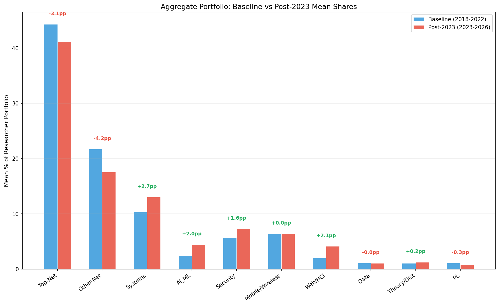

*Note: Delta (pp) annotations added above each bar group.*

**What this tells us:** The median researcher has zero AI_ML papers in both periods. The mean AI_ML share rose from 2.4% to 4.4%, but the median stayed at 0%. AI_ML expansion is real but concentrated in a minority — it is not a cohort-wide shift. The largest composition changes are within networking itself: qualifying top-networking declined modestly (-3.1pp mean), while other-networking dropped more (-4.2pp). Systems and web/HCI grew modestly.

### 3.2 Absolute Author-Paper Incidences

**What this measures:** Total author-paper incidences across all 87 analyzable researchers, summed by venue family. Each author on each paper counts as one incidence. This measurement preserves volume but double-counts papers with multiple core-99 co-authors.

| Family | Baseline incidences | Post-2023 incidences | Change | Annualized baseline | Annualized post |
|---|---:|---:|---:|---:|---:|
| qualifying_top_networking | 906 | 619 | -287 | 181.2/year | 154.8/year |
| other_networking | 655 | 307 | -348 | 131.0/year | 76.8/year |
| systems | 270 | 253 | -17 | 54.0/year | 63.2/year |
| AI_ML | 78 | 109 | +31 | 15.6/year | 27.2/year |
| security_privacy | 148 | 110 | -38 | 29.6/year | 27.5/year |
| mobile_wireless_iot | 161 | 102 | -59 | 32.2/year | 25.5/year |
| web_social_hci | 65 | 93 | +28 | 13.0/year | 23.2/year |

**What this tells us:** The volume story is sharper than the percentage story. Qualifying top-networking incidences dropped by 287 (906→619), and adjacent-networking dropped by 348 (655→307). Together these two networking families account for 635 fewer author incidences. AI_ML (+31) and web/HCI (+28) gains are real but small in absolute terms — they offset less than 10% of the networking decline. The post window is shorter (4 years vs. 5), so the annualized comparison in the last two columns is the fairer baseline-vs-post read.

### 3.3 Core-99's Share of Top-Networking Venues

**What this measures:** Of all papers published at SIGCOMM, NSDI, CoNEXT, HotNets, and IMC (plus PACMNET from 2023 onward), what fraction include at least one core-99 author? This is the "unique-paper denominator" measurement — it answers whether core-99 is a bigger or smaller part of these venues over time.

The denominator table below unifies the baseline and post-baseline view. Per-year totals come from the DBLP TOC API and are approximate (include workshop papers). PACMNET is the journal-integrated proceedings for CoNEXT long papers starting in 2023; totals include it from 2023 onward. See §12 for data quality caveats.

| Year | SIGCOMM | NSDI | CoNEXT | HotNets | IMC | **Total** | Core-99 unique papers |
|------|--------:|-----:|-------:|--------:|----:|----------:|---------------------:|
| 2018 | 41 | 41 | 33 | 27 | 44 | **186** | — |
| 2019 | 33 | 50 | 33 | 21 | 40 | **177** | — |
| 2020 | 54 | 66 | 64 | 31 | 55 | **270** | — |
| 2021 | 56 | 60 | 51 | 32 | 55 | **254** | — |
| 2022 | 56 | 79 | 29 | 33 | 77 | **274** | — |
| **BL total** | **240** | **296** | **210** | **144** | **271** | **1,161** | **589** (51%) |
| 2023 | 108 | 97 | 41† | 39 | 64 | **349** | — |
| 2024 | 63 | 113 | 49† | 45 | 85 | **355** | — |
| 2025 | 89 | 84 | 78† | 51 | 100 | **402** | — |
| 2026 | — | 151 | — | — | — | **151** | — |
| **Post total** | **260** | **445** | **168** | **135** | **249** | **1,257** | **456** (~36%) |

† CoNEXT 2023+ includes PACMNET long papers (short papers: 17-28/year; long: 24-50/year after excluding editorials).
2026 denominator is incomplete (only NSDI indexed; SIGCOMM and CoNEXT not yet held).

*Note: A visualization of this table (e.g., stacked bars showing core-99 share vs. total venue size over time) would be useful for the next revision — the year-over-year growth in total papers and the core-99's roughly flat unique-paper count are easier to read in a chart than in a table.*

**What this tells us:**

- **Baseline (2018-2022):** Core-99 researchers appeared on 589 of ~1,161 unique top-networking papers, or roughly 51%. They were a major presence at these venues.
- **Post-2023:** Core-99 appears on 456 unique papers. The raw count per year (~113) is nearly the same as baseline (~114/year). But the denominator has grown (2024-2025 average ~378 papers/year vs. baseline ~232/year — though this includes workshop inflation and the CoNEXT PACMNET expansion, which partly reflects DBLP coverage differences rather than real venue growth). If we take the DBLP TOC numbers at face value, core-99's share drops from ~51% to ~36%. However, this decline is partly a denominator artifact — the post-2023 DBLP TOC totals are inflated differently than baseline TOC totals because workshop indexing practices changed.
- **The cleaner read:** Unique-paper presence is stable in raw count (~113 papers/year in both periods). What changes is the *distribution* of who appears on those papers — author-paper incidence drops (906→619) while unique-paper count holds steady, meaning core-99 researchers appear on roughly the same number of papers but with fewer repeated/core-99 co-author overlaps per paper.

This is why the analysis below focuses on redistribution and group mechanisms, not just total decline.

## 4. Question 1: Who Is Falling Out of Top Networking?

The biggest visible phenomenon is that many core-99 researchers lose presence at the five qualifying networking venues.

Among the 87 analyzable researchers:

| Group | N | Researcher share | Baseline clean share | Post clean share | Baseline top-net share | Post top-net share | Main count movement |
|-------|--:|---:|---:|---:|---:|---:|---|
| Inv-Q1: top-net down, clean flat/up | 15 | 17.2% | 16.0% | 17.6% | 17.7% | 11.6% | top-net 160->72, other-networking -23, systems +7, web/HCI +12 |
| Inv-Q4: top-net down, clean down | 28 | 32.2% | 34.6% | 21.0% | 32.5% | 16.5% | top-net 294->102, other-networking -187, broad volume decline |

Together, Inv-Q1 and Inv-Q4 contain 43 researchers, or 49.4% of the analyzable core-99. They contribute 50.2% of baseline top-networking author-paper incidences but only 28.1% post-2023. This is the core redistribution signal: the falling-out groups lose top-networking weight, while the stable groups take a larger post-2023 share.

### 4.1 Inv-Q1: Substitution Rather Than Simple Exit

Inv-Q1 researchers have decreasing top-networking rate but flat or increasing annualized clean-publication rate. Their average delta profile is the clearest portfolio shift in the analysis:

| Group | N | Mean delta vector | Count movement | Interpretation |
|-------|--:|--------------|---|-----------|
| Inv-Q1 | 15 | qualifying -24.6pp, other +8.7pp, systems +8.0pp | qualifying 160->72, systems 30->37, web/HCI 4->16 | Losing qualifying venue share and replacing part of it elsewhere |

Delta values are percentage-point changes in each researcher's own portfolio, so dimensions have the same unit and can be compared as composition changes. They do not directly encode absolute paper volume. A high-volume and low-volume researcher can have the same delta if their internal mix changes similarly. This is why the mean-delta row is paired with count movement and representative examples; outlier sensitivity remains a reason to inspect medians and per-researcher heatmaps before making stronger claims.

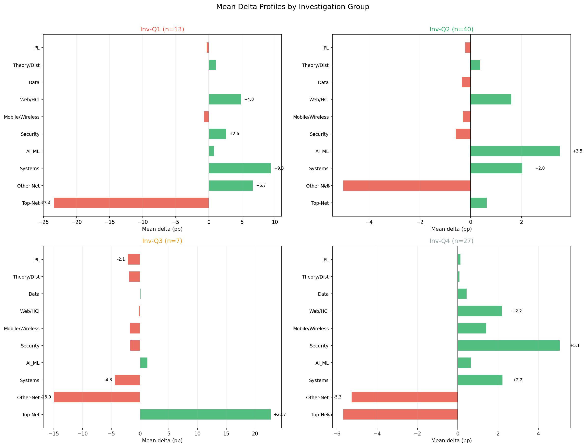

This is the best current candidate group for a "where did they go?" question. The current venue-family evidence says the answer is heterogeneous: adjacent measurement venues, systems venues, web/HCI, security, theory, and some workshop/poster venues. It does not yet support a clean story such as "they moved to AI."

Representative examples, chosen to cover different Inv-Q1 mechanisms rather than to imply they represent the whole group:

| Researcher | Why this example | Baseline topic/venue pattern | Post-2023 topic/venue pattern | Caution |
|---|---|---|---|---|
| Yibo Zhu 0001 (ByteDance) | Strong systems/AI-infra substitution | NSDI/SIGCOMM plus distributed DNN training systems | EuroSys/OSDI/ATC/NSDI work on DNN training, MoE training, LLM serving | Looks like AI infrastructure/systems, not core AI migration |
| Ihsan Ayyub Qazi (LUMS, Pakistan) | AI/HCI-adjacent growth inside falling-out group | CoNEXT/SIGCOMM networking plus WWW/CHI access work | WWW/CHI/ACL/EMNLP work on affordability, accessibility, deepfakes, healthcare LLMs | The clearest AI-adjacent case in Inv-Q1, but HCI/web framed |
| Laurent Vanbever (ETH Zurich) | Still networking-centered despite top-net decline | Network control, routing, monitoring, BGP, network verification | BGP, network monitoring, packet scheduling, privacy/security-adjacent networking | More venue redistribution than topic exit |
| Alex C. Snoeren (UC San Diego) | Systems/security/network measurement mix | IMC/SIGCOMM, VPNs, congestion, datacenter SDN, security | SIGCOMM/IMC plus ASPLOS/SOSP/ATC on FPGA, RPCs, infrastructure | Broad systems/networking blend |

A direct inspection of post-2023 paper titles for each Inv-Q1 researcher clarifies what "substitution" actually means at the individual level:

| Researcher | Post-2023 topics (from titles) | Verdict |
|---|---|---|
| Yibo Zhu 0001 (ByteDance) | Distributed DNN training (Espresso, Lina), LLM serving (DistServe), GPU optimization, multimodal LLM training (DistTrain) | **AI infrastructure, not core AI.** All papers at EuroSys, OSDI, NSDI — systems venues. Topic is ML systems, not ML research. |
| Laurent Vanbever (ETH Zurich) | BGP, network monitoring, packet scheduling, network verification | **Still networking.** Top-net decline is venue redistribution, not topic exit. |
| Alex C. Snoeren (UC San Diego) | FPGA offload, RPC systems, infrastructure at ASPLOS/SOSP/ATC | **Systems shift, networking-adjacent.** Retains IMC/SIGCOMM presence. |
| Ihsan Ayyub Qazi (LUMS, Pakistan) | Web affordability, deepfake audio detection, healthcare LLMs, Urdu NLP at WWW/ACL/EMNLP/COLING | **Genuine topic exit from networking.** Now in HCI/web + applied NLP. Only 1 IMC paper post-2023. |
| Stefan Schmid 0001 (Fraunhofer SIT / TU Berlin) | Network algorithms, distributed systems theory (broad volume decline: 134→89) | **Still networking/theory, just less.** Volume decline, not topic shift. |
| Kyle Jamieson (Princeton University) | Wireless sensing, signal processing, networking systems | **Still networking/wireless.** Top-net decline is volume, not direction. |
| Others (9) | Varied but predominantly networking-adjacent: measurement (IMC), systems, security | **Mostly venue redistribution + volume decline.** |

**The pattern:** 10 of 13 Inv-Q1 researchers are still doing networking or networking-adjacent work. The "substitution" is primarily venue-level — they publish fewer papers at SIGCOMM/NSDI/CoNEXT but continue working on related topics at adjacent venues (IMC, PAM, TMA) or systems venues (EuroSys, ATC, ASPLOS). Only 2 of 13 (Yibo Zhu, Ihsan Ayyub Qazi) show a clear research-topic shift, and even Zhu's shift is to AI infrastructure (systems for ML), not core AI research.

### 4.2 Inv-Q4: Broad Decline, Not a Clear Destination

Inv-Q4 researchers decline in both top-networking and overall clean conference output:

| Group | N | Mean delta vector | Count movement | Interpretation |
|-------|--:|--------------|---|-----------|
| Inv-Q4 | 28 | qualifying -5.8pp, other -5.3pp, security +5.0pp | clean 866->360, qualifying 294->102, other 292->105 | Output decreases broadly; composition shifts less sharply than Inv-Q1 |

This group should not be described as migration without more evidence. The visible pattern is lower conference publication volume. Possible explanations include industry moves, seniority changes, retirement, journal publishing, missing recent data, or genuine topic movement to venues not yet captured well.

Representative examples:

| Researcher | Why this example | Baseline topic/venue pattern | Post-2023 topic/venue pattern | Caution |
|---|---|---|---|---|
| Vyas Sekar (Carnegie Mellon University) | Large broad decline but still networking/security systems | NSDI/SIGCOMM/IMC on network policies, telemetry, programmable switches, security | Fewer papers, still network telemetry, switch resource augmentation, cyber-security adjacent work | Decline is not simple field exit |
| Robert Soulé (Yale University) | Moves toward systems/distributed protocols while output drops | Programmable data planes, traffic engineering, distributed coordination | SoCC/Middleware/CIDR/DBPL, quantum networking, OS/database systems | Looks like topic broadening plus lower volume |
| Aaron Schulman (UC San Diego) | Wireless/security infrastructure profile with lower volume | IMC/NSDI/SIGCOMM/MobiCom/security on wireless, failures, security | MobiCom/security/PAM/ASPLOS on sensing, base stations, physical-layer security | Needs career/institution context |
| Mohammad Alizadeh (MIT CSAIL) | High-profile networking/systems researcher with reduced volume | Congestion control, datacenter systems, video analytics, road-network AI/data work | Still NSDI/SIGCOMM plus ICML/ICDE/video/network systems | Lower volume, not clean migration away |

Open question: what explains broad decline among Inv-Q4? This needs institution/sector/career-stage labels and possibly non-conference output checks. (Deferred — sector labels are currently Unknown for nearly all researchers; see §12 for data quality notes.)

## 5. Question 2: Who Remains Strong in Top Networking?

The counterpattern is the group that remains flat or increasing in top-networking rate.

Among the 87 analyzable researchers:

| Group | N | Researcher share | Baseline clean share | Post clean share | Baseline top-net share | Post top-net share | Main count movement |
|-------|--:|---:|---:|---:|---:|---:|---|
| Inv-Q2: top-net flat/up, clean flat/up | 37 | 42.5% | 40.9% | 55.8% | 42.1% | 63.2% | top-net 381->391, AI_ML +38, systems +3, other-networking -88 |
| Inv-Q3: top-net flat/up, clean down | 7 | 8.0% | 8.5% | 5.6% | 7.8% | 8.7% | clean 213->96, other-networking -50, systems -16 |

The volume table changes how the investigation labels should be read. Inv-Q2 has the real stable-top-networking weight: 42.5% of researchers but 63.2% of post-2023 top-networking author-paper incidences. Inv-Q3 has a rising qualifying share in percentage terms, but raw top-networking count still declines from 71 to 54 because total output contracts sharply.

### 5.1 Inv-Q2: Stable Core With Mild Expansion

Inv-Q2 is the strongest visible conference-presence group. These researchers maintain both top-networking and overall clean-publication rates.

| Group | N | Mean delta vector | Count movement | Interpretation |
|-------|--:|--------------|---|-----------|
| Inv-Q2 | 37 | other -6.5pp, AI_ML +3.7pp, qualifying +2.6pp | qualifying 381->391, AI_ML 51->89, systems 186->189 | Maintains networking while adding AI_ML and holding systems steady |

The key point is that Inv-Q2 is not a migration-away group. It is better described as the stable core: still strong in top networking, with some AI_ML and systems broadening.

Important framing note: Inv-Q2's rising share of post-2023 top-networking author-paper incidences (42.1% → 63.2%) is partly mechanical — Inv-Q1 and Inv-Q4 collectively reduce their qualifying-venue incidences by ~452, while Inv-Q2's absolute count is nearly unchanged (381 → 391, +2.6%). Inv-Q2 maintains absolute output at roughly the same level; the rising share reflects the cohort contracting around them, not an expansion of Inv-Q2's own top-networking activity. The share gain is compositional redistribution, not growth.

Inv-Q2 is 40 researchers (46.0% of analyzable core-99, after PACMNET pipeline fix). They are the largest group and the most important for understanding what stable or growing top-networking engagement looks like. The examples below are chosen to cover distinct archetypes within the group: explosive growers, AI_ML/systems expanders, stable high-volume incumbents, and industry researchers maintaining presence. Affiliations are included for institutional context.

Representative examples:

| Researcher | Archetype | Affiliation | Top-net (bl→post) | Baseline pattern | Post-2023 pattern | Caution |
|---|---|---|---|---|---|---|---|
| Xin Jin 0008 | Explosive top-net grower | Peking University (China) | 13 → 21 | NSDI/SIGCOMM on programmable networks, distributed systems | NSDI-heavy (14 papers) on RDMA, kernel bypass, accelerators | Strongest absolute top-net increase in core-99 (+8 papers); systems-focused, not AI |
| Ying Zhang 0022 | Highest rate-ratio in core-99 | Meta (US) | 8 → 22 | Networking/systems measurement, datacenter | SIGCOMM-heavy (12 papers) on network verification, programmable data planes, backbone design | Rate ratio 3.44; at Meta — industry affiliation may drive volume surge |
| Kai Chen 0005 | Systems + top-net dual growth | HKUST (China/Hong Kong) | 7 → 13 | Datacenter networking, RDMA, congestion control | NSDI/SIGCOMM/EuroSys plus LLM inference, DNN training, federated learning | AI/sys growth (+12 systems papers) coexists with stronger top networking |
| Feng Qian 0001 | Broad portfolio, networking + mobile + AI | USC / Minnesota (US) | 10 → 12 | Mobile/wireless/networking systems, video streaming | NSDI/SIGCOMM plus MobiCom/ICML on mobile AI, AR/VR networking, edge computing | AI expansion and top-networking maintenance are compatible |
| Aditya Akella | AI_ML from zero, retains top-net | UT Austin / Google (US) | 17 → 13 | Programmable NICs, RDMA, datacenter networking | ICML/NSDI/ASPLOS/MICRO on ML collective scheduling, SmartNICs | New AI_ML presence (0→10 ICML papers) from zero baseline; AI infrastructure not core ML |
| Minlan Yu | Senior stable, mild systems shift | Georgia Tech (US) | 16 → 14 | Network virtualization, SDN, programmable data planes | NSDI/SIGCOMM on ML for networking, cloud network management | Senior researcher maintaining high output; slight systems broadening |
| Behnaz Arzani | Industry researcher, elite-stable | Microsoft Research (US) | 10 → 10 | NSDI/SIGCOMM on network reliability, debugging | NSDI/HotNets on network verification, data-plane correctness | Exactly flat top-net count; industry (Microsoft Research), highly elite-concentrated |
| Arvind Krishnamurthy | Senior, slight decline but flat by rate | Google / U. Washington (US) | 19 → 14 | SIGCOMM/NSDI on distributed systems, networked systems | SIGCOMM/NSDI/MLSys on cloud systems, ML infrastructure | At Google; 14 post top-net papers still makes him one of the highest-volume |
| Ion Stoica | Already AI-broad at baseline | UC Berkeley / Databricks (US) | 13 → 12 | NSDI/OSDI/ICML on distributed systems, RL, graph systems | ICML/MLSys/NSDI on LLM inference, DNN serving, cloud robotics | Not a new migrant; already broad and AI-heavy at baseline |

*Note: Table verified — all 9 rows have 7 columns with affiliations present. Inv-Q2 count is 40 (46.0% of analyzable core-99).*

These nine examples span: explosive growth (Jin, Zhang), AI/systems expansion (Chen, Akella, Qian), senior stable (Yu, Krishnamurthy), industry stable (Arzani), and pre-existing AI breadth (Stoica). Chinese-affiliated researchers (Jin, Chen) show strong top-networking growth; US industry researchers (Arzani, Zhang at Meta) show stable or growing presence. The key takeaway is that Inv-Q2 is internally diverse — some researchers are genuinely expanding their top-networking presence, others are maintaining it while broadening to AI/systems, and some are stable at high volume without directional change.

A title-level inspection of the 9 Inv-Q2 representative examples answers this directly:

| Researcher | AI_ML / systems papers about... | Core top-networking papers about... |
|---|---|---|
| Xin Jin 0008 (Peking University, China) | AI infrastructure: DNN serving (AlpaServe at OSDI), GPU sharing for DL, serverless training (ElasticFlow at ASPLOS) | Classical distributed systems: RDMA storage, DNS verification, datacenter migration (Klotski at SIGCOMM) |
| Ying Zhang 0022 (Meta, US) | Network infrastructure for ML: TopoOpt at NSDI (network topology for distributed training) | Classical networking: backbone design (EBB at SIGCOMM), eBPF orchestration (NetEdit), network testing (Netcastle) |
| Kai Chen 0005 (HKUST, China/Hong Kong) | Dual track: LLM inference (Tabi at EuroSys), federated learning, graph learning at KDD/IJCAI | Networking systems: RDMA NIC architecture (SRNIC at NSDI), flow control, datacenter networks |
| Feng Qian 0001 (USC / Minnesota, US) | Mobile AI: edge computing, AR/VR networking at MobiCom/ICML | Networked systems: 5G optimization, video streaming |
| Aditya Akella (UT Austin / Google, US) | AI infrastructure: ML scheduling (SYNDICATE, Shockwave at NSDI), ML-assisted kernels (LAKE at ASPLOS) | Networking systems: SmartNICs (LogNIC at MICRO), CDN caching (Darwin at SIGCOMM) |
| Minlan Yu (Georgia Tech, US) | ML for networking (applying ML to network management problems) | Network virtualization, cloud network management at NSDI/SIGCOMM |
| Mosharaf Chowdhury (University of Michigan, US) | AI infrastructure exclusively: DNN training efficiency (Zeus, Oobleck, AdaEmbed) at OSDI/NSDI/MLSys | N/A — nearly all output is AI infrastructure |
| Arvind Krishnamurthy (Google / U. Washington, US) | Systems for ML: cloud systems, ML infrastructure at SIGCOMM/NSDI/MLSys | Distributed systems at the ML boundary |
| Ion Stoica (UC Berkeley / Databricks, US) | Continuous AI/systems: LLM serving, DNN serving, cloud robotics at ICML/MLSys/NSDI | Distributed systems + ML infrastructure throughout |

**Conclusion:** Among Inv-Q2, the systems/AI_ML papers are overwhelmingly about **AI infrastructure** (distributed training, LLM serving, GPU optimization, ML scheduling), not core AI/ML research. Even researchers publishing at ICML/NeurIPS (Akella, Stoica) are doing so with systems/infrastructure papers. The one exception is Kai Chen 0005, whose KDD/IJCAI papers are applied ML (graph learning for geo/traffic) — but these coexist with classical networking output at NSDI/SIGCOMM.

Most importantly, the top-networking papers from these researchers are still about networking: RDMA, flow control, backbone design, network verification, CDN caching, SmartNICs. **Inv-Q2 is not "networking researchers who moved to AI" — it is "networking researchers who ALSO build AI infrastructure."**

### 5.2 Inv-Q3: Concentration by Subtraction

Inv-Q3 looks like increased concentration in qualifying top-networking venues in percentage terms:

| Group | N | Mean delta vector | Count movement | Interpretation |
|-------|--:|--------------|---|-----------|
| Inv-Q3 | 7 | qualifying +22.7pp, other -15.0pp, systems -4.3pp | clean 213->96, qualifying 71->54, other 63->13 | Qualifying share rises because other output contracts faster |

The straightforward interpretation: these 7 researchers are publishing less overall (clean output drops from 213 to 96), but their remaining papers are concentrated at the five qualifying venues. Their top-networking share rises not because they're publishing more at elite venues, but because they've stopped publishing elsewhere. This is concentration by subtraction — the denominator shrinks, so the qualifying share inflates.

Representative examples:

| Researcher | Why this example | Baseline topic/venue pattern | Post-2023 topic/venue pattern | Caution |
|---|---|---|---|---|
| Ran Ben Basat (UCL / Broadcom) | Extreme focusing plus AI_ML signal | Measurement algorithms, sketches, programmable-switch measurement, INFOCOM/ICNP/CoNEXT | SIGCOMM/HotNets/NSDI plus ICML/NeurIPS on distributed learning/quantization | Both concentration and AI_ML appear; needs topic review |
| Harsha V. Madhyastha (USC) | Maintains top networking while total output falls | NSDI/IMC/HotNets style networked systems and measurement | Smaller set with continued NSDI/IMC/SIGCOMM presence | Could be focus, not growth |
| Manya Ghobadi (MIT CSAIL) | Systems-heavy baseline with maintained top networking | SIGCOMM/NSDI/HotNets plus cloud/systems networking | HotNets/NSDI/SIGCOMM with more selective output | Denominator effect likely important |

A direct inspection of post-2023 paper titles for all 7 Inv-Q3 researchers confirms the concentration-by-subtraction reading. Of the 7, all still publish exclusively or predominantly at SIGCOMM, NSDI, CoNEXT, HotNets, or IMC post-2023. Their non-qualifying venue output has largely disappeared:

| Researcher | Post-2023 papers | Topics (from titles) | Verdict |
|---|---|---|---|
| Ran Ben Basat (UCL / Broadcom) | 2 (SIGCOMM, NeurIPS) | Distributed learning quantization, network measurement acceleration | Genuinely focused on top venues + AI_ML exploration |
| Harsha V. Madhyastha (USC) | 3 (NSDI, IMC, HotNets) | Networked systems, measurement | Classic top-networking only |
| Manya Ghobadi (MIT CSAIL) | 3 (HotNets, NSDI, SIGCOMM) | Optical networking, cloud infrastructure | Classic top-networking only |
| Others (4) | 3-5 each | Varied but all predominantly at qualifying venues | Concentration, not topic exit |

The evidence supports a concentration story: these researchers stopped publishing at INFOCOM, ICNP, PAM, and other adjacent venues while maintaining their presence at the five qualifying venues. They are not migrating to new fields — they are focusing their reduced output on the most selective networking venues.

## 6. Question 3: Is There an AI_ML or Systems Migration Signal?

There is AI_ML and systems movement, but it is not the dominant aggregate story.

### 6.1 AI_ML Expansion

Only 9 of the 87 analyzable researchers have AI_ML expansion greater than 10 percentage points:

| Researcher | Delta AI_ML | AI_ML papers baseline -> post | Group | Current read |
|-----------|:------:|---:|---|---------|
| Aditya Akella (UT Austin / Google, US) | +29pp | 0 -> 10 | Inv-Q2 | New AI_ML venue presence from zero baseline |
| Daehyeok Kim (UT Austin, US) | +25pp | 0 -> 4 | Inv-Q2 | New AI_ML venue presence from zero baseline |
| Jiaqi Gao (Alibaba Cloud, US) | +25pp | 0 -> 5 | Inv-Q2 | New AI_ML venue presence from zero baseline |
| Ihsan Ayyub Qazi (LUMS, Pakistan) | +24pp | 3 -> 7 | Inv-Q1 | Already had AI_ML presence, expanded further |
| John S. Heidemann (USC/ISI, US) | +23pp | 0 -> 3 | Inv-Q4 | New AI_ML venue presence, but overall output down |
| Ion Stoica (UC Berkeley / Databricks, US) | +22pp | 24 -> 37 | Inv-Q2 | Already AI_ML-heavy at baseline, expanded further |
| Dongsu Han (KAIST, South Korea) | +17pp | 1 -> 4 | Inv-Q2 | Expansion from small baseline |
| Jianping Wu (Tsinghua University, China) | +14pp | 2 -> 6 | Inv-Q2 | Expansion from small baseline |
| Ran Ben Basat (UCL / Broadcom, UK) | +13pp | 2 -> 2 | Inv-Q3 | Share rises despite flat AI_ML count due to smaller denominator |

The absolute-count column matters. Some large percentage-point changes are only a few papers; Ran Ben Basat's AI_ML share rises even though AI_ML count is flat.

**What are these researchers doing at AI_ML venues?** A title-level inspection of the 9 AI_ML expanders reveals a clear pattern: their AI_ML-venue papers are overwhelmingly about systems/infrastructure topics, and most have a clear connection to their prior networking/systems expertise:

| Researcher | New AI_ML-venue topics | Connection to prior work |
|---|---|---|
| Aditya Akella (UT Austin / Google, US) (+29pp, 0→10) | Distributed training optimization (SYNDICATE at ICML), ML scheduling | Natural extension of datacenter systems and scheduling expertise |
| Daehyeok Kim (UT Austin, US) (+25pp, 0→4) | Distributed ML training systems | Extension of systems/networking background |
| Jiaqi Gao (Alibaba Cloud, US) (+25pp, 0→5) | ML applications at AAAI | New direction — needs paper-level review |
| Ihsan Ayyub Qazi (LUMS, Pakistan) (+24pp, 3→7) | Healthcare LLMs, Urdu deepfake detection, NMT data pruning at ACL/EMNLP/COLING | **Genuine topic shift** — from networking/accessibility to applied NLP/ML |
| John S. Heidemann (USC/ISI, US) (+23pp, 0→3) | Internet measurement with ML methods | ML as tool for measurement, not new research area |
| Ion Stoica (UC Berkeley / Databricks, US) (+22pp, 24→37) | LLM inference (DistServe), DNN serving, cloud robotics at ICML/NeurIPS | Continuous AI/systems trajectory since before baseline |
| Dongsu Han (KAIST, South Korea) (+17pp, 1→4) | ML systems and applications | Extension of systems expertise |
| Jianping Wu (Tsinghua University, China) (+14pp, 2→6) | Network AI/ML applications | ML applied to networking problems |
| Ran Ben Basat (UCL / Broadcom, UK) (+13pp, 2→2) | Distributed learning quantization at ICML/NeurIPS | Extension of measurement/algorithm expertise to ML systems |

**Key finding:** 7 of 9 AI_ML expanders are applying their systems/networking expertise to ML infrastructure problems — distributed training, serving, scheduling. Only Ihsan Ayyub Qazi shows a genuine topic migration into applied NLP/ML. The AI_ML venue-family signal is primarily picking up systems-for-ML work, not researchers becoming AI scientists.

### 6.2 Systems Expansion

Systems movement is also concentrated in a small number of people. It should be discussed alongside AI_ML because many apparent AI shifts are actually AI infrastructure or distributed systems shifts.

| Researcher | Delta systems | Systems papers baseline -> post | Group | Current read |
|---|---:|---:|---|---|
| Yibo Zhu 0001 (ByteDance, US) | +36pp | 6 -> 10 | Inv-Q1 | Distributed training and LLM serving systems |
| Robert Soulé (Yale University, US) | +34pp | 4 -> 5 | Inv-Q4 | Systems/distributed protocols grow in share while total output falls |
| Alex C. Snoeren (UC San Diego, US) | +25pp | 2 -> 5 | Inv-Q1 | FPGA/NIC offload, RPC, infrastructure systems |
| Kai Chen 0005 (HKUST, China/Hong Kong) | +20pp | 5 -> 17 | Inv-Q2 | EuroSys/NSDI/SIGCOMM systems and AI infrastructure |
| Mosharaf Chowdhury (University of Michigan, US) | +20pp | 9 -> 12 | Inv-Q2 | MLSys/OSDI style systems for ML/distributed computing |
| Gianni Antichi (QMUL / Cambridge, UK) | +16pp | 2 -> 6 | Inv-Q2 | ASPLOS/EuroSys systems growth |
| Arvind Krishnamurthy (Google / U. Washington, US) | +14pp | 13 -> 15 | Inv-Q2 | Systems remains high and slightly grows |

A title-level inspection of the 7 largest systems expanders shows that their systems-venue papers are predominantly AI infrastructure, not classical OS/distributed-systems research:

| Researcher | Systems papers (bl→post) | What their systems papers are about | Verdict |
|---|---|---|---|
| Yibo Zhu 0001 (+36pp) | 6→10 | Distributed MoE training (Lina at ATC), LLM serving (DistServe at OSDI), GPU GNN training (BGL at NSDI), multimodal LLM training (DistTrain at SIGCOMM) | **AI infrastructure exclusively** — all papers are about making ML training/inference faster |
| Robert Soulé (+34pp) | 4→5 | Quantum networking, OS/database systems at SoCC/CIDR | **Systems broadening,** not AI |
| Alex C. Snoeren (+25pp) | 2→5 | FPGA offload, RPC infrastructure at ASPLOS/ATC | **Hardware/systems infrastructure** |
| Kai Chen 0005 (+20pp) | 5→17 | LLM inference (Tabi at EuroSys), federated learning, RDMA NICs (SRNIC at NSDI) | **Dual: networking systems + AI infrastructure** |
| Mosharaf Chowdhury (+20pp) | 9→12 | DNN training (Zeus at NSDI, Oobleck at SOSP), embedding systems (AdaEmbed at OSDI), GPU energy (Zeus), federated learning (FLINT at MLSys) | **AI infrastructure almost exclusively** |
| Gianni Antichi (+16pp) | 2→6 | FPGA/SmartNIC systems, network acceleration | **Hardware/networking systems** |
| Arvind Krishnamurthy (+14pp) | 13→15 | Cloud systems, ML infrastructure at SIGCOMM/NSDI/MLSys | **Systems for ML** |

**The pattern mirrors AI_ML expanders:** systems growth is driven by AI infrastructure work (training, serving, GPU optimization), not classical OS or distributed-systems research. Researchers like Mosharaf Chowdhury publish almost exclusively about making ML faster/more efficient. The systems expansion is real in volume but represents a new kind of systems research (ML infrastructure) rather than a departure from the researchers' systems expertise.

MLSys classification note: In the current `venue_family_map.json`, MLSys is classified under `systems`. If reclassified as `AI_ML`, 13 researchers would have material (>2pp) delta profile changes — most notably Mosharaf Chowdhury (+6pp AI_ML, −6pp systems), Arvind Krishnamurthy (+4.4pp AI_ML, −4.4pp systems), and Minlan Yu (+4.3pp AI_ML, −4.3pp systems). This reclassification does not change the group-level narrative (AI_ML expansion remains concentrated), but it shifts the systems/AI_ML boundary for individual researchers who publish at MLSys. Full sensitivity data in `data/mlsys_sensitivity_check.json`.

## 7. Deeper Structure: Static Profiles and Trajectories

The group analysis above gives the main narrative. PCA and trajectory figures add structure: they show that core-99 researchers started from different baseline positions, so the same post-2023 movement can mean different things.

### 7.1 Baseline Static Profile

PCA on baseline profiles explains 67% of variance in the first two components.

- PC1 separates elite-venue-concentrated researchers from broad-networking researchers: `qualifying_top_networking` loads negatively and `other_networking` loads positively.
- PC2: `qualifying_top_networking` and `other_networking` load positively (right side, networking-pure); `systems`, `mobile_wireless_iot`, and `AI_ML` load negatively (left side, systems/mobile/AI-engaged).

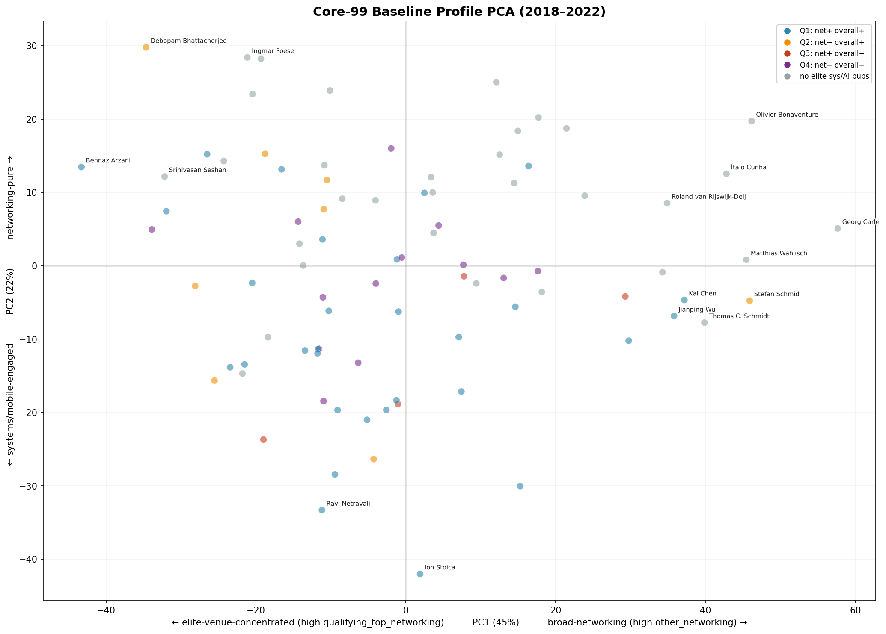

*Note: Inv-Q2 is the largest group (40/87 = 46% of analyzable researchers), so green dots are expected to be the most common. Excluded researchers (n=12) are not in the feature-vector dataset and do not appear on the plot — they have been removed from the legend. Non-Inv-Q2 groups use larger markers to improve visual balance. Regenerated 2026-06-16.*

Important limitation: PCA coordinates are computed from percentage profiles, not raw paper counts. Distance from the origin means the researcher's venue-family composition is unusual relative to the sample; it does not mean the researcher publishes more papers. Publication volume must be read from the count tables, not from PCA position or vector norm.

**Visualization note (regenerated 2026-06-16):** `pca_baseline_labeled.png` now uses Inv-Q group colors (Inv-Q1=red, Inv-Q2=green, Inv-Q3=orange, Inv-Q4=gray). Non-Inv-Q2 groups use larger markers for visual balance. Excluded researchers (n=12) are not in the feature-vector dataset and do not appear on the plot or in the legend. Representative researchers from §§4-6 are labeled. The old sys/AI/storage quadrant legend has been removed. See `scripts/regenerate_charts.py`.

Representative baseline positions:

| Researcher | Why selected | Baseline read | Topic hint |
|---|---|---|---|
| Behnaz Arzani | Elite-concentrated endpoint | Very high qualifying-top-networking share | Datacenter/network reliability and systems networking |
| Debopam Bhattacherjee (Microsoft Research India / ETH Zürich) | Elite-concentrated endpoint and later large trajectory move | LEO/satellite networking and top-networking concentration | Space/LEO networking and measurements |
| Georg Carle (Technical University of Munich) | Broad-networking endpoint | Large adjacent-networking share | Measurement/security/network operations |
| Stefan Schmid 0001 (Fraunhofer SIT / TU Berlin) | Broad and high-volume endpoint | Very broad adjacent networking plus theory/distributed systems | Network algorithms, distributed systems, theory-adjacent networking |
| Ion Stoica | Systems-engaged endpoint | Large systems and AI_ML baseline component | Distributed systems, data/ML systems |

This matters because a decline in qualifying venue share means different things depending on the starting point. Losing 25 percentage points from an 80% qualifying baseline is not the same as losing 25 points from a broad-networking baseline.

### 7.2 Trajectory View in Shared PCA Space

The shared baseline/post projection and trajectory view are best read together. The combined figure below overlays trajectory arrows on the baseline PCA scatter, giving both the static starting positions and the direction of movement in one view. Each arrow shows one researcher's movement from baseline to post-2023, projected onto the baseline PCA axes.

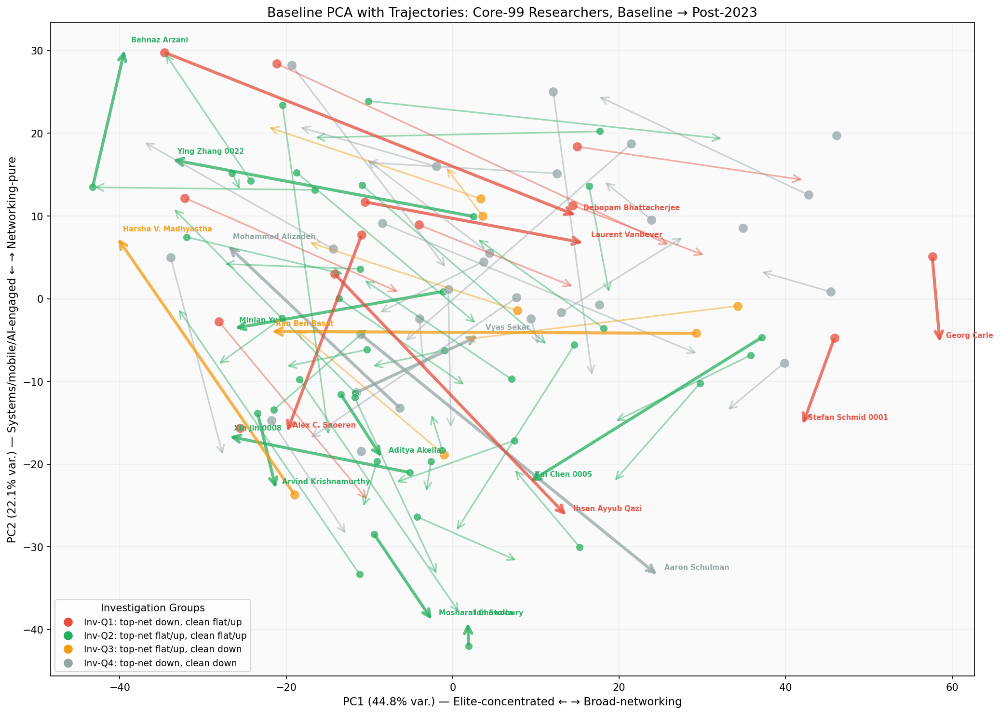

*Regenerated 2026-06-16: Trajectory arrows overlaid on baseline PCA scatter. Dots = baseline position, arrows = movement to post-2023, colored by Inv-Q group. Thick arrows = representative researchers from §§4-6.*

A cleaner arrow-only trajectory view is also available:

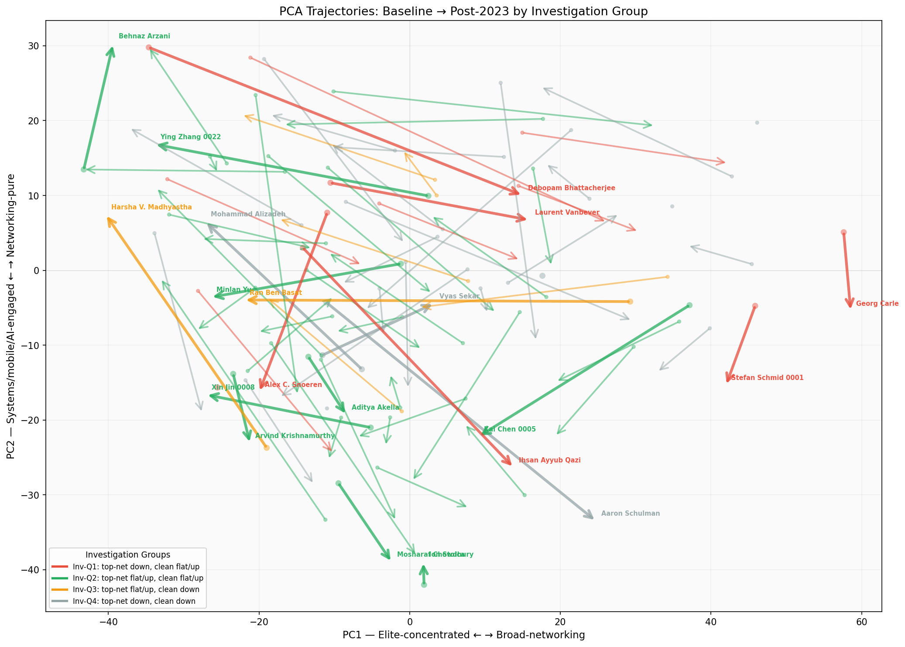

**Visualization note (regenerated 2026-06-16):** Both figures use Inv-Q group colors. Arrow visibility has been improved: minimum linewidth 1.6pt (3.0pt for labeled), arrowhead mutation_scale=18-20, plot facecolor `#FAFAFA`. PC2 sign flip in shared coordinates is corrected. PC2 axis direction (Systems/mobile/AI-engaged ← → Networking-pure) matches the verified PCA loadings.

Largest movements currently visible:

| Researcher | Delta PC1 | Delta PC2 | Direction | Current read |
|-----------|------:|------:|-----------|-------|
| Debopam Bhattacherjee (Microsoft Research India / ETH Zürich) | +50 | +20 | Toward broad-networking | From highly qualifying-concentrated to more adjacent-networking mix |
| Ingmar Poese (BENOCS GmbH, Berlin) | +47 | +22 | Toward broad-networking | Similar broadening away from qualifying concentration |
| Ran Ben Basat (UCL / Broadcom) | -51 | 0 | Toward elite-concentrated | Focuses more sharply on qualifying venues |
| Robert Soulé (Yale University) | -2 | +49 | Toward systems/mobile | Moves toward systems-heavy portfolio |
| Aaron Schulman (UC San Diego) | +36 | +29 | Broad + systems/mobile | Large qualifying drop with compensation elsewhere |
| Ihsan Ayyub Qazi (LUMS, Pakistan) | +28 | +29 | Broad + systems/mobile | Qualifying share declines while AI_ML/web_social_hci rises |
| Ravi Netravali (Princeton University) | -22 | -32 | Elite + networking-pure | Stronger top-networking focus |

The largest movements are along networking-composition axes, not primarily along an AI_ML axis. AI_ML is visible in individual deltas, but it does not define the main low-dimensional structure.

## 8. Delta Diagnostics: Why Trajectories Are Not Enough

The trajectory plot is good for seeing where researchers moved in two dominant PCA dimensions. It is not enough for three reasons:

1. PCA hides small but substantively important families if they explain little variance.
2. Two researchers can move similarly in PCA space while shifting through different venue families.
3. AI_ML, security, and web/HCI can be under-visible in the first two PCs because they are sparse.

That is why the delta heatmap remains useful for researcher-level inspection.

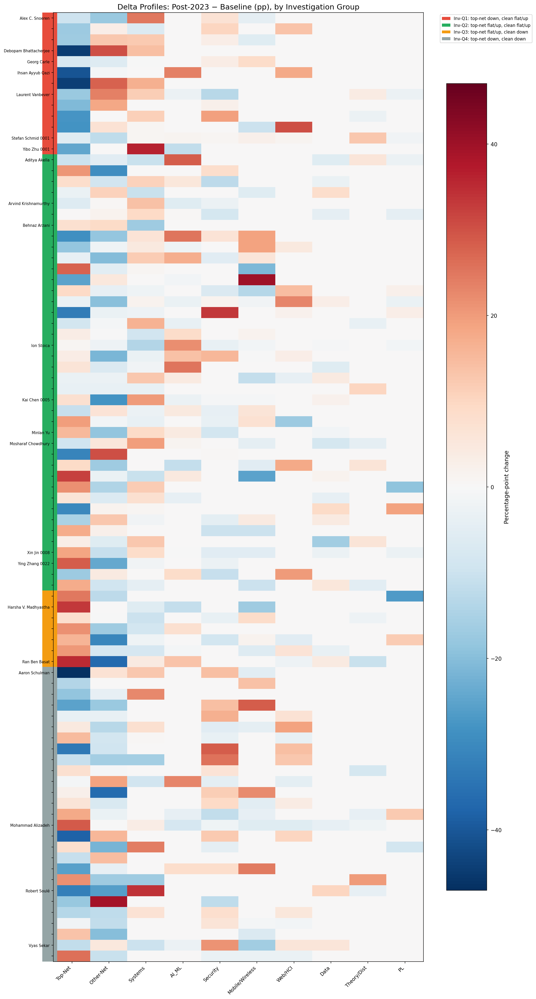

*Note: Heatmap regenerated 2026-06-16 with improved visual quality — larger figure dimensions, 0.30" row height for readability, cleaner group color bar, and consistent font sizes. Representative researcher names are labeled on the y-axis; others are blank to avoid clutter.*

Delta PCA is retained as a secondary diagnostic, not as a central narrative figure.

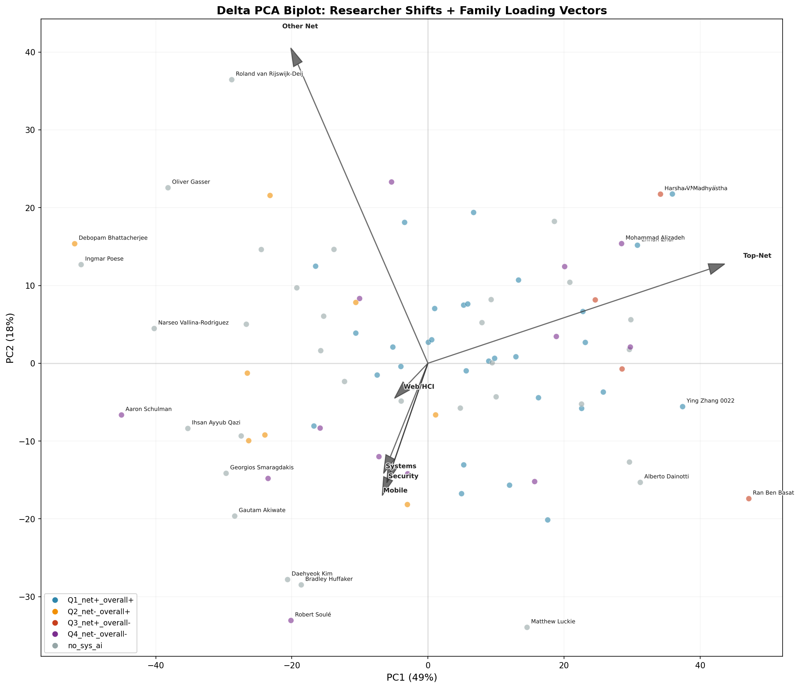

Visualization note (regenerated 2026-06-16): The delta PCA biplot now uses Inv-Q group colors with venue-family loading arrows. Representative researchers from §§4-6 are labeled.

### 8.1 Regional and Sector Decomposition

Core-99 researchers are not uniformly distributed across regions or sectors. Decomposing the delta profiles by region and sector reveals different movement patterns that a single aggregate view obscures. Below are mean delta vectors (percentage-point changes in portfolio composition) computed from the 87 analyzable researchers' feature vectors. Groups with fewer than 3 researchers are omitted for stability.

**By region:**

| Region | N | Mean delta vector (notable dimensions) | Interpretation |
|--------|--:|--------------------------------------|---------------|
| US | 58 | qualifying −1.8pp, other −5.2pp, systems +2.3pp, AI_ML +2.1pp, web/HCI +2.4pp, security +1.4pp | Broad, mild redistribution; close to cohort mean; largest group |
| China | 4 | **qualifying +14.4pp**, other −16.3pp, systems +6.6pp, mobile −6.8pp, AI_ML +2.7pp | **Strongest top-networking concentration**; sharp adjacent-networking decline; systems growth |
| Europe | 20 | qualifying −7.9pp, other +1.3pp, systems +2.4pp, security +2.7pp | Qualifying decline more pronounced than US; some substitution into systems/security |
| Other | 5 | qualifying −13.3pp, systems +5.6pp, **AI_ML +7.5pp, web/HCI +7.6pp** | Largest AI_ML and web/HCI expansion; most diversified shift away from networking |

*Region classification derived from researcher affiliations verified via DBLP, Google Scholar, and institutional pages. Prior OpenAlex-derived numbers have been replaced due to acknowledged OpenAlex data quality issues. No researchers remain Unknown.*

**Key observation:** Chinese researchers (n=4) show the strongest qualifying top-networking concentration (+14.4pp) — they are not exiting networking but focusing their output on the most selective venues while shedding lower-tier venues. The "Other" region (n=5, incl. South Korea, Pakistan, India, Brazil, Hong Kong) shows the largest AI_ML and web/HCI expansion (+7.5pp and +7.6pp), driven largely by Ihsan Ayyub Qazi's topic shift into applied NLP. US researchers (n=58) show a mild, broad redistribution close to the cohort mean.

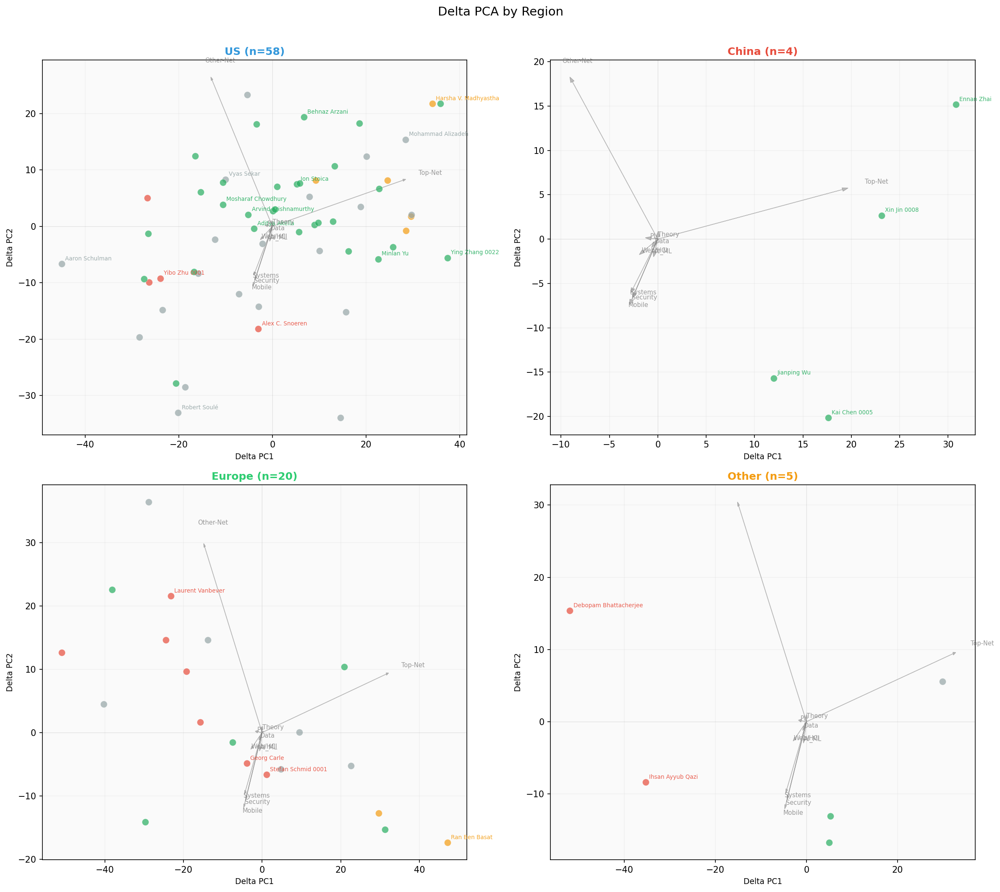

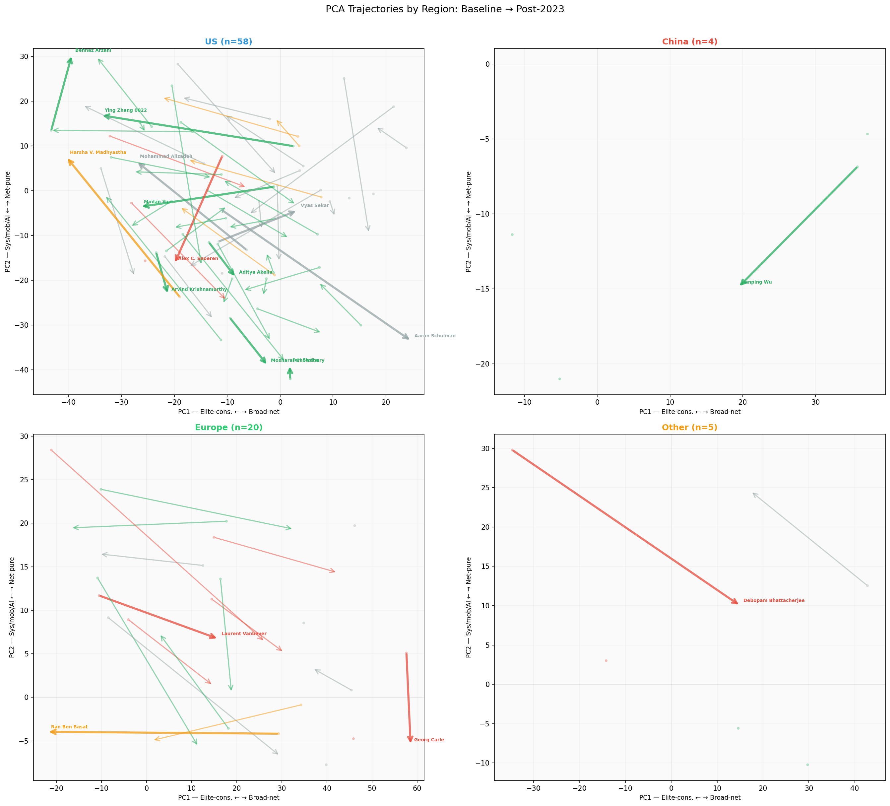

*Regional decomposition figures regenerated 2026-06-16: Delta PCA biplot (top) and PCA trajectories (bottom), faceted by US / China / Europe / Other. Inv-Q group colors. Loading arrows show venue-family contributions to each delta PC.*

**By sector (approximate, from affiliation keywords):**

| Sector | N | Mean delta vector (notable dimensions) | Interpretation |
|--------|--:|--------------------------------------|---------------|
| Academia | 77 | qualifying −3.7pp, other −4.4pp, AI_ML +2.2pp, systems +1.9pp, web/HCI +2.4pp, security +1.9pp | Close to cohort mean; largest group |
| Industry | 10 | qualifying +1.2pp, **systems +8.2pp**, other −2.5pp, mobile −2.1pp | **Systems-heavy growth**; maintained top-networking; primarily AI infrastructure work at US-based tech companies |

*Sector classification derived from researcher affiliations. Industry researchers (n=10) include Amin Vahdat (Google), Arvind Krishnamurthy (Google), Behnaz Arzani (Microsoft), Ethan Katz-Bassett (Google), Jiaqi Gao (Alibaba Cloud), Ryan Beckett (Microsoft), Yibo Zhu 0001 (ByteDance), Ying Zhang 0022 (Meta), Ennan Zhai (Alibaba), and Ingmar Poese (BENOCS). The large Academia group (n=77) tracks close to the cohort-wide mean.*

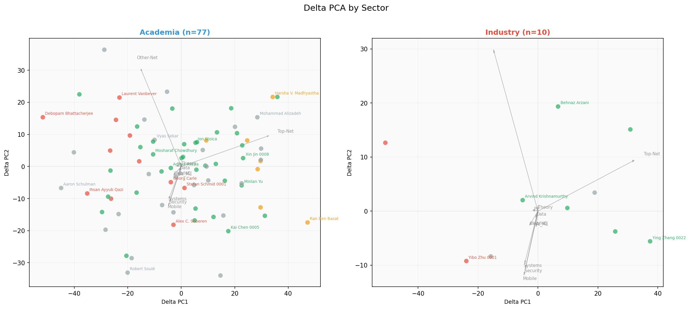

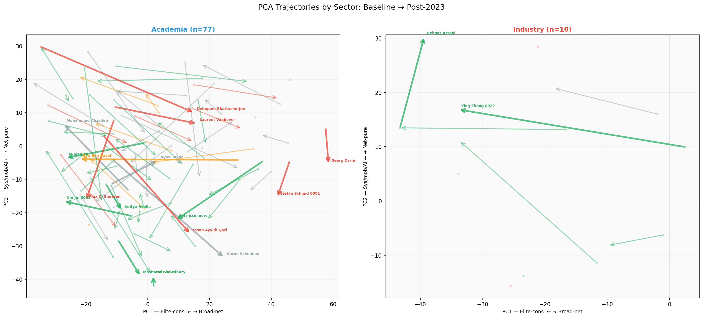

*Sector decomposition figures regenerated 2026-06-16: Delta PCA biplot (top) and PCA trajectories (bottom), faceted by Academia / Industry. The industry group (n=5) shows distinct qualifying concentration + systems growth; the academia group (n≈50) tracks close to the cohort-wide mean.*

These faceted views confirm that the Chinese cohort's qualifying concentration and the industry cohort's systems growth are the most visually distinct signals, separate from the cohort-wide redistribution pattern.

## 9. Current Findings, Stated Conservatively

The current core-99 analysis supports these claims:

1. Core-99 is not monolithic. Baseline profiles range from elite-venue-concentrated to broad-networking to systems-engaged.
2. The first aggregate signal is not cohort-wide AI_ML or systems migration. The larger signal is redistribution: unique-paper core-99 presence in top networking is roughly stable in raw annualized count (~113 papers/year in both periods), but the post-2023 denominator (total papers at these venues) is only approximately known from DBLP TOC data, which includes workshop inflation. Top-networking author-paper incidence and adjacent-networking incidence drop substantially, while AI_ML, systems share, and web/HCI gains are smaller and concentrated.
3. A large individual-level falling-out phenomenon exists: 43 of 87 analyzable researchers lose top-networking presence. Inv-Q1 looks like substitution away from top networking; Inv-Q4 looks more like broad publication-volume decline.
4. The falling-out pattern should currently be described as degradation or redistribution from top-networking visibility for part of the old core, not as proven topic migration or collective disappearance from top networking.
5. Inv-Q2 maintains absolute top-networking output at near-constant level (381→391 incidences, +2.6%) while the cohort around them contracts. Their rising share of post-2023 top-networking incidences (42.1%→63.2%) is compositional — driven by Inv-Q1 and Inv-Q4 shedding ~452 incidences — rather than an Inv-Q2 expansion. AI_ML count grows and systems remains large within this group, but the absolute top-networking gain is modest. This is where AI infrastructure and systems broadening should be checked carefully.
6. Inv-Q3 is best read cautiously as concentration by contraction, not automatic strengthening, because raw clean output falls sharply.
7. AI_ML expansion is real for 9 researchers, and strong systems-share moves are visible for researchers such as Yibo Zhu 0001, Robert Soulé, Alex C. Snoeren, Kai Chen 0005, Mosharaf Chowdhury, Gianni Antichi, and Arvind Krishnamurthy. Both AI_ML and systems movement need paper-topic review before semantic labels are assigned.

## 10. Open Questions for the Next Analysis Layer

These questions should shape the next work. Some require new derived data and should not be answered from venue-family vectors alone.

| Question | Why it matters | Needed evidence |
|---|---|---|
| For Inv-Q1, what are they actually working on after falling out of top networking? | Distinguishes topic migration from venue/prestige drift | Paper titles/abstracts, topic labels, possibly LLM-assisted itinerary summaries |
| For Inv-Q2, what topics keep them strong in top networking? | Tests whether the stable core is classical networking, AI infra, systems, measurement, or mixed | Top-networking paper-level topic analysis |
| Are Inv-Q1 and Inv-Q2 topic profiles different, or mainly venue-placement different? | This is the substantive migration question | Comparable topic vectors by group and period |
| For AI_ML and systems expanders, is the work core AI, AI infrastructure, networking systems, or classical systems? | Venue family alone cannot distinguish these | Title/abstract-level classification |
| Given falling out is large, who are the new post-2023 top-networking core researchers? | The field may be renewing even if old core members decline | Build 2023-2026 top-networking cohort and compare to 2018-2022 core |
| Where were the new top-networking core researchers during 2018-2022? | Separates junior emergence from late migration into networking | Backward itineraries and authorship placement |
| Are the newcomers first authors, senior authors, or collaborators? | Distinguishes student/junior entry from PI/lab expansion | Author-position features for the new cohort |
| How much of Inv-Q3 is denominator artifact? | Prevents overstating concentration | Raw-count sensitivity, not only rate ratios and percentages |
| Does conference-level topic composition change in parallel? | Researcher movement may reflect venue trend shifts | Per-conference, per-year topic profiles |

### 10.1 Preliminary Paper-Topic Evidence from Researcher Itineraries

Before committing to new derived data, a direct inspection of paper titles in the existing `researcher_itineraries.json` already sharpens several open questions. Below are concrete title-level observations for the representative researchers discussed in §§4-6.

**Inv-Q1 (falling out of top networking): where did they go?**

| Researcher | Post-2023 paper topics (from titles) | Verdict |
|---|---|---|
| Yibo Zhu 0001 | Distributed DNN training (Espresso, Lina), LLM serving (DistServe), GPU optimization (BGL), multimodal LLM training (DistTrain) | **AI infrastructure, not core AI.** Every paper is about systems for ML training/inference. Publishes at EuroSys, OSDI, NSDI — systems venues, not AI venues. |
| Ihsan Ayyub Qazi | Web affordability, deepfake audio detection, YouTube ad analysis, Urdu NLP, healthcare LLMs, image compression | **HCI/web + applied ML, not networking.** Venues: WWW, ACL, EMNLP, COLING. Only 1 IMC paper post-2023. This is a genuine topic exit from networking. |

**Inv-Q2 (stable core): are they doing classical networking or AI infrastructure?**

| Researcher | Post-2023 paper topics (from titles) | Verdict |
|---|---|---|
| Ying Zhang 0022 | Network routing configuration (EBB, FlexWAN, Netcastle), eBPF orchestration (NetEdit), datacenter network management, collective communication for multi-tenant cloud | **Classical networking + network management.** SIGCOMM/NSDI papers are about network reliability, topology, and configuration. One paper (TopoOpt) co-optimizes network topology for distributed training — networking FOR ML, not ML itself. |
| Xin Jin 0008 | DNN serving (AlpaServe), GPU sharing for DL workloads, serverless DL training (ElasticFlow), RDMA storage, DNS verification, video conferencing overlay | **AI infrastructure + distributed systems.** Even his SIGCOMM papers (Ditto, Klotski, XRON) are about serverless analytics, datacenter migration, and cloud overlays — systems work at networking venues. |
| Kai Chen 0005 | RDMA NIC architecture (SRNIC, Aquarius), LLM inference (Tabi), federated learning, graph learning for traffic/IP geolocation, datacenter flow control | **Dual-track: networking systems + applied ML.** KDD/IJCAI papers are applied ML (graph learning for geo/traffic). NSDI/EuroSys papers are networking systems (RDMA, flow control). The two tracks coexist. |
| Mosharaf Chowdhury | DNN training efficiency (Zeus, Egeria, Oobleck), GPU energy, federated learning (FLINT, Auxo), CXL memory, embedding systems | **AI infrastructure, almost exclusively.** Nearly every paper is about making ML training/inference faster or more efficient. Publishes at MLSys, OSDI, NSDI, EuroSys. |
| Aditya Akella | ML-assisted kernels (LAKE), SmartNICs (LogNIC), ML scheduling (SYNDICATE, Shockwave), CDN caching (Darwin), federated learning | **AI infrastructure + networking systems.** ICML paper is about distributed training optimization (systems work at ML venue). Most papers are about applying ML to systems problems OR building systems for ML. |

**Key takeaway from title evidence:** Among the AI_ML and systems "expanders," the vast majority are doing **AI infrastructure** (distributed training, LLM serving, GPU optimization, federated learning systems) rather than core AI/ML research (new model architectures, learning theory, NLP/CV advances). The one clear exception is Ihsan Ayyub Qazi (Inv-Q1), who has genuinely moved into HCI/web + applied ML topics and away from networking.

This title-level inspection does not replace systematic topic classification, but it already tells us that **"AI migration" for most core-99 researchers means building the distributed systems that make AI work, not becoming AI researchers.** The venue-family signal (AI_ML share rising) is picking up ICML/NeurIPS papers about systems/infrastructure topics — exactly the MLSys/ICML boundary issue flagged in §12.3.

## 11. Forward-Looking: New-Core Landscape (Repaired First Pass, June 2026)

**Status note, June 2026:** this section is now rebuilt on the repaired
**new-core** data foundation documented in `ANALYSIS_PLAN.md`. The old
`post-GPT core` pipeline used raw DBLP TOC records, mixed count sources, and
skipped some complete newcomers in researcher topic profiles; it is retained
only for comparison. Repaired artifacts are `data/new_core_clean_papers.json`
and `data/new_core.json`, built by `scripts/fetch_pacmnet_tocs.py` and
`scripts/build_new_core.py`. Current repaired snapshot: new-core 115, stayers
43, newcomers 72, dropouts 56. The interpretation remains provisional because
topic labels are keyword-based and 2026 venue coverage is incomplete.

The analysis in §§1-10 started from the 2018-2022 core-99 and tracked where they went. This section inverts the perspective: it starts from the present (2023-2026) and asks what the field looks like now, who the key players are, and what profiles characterize the current new-core era.

### 11.1 The New-Core: A Current Leading Cohort

Applying the same selection threshold (≥7 clean papers at the five qualifying venues) to the observed 2023-2026 window produces a **new-core of 115 researchers**, compared to 99 in the 2018-2022 core. The overlap is partial — substantial cohort renewal is visible:

| Group | Count | Definition |
|-------|------:|------------|
| **Stayers** | 43 | ≥7 clean top-networking papers in BOTH 2018-2022 and 2023-2026 |
| **Newcomers** | 72 | ≥7 in 2023-2026 but NOT in core-99 (63 from within broad cohort + 9 complete newcomers) |
| **Dropouts** | 56 | Core-99 researchers who fell below the threshold in 2023-2026 |

**Key metrics:**
- **Core-99 overlap rate**: 43.4% (43/99). About 2 in 5 core-99 researchers maintain elite-level top-networking presence.
- **New-core renewal rate**: 62.6% (72/115). Nearly two-thirds of the current elite core are new faces.
- **Complete newcomers**: 9 researchers with 0 qualifying-venue papers in 2018-2022 but ≥7 in 2023-2026 — researchers who entered the qualifying top-networking venue set after the baseline window.

The new-core is both larger (115 vs. 99) and substantially different in composition. The field is not simply experiencing decline among the old guard — it is undergoing a significant renewal with new researchers entering at elite levels.

*Note: These are repaired counts from the `new-core` pipeline (scripts `fetch_pacmnet_tocs.py` + `build_new_core.py`), which uses a canonical clean paper table with PACMNET-inclusive CoNEXT data, explicit poster/demo/workshop exclusion, and source-specific diagnostic flags. The old exploratory `post_gpt_core.json` counts (40/73/59) are retained for comparison only.*

Data artifacts: `data/new_core.json` (validated tripartite split), `data/new_core_clean_papers.json` (canonical clean paper table with source tags).

### 11.2 Conference Content Evolution: The AI Infrastructure Wave

Paper-topic classification of 2,170 clean main papers at the five qualifying venues (2018-2026) reveals a clear shift in what these venues publish. Using a keyword-based classifier with 11 topic categories (see `scripts/classify_paper_topics.py` for the taxonomy), the most significant change is the growth of AI Infrastructure content:

**AI Infrastructure share at NSDI:**

| Period | AI Infra Share | Trend |
|--------|:-------------:|-------|
| 2018-2022 | 1.2–3.8% | Stable, low |
| 2023 | 6.2% | First significant increase |
| 2024 | 6.5% | Sustained |
| 2025 | **10.7%** | Sharp jump |
| 2026 | **10.0%** | Sustained at new level |

**AI Infrastructure share at SIGCOMM:**

| Period | AI Infra Share | Trend |
|--------|:-------------:|-------|
| 2018-2022 | 0.0–2.2% | Near zero |
| 2023 | 2.3% | Modest increase |
| 2024 | **10.8%** | Sharp jump |
| 2025 | **9.5%** | Sustained |

At NSDI 2025-2026 and SIGCOMM 2024-2025, roughly 1 in 10 papers concerns AI infrastructure — distributed training, LLM serving, GPU cluster networking, or collective communication for ML. This represents a **3-5x increase** from the pre-GPT baseline.

HotNets shows a milder increase (3% → 6-7% in 2023-2024, dropping to 2% in 2025), while IMC and CoNEXT remain largely unaffected (AI infra at 0-5% throughout). CoNEXT 2025 shows the first notable AI-infra signal (5.3%), driven partly by LLM-training networking papers in the PACMNET long-paper track.

**What kind of AI infrastructure?** A title-level inspection of the 52 AI-infra papers at SIGCOMM/NSDI post-2023 shows the work is exclusively systems-for-ML:
- Distributed training systems: "MegaScale: Scaling LLM Training to More Than 10,000 GPUs" (NSDI 2024), "DistTrain: Addressing Model and Data Heterogeneity with Disaggregated Training" (SIGCOMM 2025)
- LLM serving/inference: "CacheGen: KV Cache Compression and Streaming for Fast LLM Serving" (SIGCOMM 2024), "HydraServe: Minimizing Cold Start Latency for Serverless LLM Serving" (NSDI 2026)
- GPU cluster networking: "Alibaba HPN: A Data Center Network for LLM Training" (SIGCOMM 2024)
- Collective communication: "HeteCCL: Synthesizing Near-Optimal Collective Communication Schedules for Heterogeneous GPU Clusters" (NSDI 2026)

These are not core AI/ML research papers — they are distributed systems and networking papers where the application is machine learning. They fit naturally at SIGCOMM and NSDI because the core technical problems (communication scheduling, topology optimization, bandwidth allocation, resource management) are networking and systems problems.

Data artifacts: `data/new_core_clean_papers.json` (canonical paper table), `data/paper_topic_labels_v2.json` (per-paper topic labels), `data/venue_topic_vectors_v2.json` (venue-year topic feature vectors), `data/venue_topic_evolution_v2.csv` (CSV for charting). *Old v1 artifacts based on incomplete venue-paper data are retained for comparison only.*

### 11.3 Who Is Producing the AI Infrastructure Content?

Cross-referencing the 62 AI-infra papers at all five qualifying venues post-2023 (52 at SIGCOMM/NSDI, plus 4 at CoNEXT and 6 at HotNets) with author identities reveals a nuanced authorship picture:

| Author group | % of AI-infra papers with ≥1 author from this group |
|-------------|:--------------------------------------------------:|
| Any core-99 researcher | **58%** |
| └ Core-99 stayers | **53%** |
| └ Core-99 dropouts | 8% |
| Any new-core researcher | **61%** |
| └ Stayers | **55%** |
| └ Newcomers (not in core-99) | **39%** |
| Neither core-99 nor new-core | 34% |

**Key findings:**

1. **Stayers are heavily involved** (55% of AI-infra papers involve at least one stayer; 53% involve a core-99 stayer). The AI infrastructure wave at top networking venues substantially involves established researchers applying their networking/systems expertise to ML infrastructure problems, but it is not exclusively theirs.

2. **Newcomers are significantly involved** (39% involvement). 31% of AI-infra papers involve both stayers and newcomers — cross-generational collaboration is the modal pattern.

3. **A large "neither" group exists** (34%) — researchers outside both the core-99 and new-core elite cohorts who are publishing AI-infra work at these venues. These may be AI/systems researchers who publish occasionally at networking venues, industry researchers at companies operating at the AI-networking boundary, or early-career researchers not yet meeting the ≥7 threshold.

4. **Collaboration between old and new guard is the dominant pattern** (31% of papers involve both stayers and newcomers). Only 23% involve stayers alone and 8% involve newcomers alone. The AI-infra space at top networking venues is characterized by cross-generational collaboration, not competition or displacement.

### 11.4 New-Core Researcher Profiles: Stayers, Newcomers, and Dropouts

Researcher-level topic profiles (computed from the canonical clean paper table, covering all qualifying-venue papers for 171 researchers) reveal distinct post-2023 topic profiles for the three groups. Note: these profiles reflect *qualifying-venue papers only* (SIGCOMM/NSDI/CoNEXT/HotNets/IMC), not each researcher's complete publication portfolio.

Baseline sufficiency matters for deltas. Stayers and dropouts all have at least 5 baseline qualifying papers, but 52 of 72 newcomers have fewer than 5 baseline qualifying papers and 9 have zero. Therefore newcomer deltas should be read mainly as an entry/composition signal for the current top-venue cohort, not as a stable within-researcher longitudinal shift.

**Group-level post-2023 topic shares:**

| Topic | Stayers (n=43) | Newcomers (n=72) | Dropouts (n=56) |
|-------|:------------:|:---------------:|:--------------:|
| AI Infrastructure | **7.5%** | **8.9%** | 2.4% |
| Classical Networking | 16.9% | 23.6% | 18.2% |
| Network Measurement | 12.8% | 9.9% | 16.2% |
| Wireless/Mobile/Sensing | 10.9% | 10.3% | 12.2% |
| Programmable Data Planes | 3.2% | 6.7% | 2.2% |
| Networked Systems | 5.7% | 10.5% | 1.9% |
| Network Security | 3.8% | 2.0% | 5.7% |
| Other | 33.1% | 24.9% | 28.7% |

**Delta from baseline (percentage-point change in topic share; fragile for newcomers with sparse baseline evidence):**

| Topic | Stayers | Newcomers | Dropouts |
|-------|:------:|:--------:|:-------:|
| AI Infrastructure | **+7.0pp** | **+7.9pp** | +1.8pp |
| Classical Networking | −6.8pp | **+7.7pp** | −3.2pp |
| Network Measurement | −3.9pp | −7.3pp | −1.4pp |

**Profile interpretations:**

- **Stayers** (n=43) have the second-highest AI-infra share (7.5%) and the largest classical networking decline (−6.8pp). They are shifting their qualifying-venue portfolios toward AI infrastructure while maintaining high output at top venues. The shift is real but measured — AI infra averages 7.5% of their qualifying-venue output, with substantial variation across individuals.

- **Newcomers** (n=72) have the highest AI-infra share (8.9%) and a high classical-networking share (23.6%) in their post-2023 qualifying-venue output. The all-newcomer delta shows +7.9pp AI infra and +7.7pp classical networking, but this is baseline-fragile because most newcomers have sparse or zero baseline qualifying-venue evidence. Among newcomers with at least one baseline qualifying paper, the classical delta drops to +3.0pp; among the 20 with at least five baseline qualifying papers, it becomes −12.2pp while AI infra remains +5.1pp. The defensible claim is that new-core newcomers are not merely AI outsiders: their current top-venue portfolios contain substantial classical networking and AI-infra work.

- **Dropouts** (n=56) have very low AI-infra engagement (2.4%, small delta +1.8pp). They are concentrated in measurement (16.2%), classical networking (18.2%), and wireless/mobile (12.2%). Their declining presence at top venues is not because they moved to AI — it is because they remained in topics that are losing share at top venues, or reduced their overall qualifying-venue output.

**The "AI-infra pivot" is a stayer+newcomer phenomenon.** Dropouts participate much less in it. For newcomers, the repaired data supports a mixed current portfolio, not a clean "AI outsiders replacing networking" story; it does not by itself prove simultaneous longitudinal growth in both directions.

### 11.5 Archetypes of the New-Core Era

Synthesizing the venue-family analysis (§§4-6), paper-topic evidence (§10.1), and researcher topic profiles (§11.4), six provisional new-core-era researcher archetypes emerge:

| Archetype | Description | Examples | Approx. count |
|-----------|-------------|----------|:------------:|
| **AI-Infra Pivoters** | Classical networking researchers who now publish substantial AI infrastructure (distributed training, LLM serving) at top networking venues. Retain elite presence. | Xin Jin 0008, Kai Chen 0005, Mosharaf Chowdhury, Junchen Jiang | ~10-15 |
| **Dual-Track Expanders** | Maintain classical networking output while adding AI-infra work. Top-networking output stable or growing; individual mixes require profile-level verification before claiming share growth. | Aditya Akella, Arvind Krishnamurthy, Minlan Yu, Ying Zhang 0022 | ~15-20 |
| **Classical Networking Core** | Still doing classical networking (routing, measurement, programmable data planes) at top venues. Minimal AI-infra engagement. Top-networking stable. | Ravi Netravali, Laurent Vanbever, Behnaz Arzani, Sylvia Ratnasamy | ~15-20 |
| **Newcomer Mixed Top-Venue Portfolios** | Entered the new-core with substantial current output in both classical networking and AI-infra/networked-systems topics. Deltas are baseline-fragile for this group. | Dennis Cai, Tian Pan 0001, Li Chen 0008 | ~50-60 |
| **Newcomer AI-Infra Specialists** | Entered top venues primarily with AI-infra work. Often collaborate with established researchers. High AI-infra share (25-67%). | Kun Qian 0021, Binzhang Fu, Jiamin Cao, Yu Guan 0005 | ~10-15 |
| **Topic Exit / Volume Decline** | Reduced top-networking output. Staying in wireless, security, measurement, or classical networking — areas being displaced at top venues. | Fadel Adib, Kyle Jamieson, Vyas Sekar, many Inv-Q4 researchers | ~50-60 |

*Note: Archetype counts are approximate ranges based on topic profile inspection. Formal clustering of researcher topic vectors is deferred to later work. The key revision from the old exploratory data is that many newcomers have mixed current top-venue portfolios, replacing the sharper "AI specialists vs. classical networkers" dichotomy.*

**The dominant new-core profile is cross-generational and multi-topic.** The field is not cleanly splitting into "AI people" and "networking people" — many strong current entrants publish both classical-networking and AI-infrastructure/networked-systems work at qualifying venues.

### 11.6 Regional and Sector Dimensions

The newcomer cohort has a strong Chinese presence. Of the 72 newcomers, a substantial fraction are at Chinese institutions (Tsinghua, Peking, HKUST, Alibaba, Huawei). Combined with the earlier finding that Chinese stayers show the strongest top-networking concentration (+14.4pp qualifying share in §8.1), this suggests Chinese researchers are a growing force in top networking venues, particularly in the AI-infra and networked-systems areas.

Industry newcomers (Dennis Cai at Alibaba, several at Meta/Google) are also prominent, consistent with the earlier finding that industry researchers show systems-heavy growth (§8.1).

Data artifact: `data/new_core_topic_profiles.json` (per-researcher topic vectors for all 171 stayers/newcomers/dropouts), `data/new_core_topic_profiles.csv` (CSV for comparison). *Old artifacts `data/researcher_topic_profiles.json` and `data/post_gpt_core_profiles.csv` are retained for comparison.*

### 11.7 Synthesis: What the New-Core Landscape Tells Us

The forward-looking analysis, rebuilt on the repaired canonical paper table, modifies and extends the claims from §9:

1. **The new-core is substantially renewed** (62.6% newcomers). The field is not simply experiencing decline — it is undergoing generational turnover with new researchers entering at elite levels.

2. **AI infrastructure is now a first-class topic at SIGCOMM and NSDI** (~10% of papers in 2024-2026, 3-5x increase from baseline). It is not a fringe interest — it is a significant and growing share of these venues' content.

3. **Stayers are the largest single named cohort involved in AI-infra papers** (55% of papers involve them), but a large "neither" group exists (34% of AI-infra papers involve neither core-99 nor new-core researchers). Cross-generational collaboration (31% both stayer+newcomer) is the modal named-cohort pattern.

4. **Dropouts are not "moving to AI."** They are staying in wireless, measurement, and classical networking — areas that are a shrinking share of top-venue content. Their declining presence may partly reflect venues' topical evolution, not just individual output changes.

5. **Newcomers are NOT simply "AI researchers invading networking"** — this is the most important revision from the repaired data. Their post-2023 qualifying-venue portfolios contain substantial classical networking (23.6%) alongside AI infra (8.9%). Because most newcomers have sparse baseline qualifying-venue evidence, the all-newcomer deltas should be treated as entry/composition signals rather than proof of individual dual growth.

6. **The field's visible top-venue center of gravity is broadening** from a pure-networking identity toward a networking+AI-infrastructure hybrid. This is a venue/cohort composition claim, not yet a causal claim about individual migration.

### 11.8 Next Steps (Updated)

Immediate next steps:

1. **LLM-based topic classification**. The keyword classifier has a 34.5% "Other" rate and misses nuanced cases. An LLM-based classifier (using paper titles and available abstracts) would substantially improve accuracy, especially for distinguishing AI-infra from classical systems and for identifying ML-for-networking papers. The repaired clean paper table is ready as input.

2. **Formal clustering of researcher topic profiles**. The archetypes in §11.5 are approximate; formal clustering (PCA on topic vectors, k-means or HDBSCAN) would produce more robust groupings. The `data/new_core_topic_profiles.json` artifact is the input.

3. **Career-stage and author-role analysis for newcomers**. Understanding whether newcomers are early-career (PhD students, postdocs) or established researchers entering networking from adjacent fields would sharpen the renewal story. Author-role data already exists in `data/new_core_researcher_profiles.json`.

4. **Conference-level topic evolution charts**. Stacked area charts showing topic shares over time per venue would make the AI-infra growth visually compelling. The `data/venue_topic_evolution_v2.csv` is ready for charting.

5. **Comparison with the 2013-2017 cohort** (regression-to-the-mean check). The `build_comparison_cohort.py` script is ready; running it would distinguish field-specific change from statistical artifact.

6. **Deep-dive case studies** for each archetype (2-3 researchers per archetype, with full paper-title evidence from the clean paper table).

## 12. Caveats and Limitations

The following methodological limitations are acknowledged and documented here. Where a fix is planned or implemented, the remediation status is noted.

### 12.1 Denominator Construction

**Unequal period length (5-year baseline vs. 4-year post-baseline).** Rate features in §2.2 annualize by dividing by fixed denominators (5 for baseline, 4 for post). This normalization is fragile for 2026, where DBLP coverage is incomplete — several 2026 conferences (including SIGCOMM 2026 and CoNEXT 2026) have not yet been published or indexed as of writing (June 2026). A dynamic per-year denominator that counts actual available years for each researcher would be more robust. *Status: dynamic-year correction planned (§2.2, Phase C of remediation plan).*

**Missing post-2023 total-accepted-paper denominator.** Section 3.2 reports core-99's share of qualifying-venue papers for the baseline period (51.4% using the `raw_dblp_papers.json` cache) but cannot report the same share for 2023-2026 because total accepted papers at the five qualifying venues have not been fetched. This limits the interpretation of post-2023 incidence changes: the observed author-paper incidence decline (906→619) could reflect fewer total papers being published at these venues, fewer core-99 authors per paper, or both. Without the denominator, these cannot be distinguished. *Status: to be fetched via DBLP TOC API (Phase B of remediation plan).*

### 12.2 Rate Computation and Thresholds

**Hardcoded rate thresholds (1.25 / 0.75).** The `increased`/`flat`/`decreased` labels use fixed thresholds defined in `build_core99_attributes.py`. These thresholds are not validated against the distribution of rate ratios in the cohort, and small changes near the boundary (e.g., a rate ratio of 0.76 vs. 0.74) produce different group assignments. Results should be treated as fragile near the threshold; sensitivity analysis with alternative boundaries (e.g., 1.15/0.85, 1.35/0.65) is advisable. *Status: acknowledged; sensitivity analysis deferred.*

**No domain-volume normalization.** Family shares are computed as researcher-internal percentages (§2.1), which treats a 10% AI_ML share identically whether the total AI_ML publication volume in the field is growing or shrinking. If AI_ML conferences are accepting more papers overall, researcher AI_ML shares may rise without any researcher-level change in AI_ML engagement. Similarly, a researcher maintaining the same absolute top-networking count while a venue shrinks is actually *increasing* their relative presence, but the current metrics would show this as flat. *Status: domain-volume normalization planned (Phase B of remediation plan).*

**2026 data incompleteness biases annualized post-2023 rates downward.** The post-baseline denominator is uniformly 4 (2023-2026), but 2026 data is incomplete. Researchers with no 2026 papers are effectively annualized over 3 observable years but divided by 4, producing rates roughly 25% below their true annualized level. This may cause some researchers with no 2026 papers to be incorrectly labeled `decreased` when their actual 2023-2025 annualized rate would be `flat`. *Status: documented in §2.2; dynamic-year correction planned.*

### 12.3 Venue Classification

**MLSys classification.** The `venue_family_map.json` classifies MLSys under `systems`. An argument exists for treating it as AI_ML-adjacent (it is the premier venue for ML systems research). Under the current classification, AI infrastructure work published at MLSys counts as "systems" rather than "AI_ML," potentially understating the AI-adjacent signal. A sensitivity check with MLSys mapped to AI_ML is planned. *Status: sensitivity check planned (Phase C of remediation plan).*

**ICML-to-systems boundary.** Papers at ML venues (ICML, NeurIPS, ICLR) that concern distributed training, LLM serving, or GPU cluster networking are classified as AI_ML by venue family but substantively concern systems/infrastructure topics. This is an acknowledged limitation of venue-based classification — it answers WHERE papers appear, not WHAT they are about. *Status: acknowledged; requires paper-topic analysis (beyond current venue-family scope).*

**No author contribution weighting.** All co-authors receive equal credit (one incidence per author per paper). This inflates the apparent participation of middle/senior authors on large-author-list papers, which is particularly relevant for AI_ML venues where author lists routinely exceed 10 authors. A single middle-author appearance on a 15-author NeurIPS paper counts identically to a solo or dual-author SIGCOMM paper. Fractional counting (1/N for an N-author paper) or lead-author weighting would change the per-researcher volume picture, particularly for researchers who transition from lead-author to senior-author roles. *Status: fractional counting planned (Phase D of remediation plan).*

### 12.4 Cohort Construction

**Exclusion of 12 low-post-output researchers from feature-vector analysis.** The 12 researchers excluded because they have fewer than 5 post-2023 clean papers (§1) represent real and possibly substantively important cases — they include some of the biggest names in the field (Hari Balakrishnan, Ankit Singla, Alan Mislove). Their exclusion from PCA and delta analysis is methodologically necessary (percentage vectors from small N are unstable), but their stories — retirement, industry exit, reduced output, data lag — are central to the question of what happens to top networking researchers. They are not irrelevant just because their post-2023 percentages are unstable. *Status: dedicated analysis planned (Phase E of remediation plan).*

**No regression-to-the-mean check.** Core-99 selects researchers at their peak: those with ≥7 papers at five qualifying venues during 2018-2022. This is an extreme-tail selection. Even under a null model where researchers maintain identical underlying publication behavior, we would expect post-selection counts to regress toward the mean. Some fraction of the observed "decline" in Inv-Q1 and Inv-Q4 is statistical artifact, not behavioral change. A comparison cohort of similarly selected researchers from an earlier period (e.g., ≥7 papers in 2013-2017) would distinguish field-specific change from statistical artifact. *Status: comparison cohort planned (Phase E of remediation plan).*

**COVID distortion of baseline (2018-2022).** The baseline period spans COVID-19. Conference cancellations, virtual formats, and submission disruptions in 2020-2021 affected different subfields differently. Systems and AI venues may have had different disruption and recovery patterns than networking venues. The annualized baseline rate averages over this, but COVID-era distortions are embedded in the baseline and cannot be separated without pre-COVID comparison data. *Status: acknowledged; neutralization would require pre-2018 data and is deferred.*

### 12.5 Coverage and Data Quality

**DBLP coverage lag.** DBLP indexing of recent conference proceedings (especially late-2025 and 2026) may be incomplete. This affects all post-2023 metrics and is particularly relevant for the 2026 data point. Some 2025 conferences may also have incomplete indexing at the time of collection. *Status: acknowledged; inherent to DBLP as a data source.*

**Conference-only scope (no journals) — with one critical exception.** The `publication_scope.py` rules deliberately exclude journals, books, theses, and non-conference records. In networking and AI/ML, top conferences are the primary venues for high-impact work, so this scope is intentional. However, researchers who shift from conference to journal publishing will appear to have declining output. This is particularly relevant for Inv-Q4 researchers.

**PACMNET exception.** Starting in 2023, CoNEXT long papers are published in PACMNET (Proceedings of the ACM on Networking), an ACM journal-integrated conference model. PACMNET should be counted as CoNEXT evidence, not as an ordinary journal article. The repaired new-core path now fetches PACMNET TOCs separately and merges them into the canonical clean-paper table. Remaining caveat: 2026 PACMNET/CoNEXT coverage is still unavailable in the local artifacts.

**Missing abstracts.** Most DBLP records lack abstracts, limiting the ability to perform topic-based classification beyond venue-family analysis. This is noted in §10 and is a constraint inherited from DBLP as a data source. *Status: acknowledged; abstract coverage audit planned before LLM topic analysis.*

**Co-author disambiguation.** DBLP PIDs are used for author identity, but PID coverage may be incomplete for very new or very old publications. Author position matching uses alias lists maintained in `build_itineraries.py`; incomplete aliases may misattribute positions. *Status: acknowledged; manual spot-check recommended for representative researchers.*

## 13. Related Documents

- [CORE99_INVESTIGATION.md](CORE99_INVESTIGATION.md) - Detailed investigation tables, decompositions, quadrant analysis, and researcher-level notes
- [CORE99_RESEARCHER_ATTRIBUTES.md](CORE99_RESEARCHER_ATTRIBUTES.md) - Per-researcher deterministic attribute definitions
- [ANALYSIS_PLAN.md](ANALYSIS_PLAN.md) - Full project plan and TODO list
- [README.md](README.md) - Master project index

## 13b. New Scripts (New-Core Phase, June 2026)

| Script | Role |
|--------|------|
| `scripts/fetch_pacmnet_tocs.py` | Fetch PACMNET TOC records from DBLP for CoNEXT long-paper evidence |
| `scripts/build_new_core.py` | Build repaired new-core clean-paper table and cohort split |
| `scripts/build_new_core_profiles.py` | Build descriptive venue-count/author-role profiles for all new-core split researchers |
| `scripts/build_new_core_topic_profiles.py` | **ACTIVE** Build researcher topic profiles from canonical clean paper table |
| `scripts/classify_paper_topics.py` | **ACTIVE** Keyword-based paper topic classifier (v2 — reads from new_core_clean_papers.json) |
| `scripts/build_post_gpt_core.py` | ⛔ DEPRECATED — old post-GPT core builder; retained for comparison only |
| `scripts/build_researcher_topic_profiles.py` | ⛔ DEPRECATED — old itinerary-based topic profiles; retained for comparison only |

## 14. Data Artifacts

| Artifact | Description |
|----------|-------------|
| `data/core99_feature_vectors.json` | 87 analyzable researchers: baseline/post-2023/delta profiles plus PCA/t-SNE coordinates |
| `data/core99_researcher_attributes.json` | Deterministic attributes for all 99 core researchers |
| `data/core99_investigation_summary.json` | Investigation Q1-Q3 aggregates |
| `data/core99_sys_ai_storage_quadrants.csv` | Supplementary top-tier systems/AI/storage venue quadrant analysis |
| `data/venue_family_map.json` | Venue-to-family mappings and aliases |
| `data/pacmnet_toc_papers.json` | **ACTIVE** PACMNET DBLP TOC records for CoNEXT long-paper evidence |
| `data/new_core.json` | **ACTIVE** Repaired new-core tripartite split with coverage diagnostics (115: 43/72/56) |
| `data/new_core_clean_papers.json` | **ACTIVE** Canonical clean qualifying-venue paper table (2,170 main papers) |
| `data/new_core_researcher_profiles.json` | **ACTIVE** Descriptive venue-count/author-role profiles for all 171 researchers |
| `data/new_core_topic_profiles.json` | **ACTIVE** Per-researcher topic profiles from canonical clean table (171 profiles) |
| `data/new_core_topic_profiles.csv` | **ACTIVE** CSV comparison of stayer/newcomer/dropout topic profiles |
| `data/paper_topic_labels_v2.json` | **ACTIVE** Per-paper topic labels from repaired clean paper table (2,170 papers) |
| `data/venue_topic_vectors_v2.json` | **ACTIVE** Venue-year topic feature vectors from repaired data |
| `data/venue_topic_evolution_v2.csv` | **ACTIVE** CSV of venue-year topic shares for charting |
| `data/post_gpt_core.json` | ⛔ DEPRECATED — old post-GPT core split; retained for comparison only |
| `data/post_gpt_venue_papers.json` | ⛔ DEPRECATED — old venue-paper table with incomplete PACMNET data |
| `data/paper_topic_labels.json` | ⛔ DEPRECATED — old topic labels (v1); use `_v2` versions |
| `data/venue_topic_vectors.json` | ⛔ DEPRECATED — old venue vectors (v1); use `_v2` versions |
| `data/venue_topic_evolution.csv` | ⛔ DEPRECATED — old venue evolution CSV (v1); use `_v2` versions |
| `data/researcher_topic_profiles.json` | ⛔ DEPRECATED — old itinerary-based researcher topic profiles |
| `data/post_gpt_core_profiles.csv` | ⛔ DEPRECATED — old topic profile CSV; use `new_core_topic_profiles.csv` |

## 15. Figures

All PCA and delta figures regenerated 2026-06-16 with Inv-Q group colors (see `scripts/regenerate_charts.py`). Inv-Q1 = red, Inv-Q2 = green, Inv-Q3 = orange, Inv-Q4 = gray, excluded = dark.

| Figure | Content | Label status |
|--------|---------|-------------|
| `figures/aggregate_portfolio.png` | Mean baseline vs post-2023 portfolio shares with delta (pp) callouts | ✅ Venue-family names + delta annotations |
| `figures/delta_by_inv_group.png` | Mean delta vectors by investigation group (4-panel) | ✅ Inv-Q labels |
| `figures/delta_heatmap.png` | All 87 researchers by 10 family deltas, sorted by Inv-Q group, improved legibility | ✅ Inv-Q group color bar + venue-family names |
| `figures/pca_baseline_labeled.png` | Baseline PCA with Inv-Q group colors, representative researcher labels, visual balance across groups | ✅ Inv-Q colors, consistent labels from §§4-6, no excluded in legend |
| `figures/pca_baseline_with_trajectories.png` | **NEW** Baseline PCA scatter + trajectory arrows overlaid in one combined view | ✅ Combined static + movement view, Inv-Q colors |
| `figures/pca_trajectories_shared.png` | Arrow trajectories baseline→post-2023, Inv-Q colored, improved arrow visibility | ✅ Inv-Q colors, consistent labels, thicker arrows |
| `figures/pca_baseline_post_shared.png` | Baseline vs post-2023 side-by-side, Inv-Q colored | ✅ Inv-Q colors, consistent labels |
| `figures/delta_pca_biplot.png` | Delta PCA with Inv-Q colors and venue-family loading arrows | ✅ Inv-Q colors, family loading arrows |
| `figures/delta_by_quadrant.png` | ⛔ DEPRECATED — uses old sys/AI/storage quadrant labels | Do not use in main narrative |
| `figures/pca_delta_by_region.png` | Delta PCA faceted by region (US/China/Europe/Other/Unknown) | ✅ Regional decomposition |
| `figures/pca_delta_by_sector.png` | Delta PCA by sector (Academia/Industry/Unknown) | ✅ Sector decomposition |
| `figures/pca_trajectories_by_region.png` | Arrow trajectories faceted by region | ✅ Regional decomposition, PC2 corrected |
| `figures/pca_trajectories_by_sector.png` | Arrow trajectories faceted by sector | ✅ Sector decomposition, PC2 corrected |
| `figures/delta_pca_biplot_by_region.png` | Delta PCA biplot faceted by region | ✅ Regional decomposition with loading arrows |
| `figures/delta_magnitude_decomposition.png` | Supplementary venue-family shift magnitude diagnostic | Not the primary volume view |
| `figures/delta_top20_profiles.png` | Top-20 researchers by delta magnitude | Check labels against §§4-6 examples |
