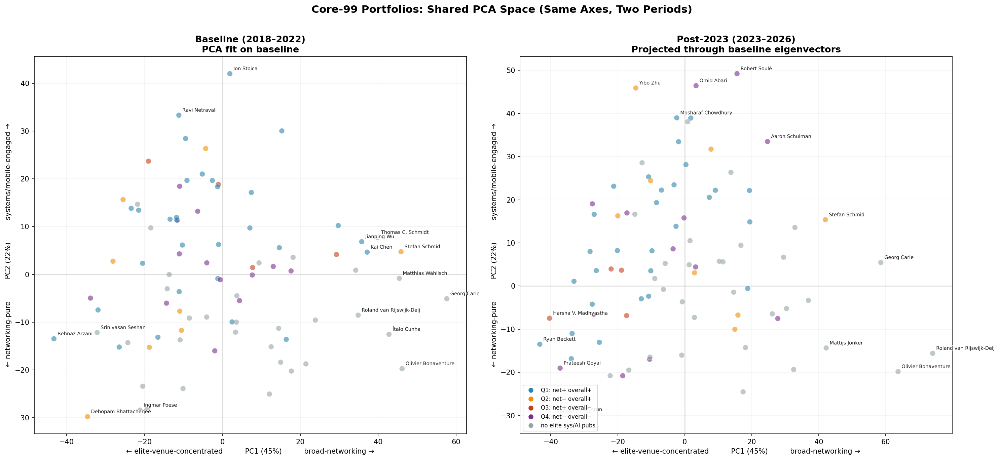
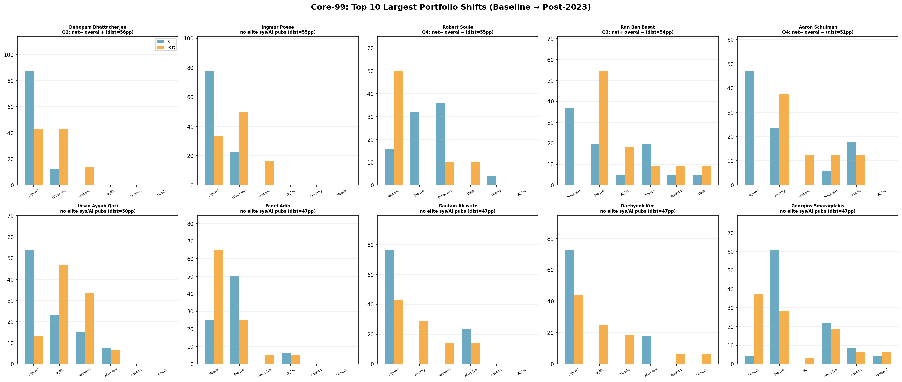
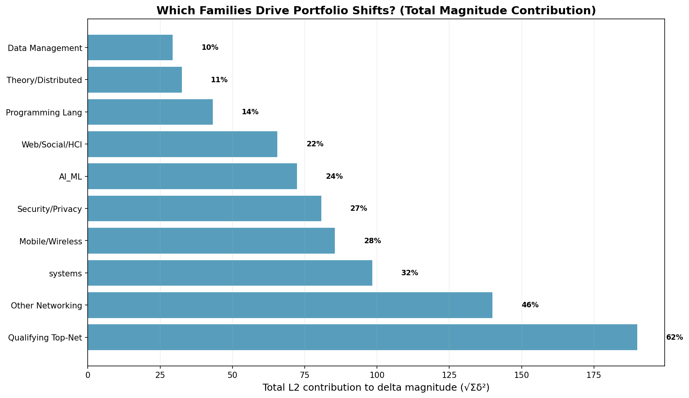
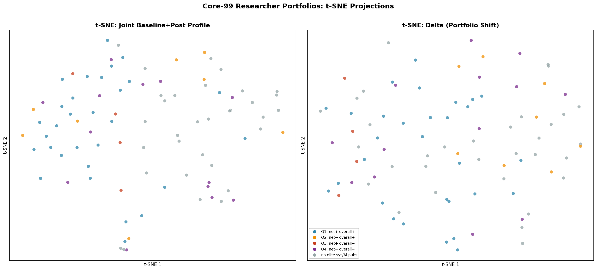

# Core-99 Investigation

This is the unified analysis narrative for the core-99 high-signal researcher slice. It consolidates what was previously spread across `CORE99_RESEARCHER_ATTRIBUTES.md`, `CORE99_INVESTIGATION_TABLES.md`, and the quadrant analysis.

## What Is Core-99?

- **99 researchers** selected by `baseline_top_networking_count > 6` — researchers with 7 or more papers at SIGCOMM, NSDI, CoNEXT, HotNets, or IMC during 2018-2022.
- This is a **derived working sample** for close inspection, not a replacement for the broad cohort (3,571 researchers).
- The threshold is provisional and documented. Researchers at exactly 6 papers (e.g., Marco Chiesa, Marco Canini) fall just below the cut line and are intentionally excluded from this slice.

## Core Attributes

Each researcher has deterministic, rule-based attributes described in `data/core99_researcher_attributes.json` and `data/core99_researcher_attributes.csv`. Key dimensions:

| Dimension | Definition |
|-----------|-----------|
| Baseline top-net count | Clean conference papers at the 5 qualifying venues, 2018-2022 |
| Post-2023 top-net count | Same, 2023-2026 |
| Top-net trend | increased / flat / decreased / inactive_after_2022 (rate ratio thresholds: ≥1.25, 0.75-1.25, ≤0.75, zero post-2023) |
| Clean-pub trend | Same thresholds, applied to all clean conference publications |
| Clean-pub activity | continuous / intermittent_post / sporadic_post / inactive_after_2022 |
| Author role | mostly_lead / mostly_senior / mostly_collaborator / mixed (first/last/middle share ≥0.5) |
| Qualifying venue mix | SIGCOMM_heavy / NSDI_heavy / IMC_heavy / CoNEXT_heavy / HotNets_heavy / mixed_2 / mixed_3plus |
| Region | US / Europe / China / Other / Unknown (from OpenAlex last-known institution) |
| Sector | Unknown for nearly all (not reliable yet) |

### Top-Networking Trend Distribution

| Trend | Count |
|-------|-------|
| decreased | 50 |
| flat | 28 |
| increased | 16 |
| inactive_after_2022 | 5 |

**Key observation**: Half the core-99 has declining top-networking output. Only 16 researchers (16%) are increasing their presence at the qualifying venues.

### Author Role Distribution

| Period | mostly_collaborator | mostly_senior | mostly_lead | mixed |
|--------|---------------------|---------------|-------------|-------|
| Baseline | 58 | 33 | 5 | 3 |
| Post-2023 | 55 | 40 | 1 | 1 |

**Key observation**: The core-99 shifts slightly from collaborator toward senior roles post-2023. Almost no one is a lead author post-2023.

## Investigation Questions (Deterministic)

These are answered in `CORE99_INVESTIGATION_TABLES.md` and its data artifacts. No LLM interpretation is used.

### Q1: Top-Net Decrease While Overall Output Flat or Increasing

**Slice**: 15 researchers where `top_networking_rate_change = decreased` AND `clean_publication_rate_change ∈ {flat, increased}`.

**Core interpretation**: Q1 is best understood as researchers **falling from top networking conferences faster than from other venues**, not as a group of "AI migrants." Almost every researcher in Q1 is declining in raw clean-publication count — the "flat/increased" label comes from the rate-ratio metric, which normalizes for the shorter post-2023 period (4 years vs 5). The raw story is simpler: these researchers are slowing down overall, and their top-networking output is falling fastest. The only researcher with genuinely *increasing* raw total output is Ihsan Ayyub Qazi (13→15).

#### Researcher-Level Summary

| Researcher | Top-net (bl→post) | Clean-pub (bl→post) | Primary shift |
|-----------|---------------------|----------------------|---------------|
| Laurent Vanbever | 19→10 | 34→26 | Systems (+3), new to systems post-2023 |
| Srinivasan Seshan | 15→8 | 20→17 | **web_social_hci (+5)**: VR/AR/3D rendering |
| Anja Feldmann | 13→6 | 31→24 | **web_social_hci (+3)**: social media analysis; exited systems (−2) |
| Alex C. Snoeren | 13→7 | 23→15 | Systems (+3): NIC/FPGA offload |
| Stefan Schmid 0001 | 12→3 | 134→89 | Broad decline across all families; systems −3 offsets others' gains |
| Mattijs Jonker | 11→5 | 24→20 | other_networking (IMC, TMA) |
| Rachit Agarwal 0001 | 11→4 | 18→12 | Systems stable (4→4) |
| Oliver Gasser | 10→5 | 15→14 | other_networking (IMC, ANRW) |
| Kyle Jamieson | 9→5 | 26→21 | Systems declined (−1) |
| Yibo Zhu 0001 | 9→4 | 17→14 | **Systems (+4)**: OSDI/EuroSys distributed training |
| Balakrishnan Chandrasekaran 0002 | 9→4 | 17→11 | Systems (+1) |
| Srinivas Narayana | 8→4 | 12→11 | Systems stable |
| Ihsan Ayyub Qazi | 7→2 | **13→15** | **web_social_hci (+3)**: web accessibility + healthcare LLMs (CHI). Only Q1 researcher with *increasing* raw total. |
| Ingmar Poese | 7→2 | 9→6 | Systems (+1) |
| Debopam Bhattacherjee | 7→3 | 8→7 | Systems (+1) |

#### Venue-Family Aggregate

| Family | Baseline | Post-2023 | Change |
|--------|----------|-----------|--------|
| qualifying_top_networking | 160 | 72 | −88 |
| other_networking | 115 | 92 | −23 |
| theory_distributed | 39 | 38 | −1 |
| systems | 30 | 37 | +7 |
| security_privacy | 24 | 21 | −3 |
| mobile_wireless_iot | 16 | 13 | −3 |
| AI_ML | 6 | 9 | +3 |
| web_social_hci | 4 | 16 | +12 |

#### Decomposing the Apparent Shifts

**Systems (+7) is three individual stories, offset by one outlier.**

| Researcher | Baseline | Post-2023 | Δ | What they're doing |
|-----------|----------|-----------|---|-------------------|
| Yibo Zhu 0001 | 6 | 10 | **+4** | OSDI, EuroSys — distributed training systems |
| Laurent Vanbever | 0 | 3 | **+3** | New to systems (PACMI@SOSP, etc.) |
| Alex C. Snoeren | 2 | 5 | **+3** | ASPLOS, USENIX ATC — NIC/FPGA offload |
| Balakrishnan Chandrasekaran | 1 | 2 | +1 | NSDI adjacent |
| Ingmar Poese | 0 | 1 | +1 | One-off |
| Debopam Bhattacherjee | 0 | 1 | +1 | One-off |
| Stefan Schmid 0001 | 11 | 8 | **−3** | Theory-heavy systems, declining across all venues |
| Anja Feldmann | 2 | 0 | −2 | Exited systems entirely |

The same three researchers (Zhu, Vanbever, Snoeren) contribute +10 of the +7 gain. Stefan Schmid's −3 decline nearly cancels them out. The systems increase is **not** a broad group trend — it's three individual career trajectories plus a countervailing outlier.

**web_social_hci (+12) is three different pivots, none toward "pure AI."**

| Researcher | Baseline | Post-2023 | Δ | Venues | What they're doing |
|-----------|----------|-----------|---|--------|-------------------|
| Srinivasan Seshan | 1 | 6 | **+5** | ISMAR, VR, MMSys | **VR/AR/3D rendering** — immersive media systems |
| Anja Feldmann | 1 | 4 | **+3** | ICWSM, WebSci | **Social media analysis** — Telegram/WhatsApp fringe communities |
| Ihsan Ayyub Qazi | 2 | 5 | **+3** | WWW, CHI | **Web accessibility** + **healthcare LLMs** (CHI: physicians' use of LLMs for diagnosis) |
| Stefan Schmid 0001 | 0 | 1 | +1 | WWW | Datacenter cluster analysis (one-off) |

Seshan is now doing VR/AR systems. Feldmann is studying online fringe communities. Qazi is the closest to AI-adjacent work (healthcare LLMs), but framed as HCI, not core ML. The +12 is three individual career shifts, not a group movement.

#### Stefan Schmid: The Outlier That Shapes Aggregates

Stefan Schmid accounts for an outsized share of Q1's aggregate numbers due to his extraordinarily broad portfolio (134 baseline papers). He appears in nearly every venue family. His decline (−3 systems, −11 qualifying_top_networking) partially masks others' increases. This is a reminder that aggregate venue-family shifts in a small slice (n=15) can be heavily influenced by a single researcher.

#### Bottom Line

Q1 is not a coherent group of "AI migrants." It's a heterogeneous collection of researchers whose top-networking output is declining faster than their overall publication rate. The specific venue-family shifts (+7 systems, +12 web_social_hci) are driven by 2–3 individuals each. The only researcher with a genuine AI-adjacent pivot is Ihsan Ayyub Qazi (healthcare LLMs at CHI), and even that is HCI-framed, not core ML research.

### Q2: Top-Net Flat or Increasing

**Slice**: 44 researchers maintaining or growing their top-networking presence.

**Core interpretation**: Q2 is the "networking core" — they maintain strong qualifying_top_networking presence (452→445, essentially flat). But within that stability, two shifts are happening: (1) **concentration** — `other_networking` drops sharply (230→104) as researchers shed adjacent networking venues, and (2) **expansion** — `AI_ML` doubles (45→91) and `systems` holds steady. This is portfolio *refocusing + expansion*, not migration.

#### 1. Networking Concentration

The `other_networking` drop (−126) is **broad-based, not driven by one outlier**. Ten researchers drop by 5+ papers each:

| Researcher | Baseline | Post-2023 | Δ |
|-----------|----------|-----------|---|
| Oliver Hohlfeld | 20 | 2 | −18 |
| Ran Ben Basat | 15 | 0 | −15 |
| Jianping Wu | 21 | 7 | −14 |
| Gareth Tyson | 19 | 7 | −12 |
| Kai Chen 0005 | 20 | 11 | −9 |
| Alberto Dainotti | 11 | 3 | −8 |
| Minlan Yu | 8 | 1 | −7 |
| Manya Ghobadi | 8 | 2 | −6 |
| Kimberly C. Claffy | 12 | 7 | −5 |
| Ang Chen 0001 | 7 | 2 | −5 |

This is consistent with researchers **concentrating effort** — shedding papers at adjacent measurement/networking venues (TMA, PAM, INFOCOM, ANRW) while maintaining or growing their presence at the five elite qualifying venues.

#### 2. Divergence Within Q2

Unlike Q1 (where Stefan Schmid skewed aggregates), Q2 has no single dominant outlier. The researcher with the broadest portfolio is **Ion Stoica** (83→73, 8 families), whose decline is modest (−10). The distribution of total publication change:

| Stat | Value |
|------|-------|
| Min | −30 (Oliver Hohlfeld, Ran Ben Basat) |
| P25 | −10 |
| Median | −3 |
| P75 | +2 |
| Max | +17 (Ennan Zhai) |

The median researcher is roughly stable (−3 papers), but with substantial variance. The top growers are Ennan Zhai (+17), Kai Chen (+12), Ying Zhang (+12), and Georgios Smaragdakis (+9). The top decliners are Hohlfeld and Ben Basat (−30 each).

#### 3. Systems & AI_ML Increases: Who Drives Them

**Systems**: The aggregate holds steady (200→183, −17). But individual researchers show significant increases:

| Researcher | Baseline | Post-2023 | Δ | Context |
|-----------|----------|-----------|---|---------|
| Kai Chen 0005 | 5 | 17 | **+12** | EuroSys-heavy; NSDI also up |
| Gianni Antichi | 2 | 6 | **+4** | ASPLOS, EuroSys |
| Xin Jin 0008 | 12 | 16 | **+4** | OSDI-heavy, consistent |
| Mosharaf Chowdhury | 9 | 12 | **+3** | MLSys, OSDI |
| Ennan Zhai | 3 | 6 | **+3** | SOSP, OSDI |

**AI_ML**: The aggregate doubles (45→91). Both "already-there" researchers expanding and new entrants:

| Researcher | Baseline | Post-2023 | Δ | Context |
|-----------|----------|-----------|---|---------|
| Ion Stoica | 24 | 37 | **+13** | Was already heavily in AI; expanding further |
| Aditya Akella | 0 | 10 | **+10** | New entrant to AI venues (ICML, NeurIPS, ICLR) |
| Jiaqi Gao | 0 | 5 | **+5** | New entrant (AAAI) |
| Jianping Wu | 2 | 6 | **+4** | CVPR, ICCV, NeurIPS |
| Daehyeok Kim | 0 | 4 | **+4** | New entrant |

The AI_ML increase is split roughly evenly between established AI authors expanding and networking researchers entering AI venues for the first time.

For a systematic clustering analysis of all core-99 researchers by venue-family shift — including feature vector design, bias diagnostics, PCA, and t-SNE — see the dedicated [Feature Vector Analysis](#feature-vector-analysis) section below. That analysis covers the full 87-researcher set (not only Q2), is orthogonal to the quadrant analysis, and includes a careful discussion of vector design choices and potential biases.

### Q3: Baseline Top-Venue Author Concentration

IMC shows the highest repeat-author share (24%) and Gini (0.31), indicating a more concentrated author community than SIGCOMM/NSDI/CoNEXT/HotNets. Core-99 researchers account for 52% of IMC papers — this partially explains the IMC-heavy profiles in the core-99.

| Venue | Papers | Unique authors | Repeat share | Gini | Core-99 paper share |
|-------|--------|---------------|-------------|------|---------------------|
| SIGCOMM | 237 | 1,098 | 0.20 | 0.24 | 0.66 |
| NSDI | 295 | 1,343 | 0.18 | 0.20 | 0.49 |
| CoNEXT | 207 | 802 | 0.15 | 0.15 | 0.36 |
| HotNets | 139 | 487 | 0.17 | 0.19 | 0.58 |
| IMC | 268 | 847 | **0.24** | **0.31** | 0.52 |

## Quadrant Analysis: Top-Tier Sys, AI, Storage Venues

**Purpose**: Beyond the five qualifying networking venues, where do core-99 researchers publish in elite systems, AI/ML, and storage venues? This is a venue-list-based classification, not an LLM or topic label.

**Tracked venues**:
- **Systems**: OSDI, SOSP, EuroSys, USENIX ATC, ASPLOS, SoCC, MLSys
- **AI**: ICML, ICLR, NeurIPS, AAAI, AISTATS, CVPR, ICCV, ECCV
- **Storage**: FAST

**Quadrant definitions** (two-axis: top-networking direction × overall clean-publication direction):

```
                    overall clean-pub flat/increased    overall clean-pub decreased/inactive
top-net flat/inc    Q1: net+ overall+ (30 researchers)  Q3: net+ overall- (4)
top-net dec/inact   Q2: net- overall+ (8)               Q4: net- overall- (18)
```

60 of the 99 core-99 researchers publish in these venues. Data: `data/core99_sys_ai_storage_quadrants.csv`.

### Q1: Net+ Overall+ (30 researchers)

Researchers maintaining or growing both top-networking presence AND overall output, while also publishing in elite sys/AI/storage venues.

**Interpretation**: These are the strongest all-around performers. They stay anchored in networking while also engaging with systems and AI venues. Not "migrants" — they're *expanding* their venue portfolio while maintaining networking output.

**Notable**: Ion Stoica (89 papers in tracked venues: ICML 25, OSDI 11, NeurIPS 10), Xin Jin (25 papers, OSDI-heavy with ICML/FAST presence), Kai Chen 0005 (22 papers, EuroSys-heavy).

### Q2: Net- Overall+ (8 researchers)

Top-networking declining but overall output flat or increasing. These are the clearest "portfolio shift" candidates — they're still productive, just less at top networking venues.

**Interpretation**: Worth close inspection. Where did their output go? Are they shifting to adjacent networking, systems, AI, or something else? This is the group where "migration" questions are most relevant.

**Notable**: Yibo Zhu 0001 (14 papers: OSDI 3, EuroSys 3, ICLR/MLSys/NeurIPS presence), Rachit Agarwal 0001 (8 papers: OSDI-heavy), Laurent Vanbever (1 paper: NeurIPS 2022).

### Q3: Net+ Overall- (4 researchers)

Top-networking stable or increasing while overall output declines. Rarer pattern.

**Interpretation**: These researchers are *concentrating* — they're publishing less overall but maintaining or growing their share at top networking venues. Could indicate a deliberate focus on networking, or could be a data artifact (missing papers from non-DBLP sources).

**Notable**: Harsha V. Madhyastha (7 papers: OSDI 3, SoCC 2), Ran Ben Basat (5 papers: NeurIPS 2, ICML 2), Ramesh Govindan, Manya Ghobadi.

### Q4: Net- Overall- (18 researchers)

Both top-networking and overall output declining.

**Interpretation**: Broad decline group. Could be moving to industry, retiring, changing research focus in ways not captured by these venue lists, or experiencing DBLP indexing lag for recent years. Not necessarily "leaving networking for AI" — the decline could be in all directions.

**Notable**: Mohammad Alizadeh (13 papers: ICCV 3, NeurIPS 2, diverse portfolio), Amin Vahdat (8 papers: systems-heavy), Vyas Sekar (5 papers across systems and AI venues).

## Feature Vector Analysis: Venue-Family Portfolio Shifts

**Purpose**: Represent each researcher as a quantitative feature vector based on how their venue-family publication portfolio changed from baseline to post-2023. This is orthogonal to the quadrant analysis — the quadrants are defined by top-networking and overall output direction, while the feature vectors capture *where* the output shifted across 10 venue families.

### Feature Vector Design: Three Complementary Views

A single delta view (post − baseline) loses the starting point. Two researchers with the same +10pp systems shift could have started at 80% networking → 70% networking or at 20% networking → 10% networking. We therefore define **three views** per researcher, each a 10-dimensional vector over the same venue families:

| View | Definition | What it captures |
|------|-----------|-----------------|
| **Baseline profile** | `f_i = (papers_in_family_i / total_bl_papers) × 100` | Static portfolio composition, 2018-2022 |
| **Post-2023 profile** | `f_i = (papers_in_family_i / total_post_papers) × 100` | Static portfolio composition, 2023-2026 |
| **Delta** | `f_i = post_pct_i − bl_pct_i` | Portfolio shift (dynamic view) |

**Inclusion threshold**: ≥5 clean papers in both periods. Covers **87 of 99** core-99 researchers.

**Why percentages**: A researcher with 100 total papers shifting 5 papers into systems is different from one with 10 total papers shifting 5. Percentages account for total output and are comparable across researchers. Raw counts are also preserved in `data/core99_feature_vectors.json`.

### Core-99 Aggregate Portfolio

| Family | Baseline mean | Post-2023 mean | Δ mean | Baseline median | Post-2023 median |
|--------|:------------:|:-------------:|:------:|:--------------:|:----------------:|
| qualifying_top_networking | 44.3% | 41.1% | −3.1pp | 44.9% | 38.5% |
| other_networking | 21.7% | 17.6% | −4.2pp | 16.7% | 11.8% |
| systems | 10.4% | 13.0% | +2.7pp | 6.7% | 6.7% |
| AI_ML | 2.4% | 4.4% | +2.0pp | 0.0% | 0.0% |
| security_privacy | 5.7% | 7.3% | +1.6pp | 2.8% | 0.0% |
| mobile_wireless_iot | 6.3% | 6.4% | +0.0pp | 0.0% | 0.0% |
| web_social_hci | 2.0% | 4.1% | +2.1pp | 0.0% | 0.0% |
| data_management | 1.1% | 1.1% | −0.0pp | 0.0% | 0.0% |
| theory_distributed | 1.0% | 1.3% | +0.2pp | 0.0% | 0.0% |
| programming_languages | 1.1% | 0.8% | −0.3pp | 0.0% | 0.0% |

The mean core-99 researcher is 44% networking in baseline, dropping to 41% post-2023. The median drops more (45% → 39%). Gains are in systems (+2.7pp), AI_ML (+2.0pp), and web_social_hci (+2.1pp) — but from very low bases. The median researcher has **zero** AI_ML papers in BOTH periods — AI_ML presence is concentrated in a minority.


### Baseline Profile: Two Distinct Researcher Types

Baseline PCA (45% + 22% = 67% variance, verified against researcher scores):

- **PC1**: `other_networking` (+0.70) vs. `qualifying_top_networking` (−0.69). Verified: Georg Carle (68% other) scores +57.6; Behnaz Arzani (83% qualifying) scores −43.3. **Left (negative) = elite-venue-concentrated** (dominated by the five qualifying venues). **Right (positive) = broad-networking** (portfolio spread across TMA, PAM, INFOCOM, etc.).
- **PC2**: `qualifying_top_networking` (−0.61) and `other_networking` (−0.47) load negatively; `systems` (+0.47) and `mobile_wireless_iot` (+0.39) load positively. Verified: Ion Stoica (40% systems) scores +42.0. **Left (negative) = networking-pure** (qualifying + other dominant). **Right (positive) = systems/mobile-engaged**.

The baseline PCA reveals a **continuous spectrum**, not discrete clusters:
- **Left side** (elite-concentrated): Behnaz Arzani (−43, 83% qualifying), Aurojit Panda, Mosharaf Chowdhury
- **Right side** (broad-networking): Georg Carle (+58, 68% other_networking), Stefan Schmid (+46, 50% other_networking + 28% theory), Olivier Bonaventure (+46, 69% other_networking)
- **Top side** (networking-pure, negative PC2): Debopam Bhattacherjee, Gautam Akiwate
- **Bottom side** (systems/mobile, positive PC2): Ion Stoica (+42, 40% systems), Robert Soulé


### Post-2023 Profile: Projected Through Baseline Eigenvectors

To make the two periods directly comparable, the post-2023 profile is projected through the **same eigenvectors** fit on baseline data. This means the axes have identical meaning across both panels — a shift right always means "more broad-networking," a shift down always means "more networking-pure."



Key changes visible in the shared projection:
- The post-2023 cloud is more **diffuse** (variance explained by these same two PCs drops from 67% to ~55%) — portfolios are diversifying
- Several researchers make large diagonal moves from "elite-concentrated + networking-pure" (bottom-left) toward "broad-networking + networking-pure" (bottom-right) — they remain networking-focused but shift venue composition
- A few researchers (visible as isolated diamonds) move into the systems/mobile region (positive PC2)

### Trajectories in Shared PCA Space

Each arrow shows one researcher's movement from baseline (circle) to post-2023 (diamond):


Largest movements in shared PCA space:

| Researcher | Δ PC1 | Δ PC2 | Direction |
|-----------|------:|------:|-----------|
| Debopam Bhattacherjee | +50 | +20 | → broad-networking, → networking-pure |
| Ingmar Poese | +47 | +22 | → broad-networking, → networking-pure |
| Ran Ben Basat | −51 | 0 | → elite-concentrated (extreme focus) |
| Robert Soulé | −2 | +49 | ↑ systems/mobile |
| Aaron Schulman | +36 | +29 | → broad-networking, ↑ systems/mobile |
| Ihsan Ayyub Qazi | +28 | +29 | → broad-networking, ↑ systems/mobile |
| Ravi Netravali | −22 | −32 | → elite-concentrated, → networking-pure |
| Harsha V. Madhyastha | −21 | −31 | → elite-concentrated, → networking-pure |

The largest moves are NOT toward AI — they're along the networking composition axes (elite vs broad, networking-pure vs systems-engaged). The AI_ML dimension contributes very little to these first two PCs (AI_ML loading on PC1 = −0.01, on PC2 = +0.15) because AI_ML presence is still rare and doesn't define the main variance structure

### Diversity of Baseline Portfolios

The baseline profile reveals that the core-99 is **not monolithic**. At opposite ends of PC1:

| Researcher | Baseline PC1 | Baseline composition |
|-----------|:----------:|---------------------|
| Georg Carle | +58 | 68% other_networking, 9% qualifying |
| Stefan Schmid | +46 | 50% other_networking, 28% theory, 9% qualifying |
| Olivier Bonaventure | +46 | 69% other_networking, 28% qualifying |
| Behnaz Arzani | −43 | 83% qualifying_top_networking, 17% systems |
| Debopam Bhattacherjee | −35 | 88% qualifying_top_networking |
| Aurojit Panda | −31 | 50% qualifying, 42% security |

"Networking researcher" means very different things — some are anchored in the elite five venues, others primarily publish at adjacent networking venues. Both are valid, but they start from different places and their trajectories should be interpreted differently.

### Largest Portfolio Shifts

Measured by Euclidean distance between baseline and post-2023 percentage vectors:

| Researcher | From → To | Distance | Quadrant |
|-----------|----------|:-------:|----------|
| Debopam Bhattacherjee | 88% qualifying → 43% qualifying, 43% other | 56pp | Q2 |
| Ingmar Poese | 78% qualifying → 33% qualifying, 50% other | 55pp | no_sys_ai |
| Robert Soulé | 36% other, 32% qualifying → 50% systems, 10% other | 55pp | Q4 |
| Ran Ben Basat | 37% other, 20% qualifying → 55% qualifying, 18% AI | 54pp | Q3 |
| Aaron Schulman | 47% qualifying, 24% security → 38% security, 12% other | 51pp | Q4 |
| Ihsan Ayyub Qazi | 54% qualifying, 23% AI → 47% AI, 33% web_social_hci | 50pp | no_sys_ai |
| Fadel Adib | 50% qualifying, 25% mobile → 65% mobile, 25% qualifying | 47pp | no_sys_ai |

The largest shifts are NOT toward AI_ML. They're toward `other_networking`, `systems`, `web_social_hci`, and `mobile_wireless_iot`. The AI_ML shifts (Stoica +22pp, Akella +29pp) are large in magnitude but don't make the top-10 distance list because these researchers started with more diverse portfolios, so the Euclidean shift is smaller.



### Delta Vector Analysis: What Drives Portfolio Shifts?

The delta vector `Δ = post_pct − bl_pct` captures the *direction and magnitude* of each researcher's portfolio change. Analyzing these 87 vectors reveals the structure of shifts across the core-99.

#### Which Families Drive Shifts?

Total L2 magnitude contribution across all 87 researchers:

| Family | Contribution | % of total |
|--------|:-----------:|:----------:|
| qualifying_top_networking | 190 | **62.5%** |
| other_networking | 140 | 46.0% |
| systems | 98 | 32.3% |
| mobile_wireless_iot | 85 | 28.1% |
| security_privacy | 81 | 26.5% |
| AI_ML | 72 | 23.8% |



Qualifying_top_networking alone accounts for **62.5%** of total shift energy. Systems, AI_ML, security, and mobile each contribute 24-32%. The dominance of qualifying_top_networking confirms that the primary story is about networking venue composition, not about "moving to AI."

#### Mean Delta by Investigation Group

Using the same four investigation groups defined earlier (top-networking rate change × clean-publication rate change). These are the same Q1-Q4 from the investigation tables above — consistent taxonomy throughout. 87 researchers meet the ≥5 papers threshold.

| Group | N | Dominant shifts | Interpretation |
|-------|--:|----------------|---------------|
| **Inv-Q1**: top-net ↓, clean →/↑ | 15 | qualifying −24.6pp, other +8.7pp, systems +8.0pp | Clear portfolio shift: losing qualifying share, gaining in adjacent networking and systems |
| **Inv-Q2**: top-net →/↑, clean →/↑ | 37 | other −6.5pp, AI_ML +3.7pp, qualifying +2.6pp | Stable core: mild shed of adjacent networking, mild AI expansion, slight qualifying concentration |
| **Inv-Q3**: top-net →/↑, clean ↓ | 7 | **qualifying +22.7pp**, other −15.0pp, systems −4.3pp | Extreme concentration: shedding everything else to focus on the five elite venues |
| **Inv-Q4**: top-net ↓, clean ↓ | 28 | qualifying −5.8pp, other −5.3pp, security +5.0pp | Proportionate decline: losing across nearly all families; no shift in composition |

**Total: 87** (15 + 37 + 7 + 28). The remaining 12 core-99 researchers have <5 clean papers in at least one period and are excluded from the delta analysis.


**Inv-Q1 has the most extreme delta**: the −24.6pp qualifying_top_networking drop is the largest mean shift of any group in any family. These 15 researchers are losing elite venue share at 5× the rate of Inv-Q4.

**Inv-Q3 is the mirror image**: +22.7pp qualifying_top_networking concentration. These 7 researchers are focusing MORE of their output on the five elite venues, even as their total output declines. This is the "doubling down on networking" group.

**Inv-Q4 is surprisingly flat**: despite being "decreased/decreased," the delta vector shows no strong compositional shift — they're just publishing less across the board, not changing their portfolio mix.

#### Single-Family Dominance

How much of each researcher's shift is driven by a single family? The **median researcher has 39% of their total shift concentrated in one family**. The top cases:

| Researcher | Dominant family | Share | Value |
|-----------|----------------|:-----:|------:|
| Olivier Bonaventure | other_networking | 57% | +14pp |
| Ítalo Cunha | qualifying_top_networking | 57% | +26pp |
| Fadel Adib | mobile_wireless_iot | 56% | +40pp |
| Dave Levin | security_privacy | 56% | +39pp |
| Jiaqi Gao | AI_ML | 56% | +25pp |

This suggests that for most researchers, portfolio shifts are **dominated by a single family changing**, with secondary adjustments elsewhere. The "broadening" story is real but usually takes the form of "I stayed anchored in networking but added one new venue family."

#### Delta Heatmap: All Researchers × All Families

The full heatmap (sorted by PC1 of delta — diversifying → concentrating) shows the individual structure:


Key patterns visible in the heatmap:
- **Top half** (diversifying): wide red bands in qualifying_top_networking, compensating blue/green in other_networking, systems, mobile
- **Bottom half** (concentrating): blue band in qualifying_top_networking (increasing), red bands in other_networking and mobile (decreasing)
- **AI_ML column**: sporadic blue dots — AI expansion is a minority pattern, not a broad trend
- **Q3 researchers** (n=4) are sharply visible as the most extreme blue in qualifying_top_networking

#### Delta PCA Biplot: Researcher Shifts + Family Vectors


The biplot overlays loading vectors for each family on the researcher scatter. The arrow for `qualifying_top_networking` dominates PC1 — researchers further right increased their qualifying share. `other_networking` dominates PC2 — researchers higher up shifted toward adjacent networking venues. The `AI_ML` vector is short and points in a direction with few extreme researchers, confirming that AI migration is not a dominant structural pattern.

### Bias and Robustness

**Small-denominator noise**: 17 researchers have <10 papers in one period. Their vectors are noisier but included.

**Zero-inflation**: AI_ML, web_social_hci, data_management, theory_distributed, and programming_languages have median 0% in BOTH baseline and post-2023. These families contribute less variance. The PCA is dominated by `qualifying_top_networking` and `other_networking` — this is intentional and reflects where the meaningful variance actually is.

**Form robustness**: PP-shift vs. log-ratio correlated at r>0.77 for 8 of 10 families. The choice of percentage form is unlikely to change results materially.

### Projections Available

All 87 researchers have coordinates in `data/core99_feature_vectors.json`:

| Projection | Method | Use case |
|-----------|--------|----------|
| **pca_shared_baseline** | PCA fit on baseline; both periods projected through same eigenvectors | Compare baseline vs post-2023 in consistent coordinate system |
| **pca_shared_post2023** | Same eigenvectors as above | See where each researcher landed |
| **pca_shared_delta** | post − baseline in shared PCA | Trajectory vectors |
| pca_baseline | Separate PCA fit on baseline | Pre-existing clusters (different eigenbasis) |
| pca_post2023 | Separate PCA fit on post-2023 | Post-2023 clusters (different eigenbasis) |
| pca_delta | Separate PCA fit on delta | Shift clusters (different eigenbasis) |
| t-SNE joint | 20-dim [bl ∥ post] non-linear | Local neighborhoods in start+end profile |
| t-SNE delta | 10-dim delta non-linear | Local neighborhoods in shift patterns |



## Cross-Method Synthesis

This section walks through what the four analytical lenses agree on, where they diverge, and what deeper patterns emerge.

### The "Falling Out" Phenomenon: Inv-Q1 + Inv-Q4 = 43 Researchers (49%)

Nearly half the analyzable core-99 is losing presence at the five elite qualifying venues. But there are two distinct mechanisms:

| Group | N | Top-net rate | Clean rate | Mechanism |
|-------|--:|:----------:|:----------:|-----------|
| **Inv-Q1** (portfolio shifters) | 15 | 0.57 | 1.01 | Losing elite venue share but maintaining total output — output is shifting to adjacent venues |
| **Inv-Q4** (broad decliners) | 28 | 0.44 | 0.52 | Declining proportionately across all venue families |

**Where Inv-Q1 is losing papers (venue-level):** CoNEXT (−25), HotNets (−16), SIGCOMM (−15), INFOCOM (−7), SIGCOMM Posters (−7), SOSR (−6), ANCS (−6). These are mostly the qualifying venues themselves plus adjacent networking workshops.

**Where Inv-Q1 output is going:** IMC (+8), TMA (+8), WWW (+4), ANRW (+4), SIGCOMM Posters (+5), OPODIS (+3), USENIX Security (+3). The gainers are measurement venues (IMC, TMA), workshop/poster venues, and a few forays into web (WWW), security (USENIX Security), and theory (OPODIS).

**The pattern**: Inv-Q1 researchers aren't finding a single new home — they're *scattering* to adjacent measurement workshops, poster sessions, and occasional papers in neighboring fields. This is not a clean "pivot to systems" or "pivot to AI." It's a **diffusion pattern** — losing concentration in elite venues and spreading output across a wider set of lower-tier venues.

**Inv-Q1's baseline matters**: They started with **56% qualifying_top_networking** at baseline — the most elite-concentrated group of all. They had the most to lose, and they lost it. Their clean-pub rate is flat (1.01), meaning they're publishing at the same per-year rate, just in different venues. They are "running to stand still" — working just as hard but appearing at fewer top venues.

#### Inv-Q1 vs Inv-Q3: Diverging from Different Starting Points

| | Inv-Q1 (falling out) | Inv-Q3 (concentrating) |
|---|---|---|
| Baseline qualifying_top_networking | **56%** | 36% |
| Baseline other_networking | 19% | **26%** |
| Baseline systems | 7% | **12%** |
| Post-2023 qualifying_top_networking | 31% (−25pp) | **59% (+23pp)** |
| Median top-net rate | 0.57 (genuine decline) | 0.94 (flat) |
| Median clean rate | 1.01 (flat) | **0.62 (declining significantly)** |

The critical insight: **Inv-Q3's "concentration" is partly a denominator artifact.** Their top-net rate is 0.94 — their qualifying_top_networking output is essentially flat. But their total clean-pub rate is 0.62 — they're publishing 38% fewer papers overall. The qualifying_top_networking share rises from 36% to 59% not because they're publishing MORE at elite venues, but because they're publishing LESS everywhere else. Q3 researchers are "concentrating by subtraction" — cutting adjacent networking, systems, and security papers while maintaining elite venue presence.

Inv-Q1, by contrast, has a genuine top-net rate decline (0.57) — they ARE publishing fewer papers at elite venues in absolute terms. Their total output is flat because they're replacing elite venue papers with papers at adjacent venues. They are "substituting down."

Both groups look like "falling out" from elite venues, but for different reasons:
- **Inv-Q1**: Substitution — replacing elite papers with adjacent papers
- **Inv-Q3**: Subtraction — cutting everything except elite papers
- **Inv-Q4**: Proportional decline — cutting all papers equally

### PCA Move vs. Delta Magnitude: Resolved

The correlation between PCA move and delta magnitude is **0.88** — strong but not perfect. The disagreement is fully explained by **family-level PCA loadings**:

| Family | PCA loading (abs PC1 + abs PC2) | Delta contribution |
|--------|:-------------------------------:|:------------------:|
| qualifying_top_networking | **1.31** | 190 |
| other_networking | **1.17** | 140 |
| systems | 0.64 | 98 |
| mobile_wireless_iot | 0.43 | 85 |
| security_privacy | **0.07** | 81 |
| AI_ML | **0.16** | 72 |
| web_social_hci | **0.08** | 66 |

Researchers with large shifts in `security_privacy` (loading 0.07), `AI_ML` (0.16), or `web_social_hci` (0.08) get high delta magnitude but modest PCA moves because these families barely project onto PC1 or PC2. This is a feature, not a bug:

- **Delta-amplified researchers** (large shifts in weak-loading families): Geoffrey Voelker (security +26pp), Aditya Akella (AI_ML +29pp), Ion Stoica (AI_ML +22pp), Fadel Adib (mobile +40pp). These are the "domain pivot" cases — they shifted into families that the baseline PCA doesn't track well because those families were rare at baseline.
- **PCA-amplified researchers** (large moves in networking composition): Debopam Bhattacherjee, Ingmar Poese, Ran Ben Basat. Their shifts are in the high-loading families (qualifying_top_networking, other_networking). The PCA was literally built to detect these shifts.

**Practical implication**: Use PCA for understanding networking-composition changes. Use delta magnitude for detecting shifts into any family. The two measures disagree when researchers pivot into AI_ML, security, or web_social_hci — exactly the cases we most want to catch.

### Findings That Agree Across Methods

**1. The dominant axis of variation is qualifying_top_networking composition.**

| Method | Evidence |
|--------|----------|
| Baseline PCA | PC1 (45%) = qualifying_top_networking vs. other_networking |
| Delta PCA | PC1 (49%) = concentrating into vs. diversifying away from qualifying_top_networking |
| Delta L2 | qualifying_top_networking contributes 62.5% of total shift magnitude |
| Delta heatmap | The strongest visual signal is the red-blue band in the qualifying_top_networking column |

All four methods converge on the same story: the primary variation in the core-99 is about networking venue composition — are you anchored in the five elite venues, spread across adjacent networking venues, or shifting between them? AI_ML contributes 24% of delta magnitude (real but secondary).

**2. Inv-Q1 (top-net decreasing, clean flat/increasing) has the largest portfolio shifts.**

| Group | Mean ‖Δ‖ | Mean PCA move |
|-------|:------:|:----------:|
| Inv-Q1 | **36pp** | **30** |
| Inv-Q2 | 27pp | 19 |
| Inv-Q3 | 34pp | 30 |
| Inv-Q4 | 31pp | 23 |

The 15 Inv-Q1 researchers shift more — in both PCA space and absolute percentage points — than any other group. The PCA and delta measures agree on rank order.

**3. Inv-Q3 (top-net flat/increasing, clean decreasing) is the "concentration" group.**

Mean delta: qualifying_top_networking **+23pp**, other_networking −15pp, systems −4pp. In PCA space, they move rightward toward "elite-concentrated." The 7 Inv-Q3 researchers are shedding adjacent networking venues while maintaining or increasing their share at the five elite venues. This is visible in all four methods.

**4. AI_ML expansion is concentrated, not broad-based.**

Only 9 researchers have AI_ML expansion >10pp. They are: Aditya Akella (+29pp), Daehyeok Kim (+25pp), Jiaqi Gao (+25pp), Ihsan Ayyub Qazi (+24pp), John Heidemann (+23pp), Ion Stoica (+22pp), Dongsu Han (+17pp), Jianping Wu (+14pp), Ran Ben Basat (+13pp). Half of them started from **zero** AI_ML in baseline; they are new entrants, not established AI researchers expanding. The heatmap confirms: the AI_ML column shows sporadic blue dots, not a broad band.

### Findings That Disagree / Need Interpretation

**1. PCA move vs. delta magnitude: not the same researchers.**

Only 7 of the top-10 largest movers overlap between the two measures. The top-10 lists differ because they weight families differently:

| Rank | By PCA move | ΔPC1 | ΔPC2 | By delta ‖Δ‖ | Dominant shift family |
|:----:|------------|-----:|-----:|-------------|----------------------|
| 1 | Debopam Bhattacherjee | +50 | +20 | Debopam Bhattacherjee | qualifying_top_networking |
| 2 | Ingmar Poese | +47 | +22 | Ingmar Poese | qualifying_top_networking |
| 3 | Ran Ben Basat | −51 | +0 | Robert Soulé | systems |
| 4 | Robert Soulé | −2 | +49 | Ran Ben Basat | other_networking |
| 5 | **Roland van Rijswijk-Deij** | +39 | −7 | Aaron Schulman | qualifying_top_networking |
| 6 | Aaron Schulman | +36 | +29 | Ihsan Ayyub Qazi | qualifying_top_networking |
| 7 | **Oliver Gasser** | +43 | +5 | **Fadel Adib** | mobile_wireless_iot |
| 8 | Ihsan Ayyub Qazi | +28 | +29 | **Gautam Akiwate** | security_privacy |
| 9 | **Narseo Vallina-Rodriguez** | +38 | +16 | **Georgios Smaragdakis** | security_privacy |
| 10 | Ravi Netravali | −22 | −32 | Daehyeok Kim | qualifying_top_networking |

**Bold** = unique to that top-10 list. The 3 PCA-only researchers shift primarily between `qualifying_top_networking` and `other_networking` — the two families with the highest PCA loadings (1.31 and 1.17 respectively). The 3 delta-only researchers shift primarily into `security_privacy` (loading 0.07) and `mobile_wireless_iot` (loading 0.43) — families that barely project onto PC1/PC2. This is fully explained by the family-level PCA loading strengths (see resolved analysis above).

**2. Inv-Q4's decline is compositionally flat.**

Despite being classified as "decreased/decreased," Inv-Q4's mean delta shows qualifying_top_networking −6pp and other_networking −5pp — a nearly proportionate decline. Their portfolio composition isn't changing; they're just publishing less. This suggests the rate-ratio metric may create apparent "decrease" from year-length normalization when raw counts show proportionate decline. Worth double-clicking: compare raw-count classification vs. rate-ratio classification.

**3. Investigation groups and sys/AI quadrants are orthogonal taxonomies.**

Cross-tabulation of the 87 researchers:

| | Q1_sys_ai | Q2_sys_ai | Q3_sys_ai | Q4_sys_ai | no_sys_ai |
|--------|:------:|:------:|:------:|:------:|:------:|
| **Inv-Q1** | 0 | 8 | 0 | 0 | 7 |
| **Inv-Q2** | 30 | 0 | 0 | 0 | 7 |
| **Inv-Q3** | 0 | 0 | 4 | 0 | 3 |
| **Inv-Q4** | 0 | 0 | 0 | 13 | 15 |

All 8 Inv-Q1 researchers who publish in elite sys/AI/storage venues fall into the Q2_sys_ai quadrant (net− overall+). All 30 Inv-Q2 researchers in elite venues fall into Q1_sys_ai (net+ overall+). The two taxonomies are structurally aligned but use different thresholds — a researcher can be "top-net decreased" by rate ratio (Inv-Q1) while being "net flat" by the coarser quadrant definition (Q2_sys_ai).

### Subgroups Needing Deeper Investigation

**A. AI_ML expanders (ΔAI_ML > 10pp, n=9).** These are the closest the core-99 has to "AI migrants." Need topic analysis of their AI_ML papers: are they doing AI infrastructure (MLSys, distributed training) or core AI/ML research (new architectures, learning algorithms)? Three distinct profiles: new entrants from zero base (Akella, Kim, Gao, Heidemann), established AI authors expanding (Stoica, Qazi), and concentrators who also added AI (Ben Basat).

**B. Extreme concentrators (Inv-Q3, n=7).** Ran Ben Basat (+35pp qualifying, −37pp other), Harsha Madhyastha (+33pp), David Walker (+25pp), Manya Ghobadi (+22pp), Ramesh Govindan (+21pp), Oliver Hohlfeld (+16pp), Kimberly Claffy (+8pp). Need to distinguish: are they genuinely focusing on elite networking venues, or is their total output declining so fast that qualifying_top_networking share rises as a denominator artifact? Check raw counts vs. percentages.

**C. Large PCA move, modest delta magnitude (n=8).** Ying Zhang, Harsha Madhyastha, Kai Chen, Alberto Dainotti, Ennan Zhai, and others show PCA moves of 30-38 but delta magnitudes of 35-39pp. Their shifts are concentrated in the networking-composition axes (qualifying ↔ other_networking), which PCA amplifies. These are "networking rebalancers" — changing where they publish within networking, not changing what they work on.

**D. Inv-Q4 researchers with flat composition (n=28).** The largest group by count, but the least studied. Their delta vectors are the flattest across families — they're declining proportionately. Are they retiring, moving to industry, moving to journals, or experiencing DBLP indexing lag? This group needs a different analytical lens (career stage, institution type, raw publication counts over time).

### Intriguing Individuals for In-Depth Topic Analysis

Scored by: AI_ML expansion, portfolio shift magnitude, PCA extremeness, cross-method disagreement, unusual baseline composition, and concentration pattern. The top 15:

| Score | Researcher | Signal |
|:----:|-----------|-------|
| **11** | **Ihsan Ayyub Qazi** | AI_ML +24pp (from 23%→47% base), ‖Δ‖=50pp, large PCA move, had AI_ML in baseline. The only Inv-Q1 researcher with substantial AI_ML expansion. Shifted from qualifying_top_networking (54%→13%) into AI_ML + web_social_hci. |
| **8** | **Ran Ben Basat** | Inv-Q3 concentrator who also added AI_ML (+13pp). Extreme qualifying_top_networking concentration (+35pp) while adding AI_ML papers. Unusual combination: "focusing on networking AND entering AI." |
| **8** | **Daehyeok Kim** | AI_ML +25pp from zero base. Large qualifying_top_networking drop (−29pp) compensated by AI_ML (+25pp) and mobile (+19pp). Clean "portfolio pivot" story. |
| **7** | **Aaron Schulman** | Largest qualifying_top_networking drop in core-99 (−47pp). Compensated by systems (+12pp) and other_networking (+7pp). Inv-Q4 — declining overall, but the decline is entirely concentrated in qualifying_top_networking. |
| **6** | **Oliver Hohlfeld** | Inv-Q3 concentrator with the most extreme other_networking drop (−31pp). Started with only 19% qualifying_top_networking at baseline — the "broad-networker who focused." |
| **6** | **Yibo Zhu** | Systems +36pp (from 35%→71% systems). The most extreme systems pivot in core-99. Baseline was already systems-heavy — this is doubling down. |
| **5** | **Ion Stoica** | AI_ML +22pp (from 29%→51%). Already had the most AI_ML-heavy baseline in core-99. Reducing systems share (−14pp) while expanding AI_ML. The "AI-native" networking researcher. |
| **5** | **Fadel Adib** | Mobile +40pp. The most extreme domain pivot in core-99 — from qualifying_top_networking (50%→25%) to mobile_wireless_iot (25%→65%). |
| **5** | **Robert Soulé** | Systems +34pp, other_networking −26pp, qualifying_top_networking −32pp. Large compositional shift from broad-networking to systems-heavy. |
| **4** | **Aditya Akella** | AI_ML +29pp from zero base — the largest AI_ML increase in core-99. Started with 33% systems, 47% qualifying_top_networking. Both dropped to accommodate AI_ML entry. |
| **4** | **Ravi Netravali** | Qualifying_top_networking +32pp. Largest qualifying_top_networking INCREASE. Shedding mobile (−25pp) and systems (−11pp). The purest "networking focus" story. |
| **4** | **Manya Ghobadi** | Inv-Q3 concentrator (+22pp qualifying, −17pp other, −9pp systems) who also added AI_ML (+8pp). Started with 32% systems — the "systems-heavy researcher who focused on networking." |
| **4** | **Kai Chen** | Systems +20pp, other_networking −28pp. Started with 49% other_networking — the "broad-networker who pivoted to systems." Large PCA move (33) but modest delta (35pp). |

## Data Artifacts

| Artifact | Description |
|----------|-------------|
| `data/core99_researcher_attributes.json` / `.csv` | Per-researcher deterministic attributes |
| `data/core99_investigation_summary.json` | Aggregated Q1-Q3 investigation results |
| `data/core99_researcher_venue_family_transitions.csv` | Venue-family-level changes per researcher |
| `data/core99_topnet_decrease_clean_flat_or_increase.csv` | Q1 researcher-level detail |
| `data/core99_topnet_flat_or_increase_profiles.csv` | Q2 researcher-level detail |
| `data/top_venue_author_concentration_2018_2022.csv` | Q3 venue-level author concentration |
| `data/core99_sys_ai_storage_quadrants.csv` | Quadrant analysis: core-99 in elite sys/AI/storage venues |
| `data/q2_pca_results.json` | Earlier PCA of Q2 venue-family shifts (superseded by core99_feature_vectors.json) |
| `data/core99_feature_vectors.json` | **Canonical** feature vectors, PCA, t-SNE for 87 core-99 researchers |
| `figures/aggregate_portfolio.png` | Aggregate baseline vs post-2023 portfolio comparison |
| `figures/pca_baseline_labeled.png` | Baseline PCA with researcher labels at extremes |
| `figures/pca_baseline_post_shared.png` | **Canonical**: Baseline + Post-2023 projected through same eigenvectors |
| `figures/pca_trajectories_shared.png` | **Canonical**: Arrows showing each researcher's movement in shared PCA space |
| `figures/delta_heatmap.png` | All 87 researchers × 10 families delta heatmap (sorted by PC1) |
| `figures/delta_by_inv_group.png` | Mean delta vector per investigation group (consistent Q1-Q4 taxonomy) |
| `figures/delta_pca_biplot.png` | Delta PCA with family loading vectors overlaid |
| `figures/delta_top20_profiles.png` | Small multiples: top 20 individual delta vectors |
| `figures/delta_magnitude_decomposition.png` | Which families contribute most to total shift magnitude |
| `figures/top10_portfolio_shifts.png` | Top 10 largest portfolio shifts (small multiples) |
| `figures/tsne_joint_delta.png` | t-SNE joint profile + delta side-by-side |
| `data/venue_family_map.json` | Venue→family mapping (343 mappings, 24 aliases; Q1: 0% unknown, Q2: 2.2%, core-99: 3.6%) |
| `data/selected_sample_network_gt6_packet.json` | Full title-level evidence for core-99 |
| `data/selected_sample_network_gt6_summary.csv` | Compact one-row-per-researcher summary |

## Immediate Next Steps

1. ✅ ~~Investigate `unknown` venue family~~ — COMPLETE. 273 venue mappings, 21 aliases. Q1 slice: unknown reduced from 106 papers to <1%. Full core-99: 5.7% remaining (long tail of 1-paper venues).

2. **Q2 researcher-level venue-family tracing** — for the 8 researchers in Q2 (net- overall+), trace exact venue destinations to understand the nature of their portfolio shift.

3. **Abstract coverage audit** — flag which core-99 papers have abstracts vs title-only before any topic discovery.

## Related Documents

- [ANALYSIS_PLAN.md](ANALYSIS_PLAN.md) — full TODO list, methodological commitments, deferred work
- [README.md](README.md) — master project index and chaining guide
- [CORE99_RESEARCHER_ATTRIBUTES.md](CORE99_RESEARCHER_ATTRIBUTES.md) — detailed attribute definitions
- [CORE99_INVESTIGATION_TABLES.md](CORE99_INVESTIGATION_TABLES.md) — original Q1-Q3 investigation tables
- [COHORT_SHAPE.md](COHORT_SHAPE.md) — broad cohort descriptive audit
- [SELECTED_SAMPLE_NETWORK_GT6.md](SELECTED_SAMPLE_NETWORK_GT6.md) — core-99 selection review packet
- [CORE99_AUTHOR_POSITION_ISSUES.md](CORE99_AUTHOR_POSITION_ISSUES.md) — author-position audit (resolved)
