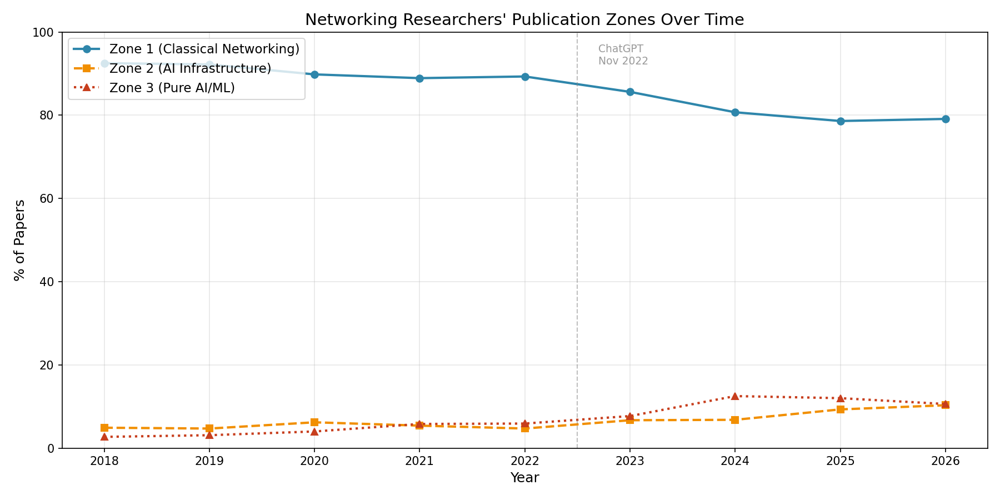
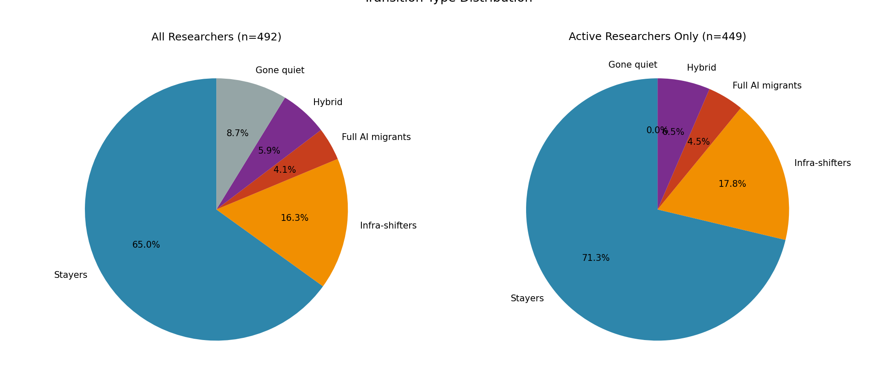
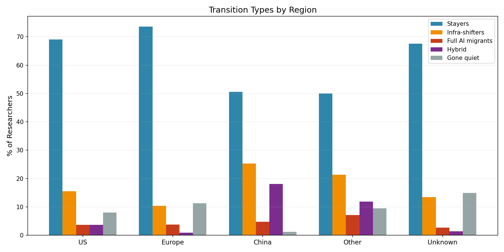
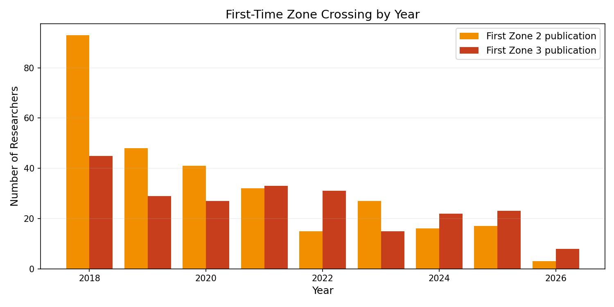
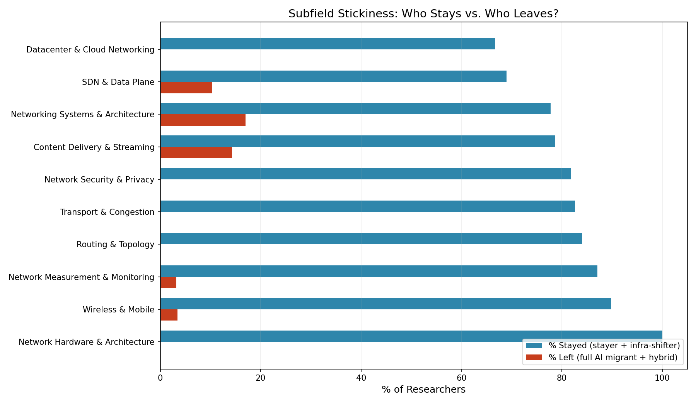

# Networking → AI Migration: Quantitative Analysis

*Generated from DBLP publication data, 2018–2026*

## Executive Summary

Out of **492** top networking researchers (≥3 papers at SIGCOMM/NSDI/CoNEXT/HotNets/IMC during 2018–2022), **449** remained active in publishing during 2023–2026.

### Key Findings

1. **65.0%** of researchers stayed in classical networking (≥80% Zone 1 publications)
2. **26.2%** of researchers shifted toward AI — 16.3% to AI infrastructure, 4.1% to pure AI/ML, 5.9% hybrid
3. **8.7%** of researchers published fewer than 2 papers in 2023–2026 ("gone quiet")

### Temporal Trends

- Zone 1 (classical networking) went from **92.5%** (2018) to **79.1%** (2026)
- Zone 2 (AI infrastructure) went from **4.9%** to **10.3%**
- Zone 3 (pure AI/ML) went from **2.7%** to **10.6%**

### Regional Differences

| Region | Total | Active | Stayers | Infra-shift | Full AI migrant | Hybrid | Gone quiet |
|--------|-------|--------|---------|-------------|-----------------|--------|------------|
| US | 187 | 172 | 69.0% | 15.5% | 3.7% | 3.7% | 8.0% |
| Europe | 106 | 94 | 73.6% | 10.4% | 3.8% | 0.9% | 11.3% |
| China | 83 | 82 | 50.6% | 25.3% | 4.8% | 18.1% | 1.2% |
| Other | 42 | 38 | 50.0% | 21.4% | 7.1% | 11.9% | 9.5% |
| Unknown | 74 | 63 | 67.6% | 13.5% | 2.7% | 1.4% | 14.9% |

### Subfield Stickiness

| Subfield | N | Stickiness | Stayed | Left | Gone quiet |
|----------|---|------------|--------|------|------------|
| Network Hardware & Architecture | 4 | 100% | 4 | 0 | 0 |
| Wireless & Mobile | 88 | 90% | 79 | 3 | 6 |
| Network Measurement & Monitoring | 62 | 87% | 54 | 2 | 6 |
| Routing & Topology | 25 | 84% | 21 | 0 | 4 |
| Transport & Congestion | 23 | 83% | 19 | 0 | 4 |
| Network Security & Privacy | 11 | 82% | 9 | 0 | 2 |
| Content Delivery & Streaming | 14 | 79% | 11 | 2 | 1 |
| Networking Systems & Architecture | 230 | 78% | 179 | 39 | 12 |
| SDN & Data Plane | 29 | 69% | 20 | 3 | 6 |
| Datacenter & Cloud Networking | 6 | 67% | 4 | 0 | 2 |

### Notable Full AI Migrants (Top 15)

1. **Weifan Jiang** — 75% Zone 3 papers
   - Don't Stop Me Now: Embedding Based Scheduling for LLMs
   - Intra-request branch orchestration for efficient LLM reasoning
   - Don't stop me Now: Embedding based Scheduling for LLMS
2. **Changhoon Kim** — 64% Zone 3 papers
   - Attributing Image Generative Models using Latent Fingerprints
   - WOUAF: Weight Modulation for User Attribution and Fingerprinting in Text-to-Image Diffusion Models
   - ECLIPSE: A Resource-Efficient Text-to-Image Prior for Image Generations
3. **Dina Katabi** — 58% Zone 3 papers
   - MAGE: MAsked Generative Encoder to Unify Representation Learning and Image Synthesis
   - Leveraging Unpaired Data for Vision-Language Generative Models via Cycle Consistency
   - Self-conditioned Image Generation via Generating Representations
4. **Roberto Bifulco** — 55% Zone 3 papers
   - AgentQuest: A Modular Benchmark Framework to Measure Progress and Improve LLM Agents
   - What Did I Do Wrong? Quantifying LLMs' Sensitivity and Consistency to Prompt Engineering
   - AgentQuest: A Modular Benchmark Framework to Measure Progress and Improve LLM Agents
5. **Zinan Lin 0001** — 53% Zone 3 papers
   - Selective Pre-training for Private Fine-tuning
   - Skeleton-of-Thought: Large Language Models Can Do Parallel Decoding
   - Privacy-Preserving In-Context Learning with Differentially Private Few-Shot Generation
6. **Da Yu** — 52% Zone 3 papers
   - Adversarial Noises Are Linearly Separable for (Nearly) Random Neural Networks
   - Selective Pre-training for Private Fine-tuning
   - Exploring the Limits of Differentially Private Deep Learning with Group-wise Clipping
7. **Martin T. Vechev** — 50% Zone 3 papers
   - Large Language Models for Code: Security Hardening and Adversarial Testing
   - Controlling Large Language Models to Generate Secure and Vulnerable Code
   - Self-contradictory Hallucinations of Large Language Models: Evaluation, Detection and Mitigation
8. **Petar Tsankov** — 50% Zone 3 papers
   - COMPL-AI Framework: A Technical Interpretation and LLM Benchmarking Suite for the EU Artificial Intelligence Act
9. **Youngmok Jung** — 50% Zone 3 papers
   - DNACHUNKER: Learnable Tokenization for DNA Language Models
10. **Jingfeng Wu** — 49% Zone 3 papers
   - Fixed Design Analysis of Regularization-Based Continual Learning
   - Fixed Design Analysis of Regularization-Based Continual Learning
   - How Many Pretraining Tasks Are Needed for In-Context Learning of Linear Regression?
11. **Vladimir Braverman** — 46% Zone 3 papers
   - Fixed Design Analysis of Regularization-Based Continual Learning
   - Selective experience replay compression using coresets for lifelong deep reinforcement learning in medical imaging
   - Fixed Design Analysis of Regularization-Based Continual Learning
12. **Yu Zhou 0008** — 45% Zone 3 papers
   - InfinitePOD: Building Datacenter-Scale High-Bandwidth Domain for LLM with Optical Circuit Switching Transceivers
   - Step-Video-TI2V Technical Report: A State-of-the-Art Text-Driven Image-to-Video Generation Model
   - StreamRL: Scalable, Heterogeneous, and Elastic RL for LLMs with Disaggregated Stream Generation
13. **Giuseppe Siracusano** — 40% Zone 3 papers
   - AgentQuest: A Modular Benchmark Framework to Measure Progress and Improve LLM Agents
   - What Did I Do Wrong? Quantifying LLMs' Sensitivity and Consistency to Prompt Engineering
   - AgentQuest: A Modular Benchmark Framework to Measure Progress and Improve LLM Agents
14. **Siddhartha Sen 0001** — 39% Zone 3 papers
   - Visual Encoders for Data-Efficient Imitation Learning in Modern Video Games
   - CodaMosa: Escaping Coverage Plateaus in Test Generation with Pre-trained Large Language Models
   - Arbitrariness and Social Prediction: The Confounding Role of Variance in Fair Classification
15. **Ruben Martins** — 38% Zone 3 papers
   - Large Language Models for Test-Free Fault Localization
   - Certified CNF Translations for Pseudo-Boolean Solving (Extended Abstract)
   - Revisiting Unnaturalness for Automated Program Repair in the Era of Large Language Models

### Notable Infra-Shifters (Top 15)

1. **Edgar Costa Molero** — 100% Zone 2 papers
   - Canary: Congestion-Aware In-Network Allreduce Using Dynamic Trees
   - Canary: Congestion-aware in-network allreduce using dynamic trees
2. **Zheng Cao 0003** — 80% Zone 2 papers
   - Fisc: A Large-scale Cloud-native-oriented File System
   - More Than Capacity: Performance-oriented Evolution of Pangu in Alibaba
   - Flor: An Open High Performance RDMA Framework Over Heterogeneous RNICs
3. **Qizhe Cai** — 67% Zone 2 papers
   - High-throughput and Flexible Host Networking for Accelerated Computing
   - Fast & Safe IO Memory Protection
4. **Simon Peter 0001** — 60% Zone 2 papers
   - ScaleDB: A Scalable, Asynchronous In-Memory Database
   - POD-Attention: Unlocking Full Prefill-Decode Overlap for Faster LLM Inference
   - Cloud abstractions for AI workloads
5. **Michael M. Swift** — 53% Zone 2 papers
   - Proceedings of the 28th ACM International Conference on Architectural Support for Programming Languages and Operating Systems, Volume 2, ASPLOS 2023, Vancouver, BC, Canada, March 25-29, 2023
   - Proceedings of the 28th ACM International Conference on Architectural Support for Programming Languages and Operating Systems, Volume 3, ASPLOS 2023, Vancouver, BC, Canada, March 25-29, 2023
   - Proceedings of the 28th ACM International Conference on Architectural Support for Programming Languages and Operating Systems, Volume 4, ASPLOS 2023, Vancouver, BC, Canada, March 25-29, 2023
6. **Keith Winstein** — 50% Zone 2 papers
   - Internet Connection Splitting: What's Old is New Again
   - Fix: externalizing network I/O in serverless computing
7. **George Candea** — 50% Zone 2 papers
   - Achieving Microsecond-Scale Tail Latency Efficiently with Approximate Optimal Scheduling
   - Transparent Multicore Scaling of Single-Threaded Network Functions
   - Automatically Reasoning About How Systems Code Uses the CPU Cache
8. **Hong Zhang 0025** — 50% Zone 2 papers
   - RainbowCake: Mitigating Cold-starts in Serverless with Layer-wise Container Caching and Sharing
   - Accelerating Privacy-Preserving Machine Learning With GeniBatch
   - fMoE: Fine-Grained Expert Offloading for Large Mixture-of-Experts Serving
9. **Balaji Prabhakar** — 50% Zone 2 papers
   - Tiga: Accelerating Geo-Distributed Transactions with Synchronized Clocks
10. **Kuo-Feng Hsu** — 50% Zone 2 papers
   - Occam: A Programming System for Reliable Network Management
11. **Kaiyuan Zhang 0001** — 50% Zone 2 papers
   - SG-IOV: Socket-Granular I/O Virtualization for SmartNIC-Based Container Networks
12. **Dingming Wu 0002** — 50% Zone 2 papers
   - Towards Fully Disaggregated Recommendation Model Serving
13. **Daniel S. Berger** — 45% Zone 2 papers
   - Pond: CXL-Based Memory Pooling Systems for Cloud Platforms
   - Palette Load Balancing: Locality Hints for Serverless Functions
   - Design Tradeoffs in CXL-Based Memory Pools for Public Cloud Platforms
14. **Amy Ousterhout** — 44% Zone 2 papers
   - Cornflakes: Zero-Copy Serialization for Microsecond-Scale Networking
   - Limited Access: The Truth Behind Far Memory
   - Efficient Microsecond-scale Blind Scheduling with Tiny Quanta
15. **Paolo Costa** — 43% Zone 2 papers
   - Saba: Rethinking Datacenter Network Allocation from Application's Perspective
   - Good things come in small packages: Should we adopt Lite-GPUs in AI infrastructure?
   - Good things come in small packages: Should we build AI clusters with Lite-GPUs?

## Charts

## Methodology

### Cohort Definition
- Researchers with ≥3 papers at SIGCOMM, NSDI, CoNEXT, HotNets, or IMC during 2018–2022
- Full publication records fetched from DBLP for 2018–2026

### Zone Classification
- **Zone 1** (Classical Networking): Traditional networking topics and venues
- **Zone 2** (AI Infrastructure): LLM serving, distributed training, KV cache, GPU cluster networking
- **Zone 3** (Pure AI/ML): Model architectures, training algorithms, NLP, CV, RL

### Transition Types
- **Stayer**: ≥80% Zone 1 publications in 2023–2026
- **Infra-shifter**: ≥30% Zone 2, <20% Zone 3
- **Full AI migrant**: ≥30% Zone 3
- **Hybrid**: ≥20% both Zone 1 and Zone 3
- **Gone quiet**: <2 papers total in 2023–2026