<!-- _class: lead -->
<!-- _paginate: "false" -->

# NVIDIA 研究 **→** 产品转化管道

学术界如何驱动 NVIDIA 技术生态系统 (2020-2026)

2026-06-26 · 923篇论文 · 3,678篇博客 · 14个领域

---

<!-- _class: lead -->

## 研究全景

923 研究论文 (2020-2026)

56 已验证产品转化

6.1% 总体转化率

3,678 技术博客分析

**三阶段验证**：启发式匹配 (442候选) → 标题匹配筛选 (69通过) → 智能体内容审核 (56验证)

<strong>💡</strong> 仅 6.1% 的 NVIDIA 论文通过博客公开记录了产品转化——这是可见的下限，而非全貌。

---

## 1. 方法论：三阶段转移验证

**Stage 1 — 启发式匹配（粗筛）**：NVIDIA论文语料 × 3,678篇博客，作者重名、标题短语、项目名称交叉比对 → *442 个候选配对*

**Stage 2 — 标题匹配筛选（精筛）**：博客包含论文标题中 ≥ 5 个连续词——罕见但高度可靠 → *69 篇通过*（排除 373 个仅作者匹配的假阳性）

**Stage 3 — 智能体内容审核（验证）**：对 70 篇博客逐一人工水准判断：真转化 vs. 新闻汇总/奖项/教程 → *56 篇验证论文*，标注 DIRECT 或 MODERATE

<strong>💡 7.9 倍降噪</strong> 442 → 56 不是数据损失，而是噪声剔除。这 56 篇是有直接博客证据支撑的、可辩护的转化集合。

---

## 1. 方法论：验证结果与局限

| 证据类型 | 数量 |
|----------|------|
| DIRECT 博客明确讨论论文成果应用于产品 | **40** |
| MODERATE 博客讨论同一研究方向 | **18** |

| 时期 | 有转化论文 | 转化率 |
|------|-----------|--------|
| GPT 前 (2020-2022) | 16 | 3.6% |
| GPT 后 (2023-2026) | **40** | **9.0%** |

<strong style="color:#D55E00;">⚠ 局限</strong> 仅捕获博客渠道。GPU 架构（158篇，零博客转化）通过产品发布会出货。GTC 演讲、文档等渠道未纳入。

<strong>💡 GPT 后转化率提升 2.5 倍</strong> ——更多博客友好领域 + NVIDIA 报道系统性成熟。

---

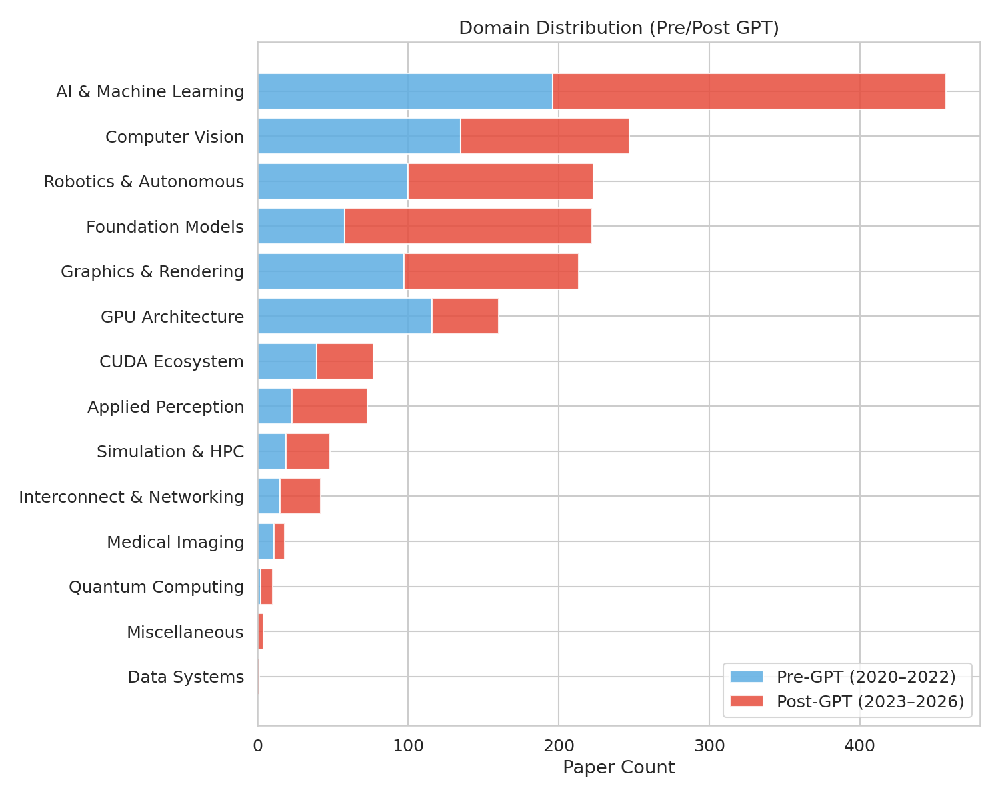

## 2. 领域全景：研究组合构成

*图1 — 14 个领域静态分布（GPT 前/后拆分）*

**AI 与机器学习** 以 451 篇占绝对主导（50.6%）——超过排名其后两个领域之和。

**第二梯队**：计算机视觉（246）、基础模型（219）、机器人与自主系统（219）。

GPU 架构、CUDA、图形学合计 446 篇，仍不及 AI/ML 一个领域——**NVIDIA 不是 GPU 公司，而是 AI 公司。**

<strong>💡</strong> AI/ML 论文数超过了 GPU 架构、CUDA 和图形学的总和。

---

## 2. 领域全景：时间演化

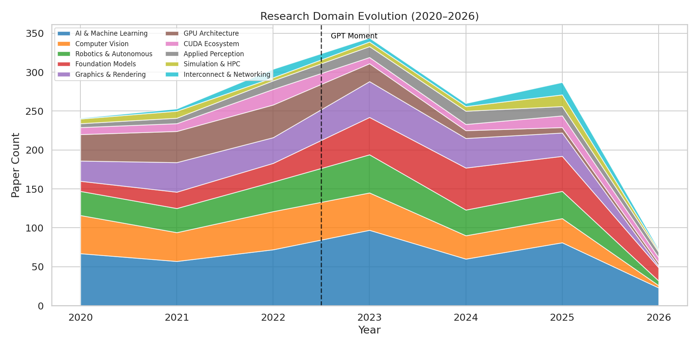

图2 — 各年度领域构成（GPT-3.5/ChatGPT 为分界线）

2022 年末后，<strong>基础模型</strong> 从 58 篇增长至 164 篇（+183%），而 <strong>GPU 架构</strong> 从 116 篇降至 44 篇。AI/ML、CV 和图形学保持稳健，构成研究基石。

<strong>💡 研究组合在 2022 年末发生结构性断裂</strong>——从硬件为中心转向模型为中心。

---

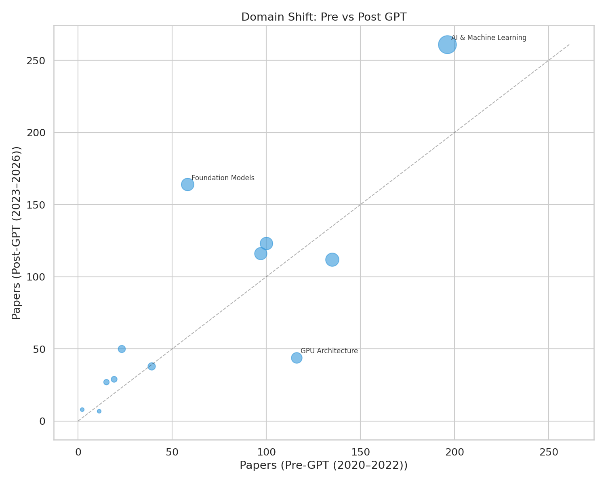

## 2. 领域全景：GPT 时刻转变

*图3 — 每个领域 GPT 前 vs. GPT 后论文数*

**📈 最大增长**：基础模型 +106篇 (+183%) · 应用感知 +27篇 (+117%)

**📉 最大缩减**：GPU 架构 -72篇 (-62%) · CUDA 生态基本持平

**➡️ 稳定基石**：AI/ML、CV、机器人学各年波动 < 15%

总产出 451→472 近似持平——研究组合从 GPU 架构显著转向基础模型。**资源再分配，而非规模扩张。**

<strong>💡</strong> 总产出近似持平，但基础模型净增 106 篇，GPU 架构减少 72 篇。

---

## 2. 领域全景：关键轨迹与 Venue 布局

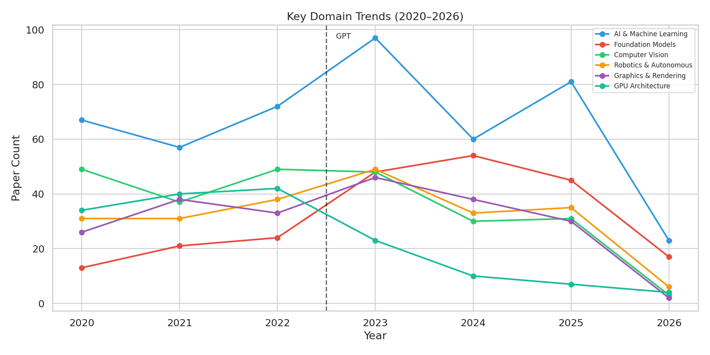

图4 — 七大领域年度追踪

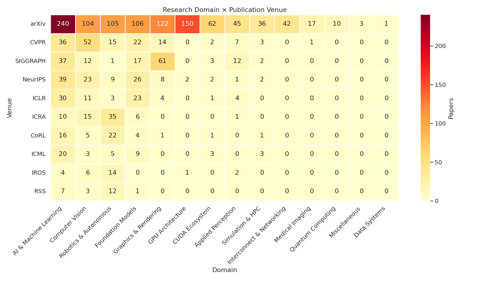

图5 — 领域 × 发表 Venue 热力图

<strong>基础模型</strong> 曲棍球曲线 ↗ · <strong>GPU 架构</strong> 急剧下跌 ↘ · <strong>AI/ML, CV, 图形学</strong> 稳健基石 → · GPU 架构 2022 年后转向 arxiv，传统会议投稿显著减少。

<strong>💡 发表策略是领域健康信号。</strong> GPU 架构退出传统会议转向 arxiv，提示发表偏好变化。

---

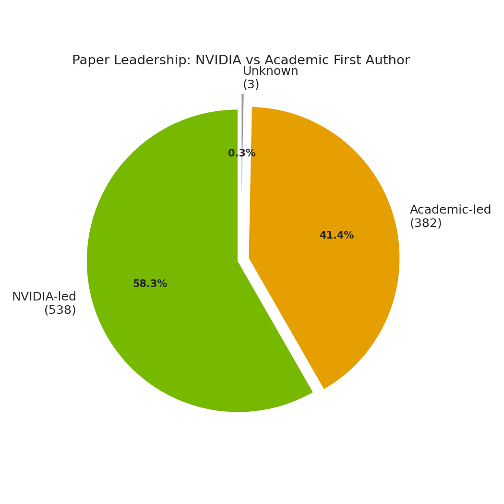

## 3. 学术合作：谁主导研究？

*图6 — NVIDIA 第一作者 vs. 学术界第一作者*

**58.5%** NVIDIA 第一作者（538/920篇）· **41.5%** 学术界第一作者（382篇）

**38.3%**（352/920）为纯 NVIDIA 论文，**61.7%** 为合作论文

NVIDIA 仍主导多数论文，但修正后的所属机构显示学术界也在大量论文中担任第一作者。学术合作不是简单外包，而是共同设定和推进研究议程。

<strong>💡 学术合作是嵌入式协作，非替代关系。</strong> NVIDIA 把控方向，学术界贡献专业深度。

---

## 3. 学术合作：时间稳定性与领域参与度

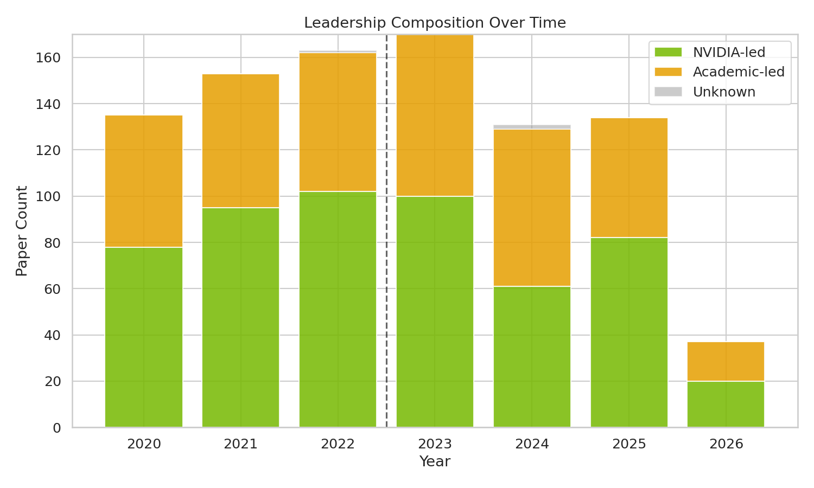

图7 — 各年度 NVIDIA 主导 vs. 学术主导

NVIDIA 主导比例七年保持 **85-90%**——结构性制度特征，非对 AI 趋势的应激反应。

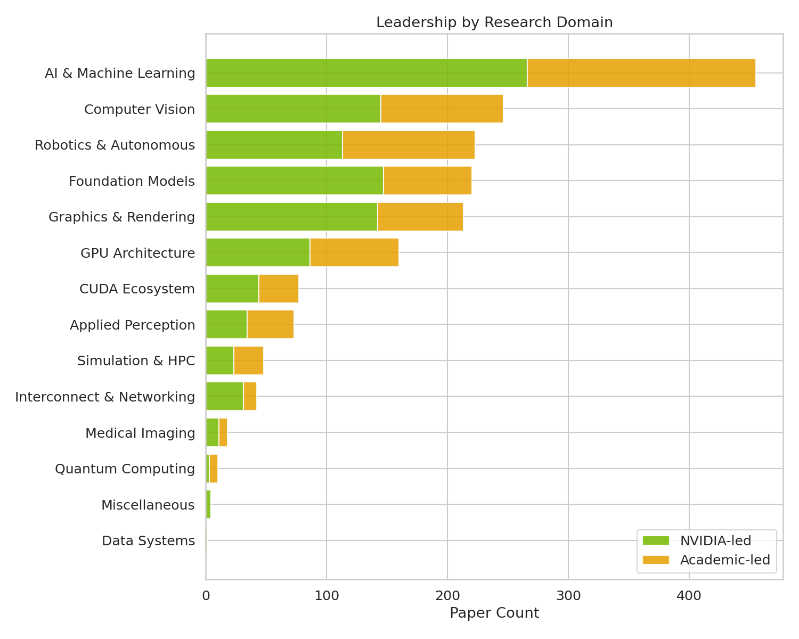

图8 — 各领域第一作者来源分布

学术第一作者占比最高：**医学影像 33.3%**、**基础模型 25.1%**。219 篇基础模型论文中有 55 篇学术第一作者。

<strong>💡 合作模式在 GPT 冲击下完好无损。</strong> NVIDIA 的核心研究组织方式不因技术变革而动摇。

---

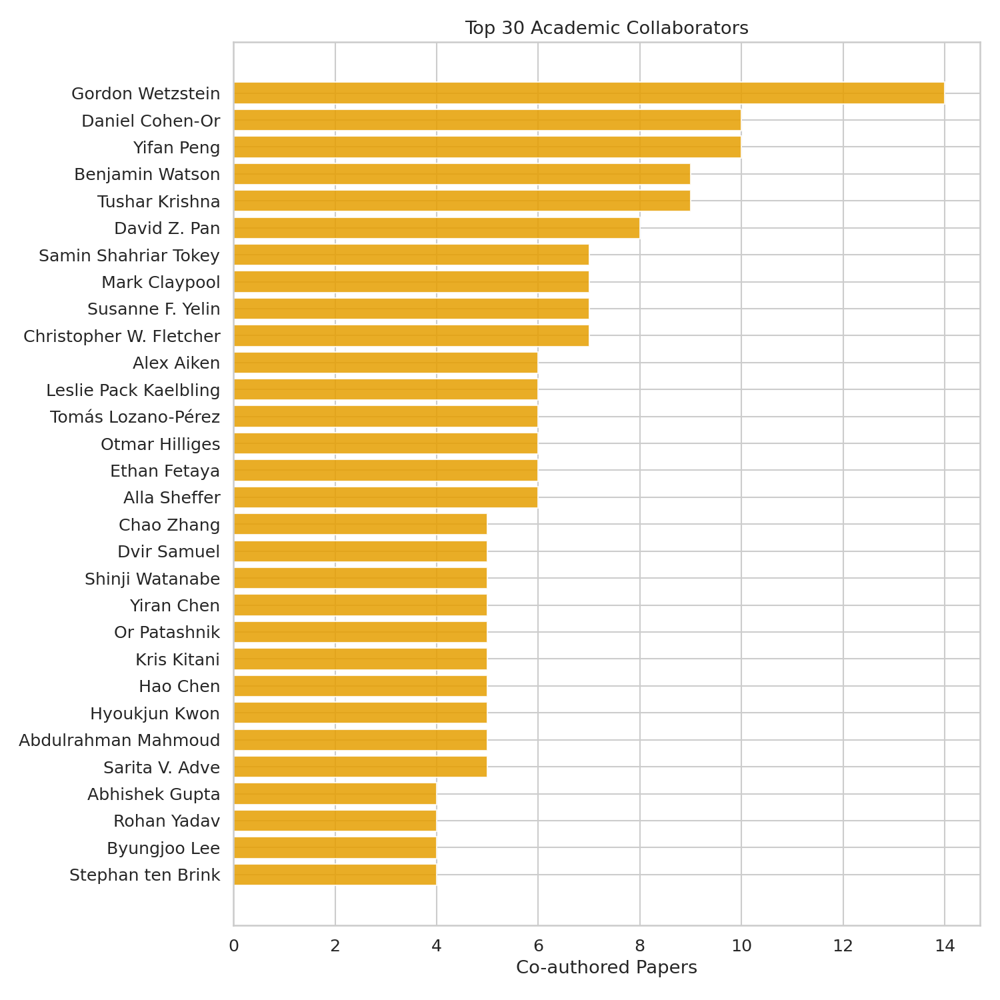

## 3. 学术合作：顶尖合作伙伴

*图9 — 前 30 位学术合作者*

**顶尖合作者同时也是 NVIDIA 内部人**——双重任职是架构，不是例外：

- **Dieter Fox**（机器人学）— 华盛顿大学教授 + NVIDIA 机器人研究高级总监
- **Boris Ginsburg**（语音）— NVIDIA 研究总监 + 大学任职
- **Mark Ren**（AI/ML）— 前 NVIDIA 高级研究科学家

"学术"合作者与"产业"研究者的边界在 NVIDIA 研究领导层中是模糊的——许多人同时兼具两种身份。

<strong>💡 "学术"合作者往往也是 NVIDIA 内部人。</strong> 双重任职模糊了学术发表与产品开发的边界。

---

## 4. 产品转化：概览与证据类型

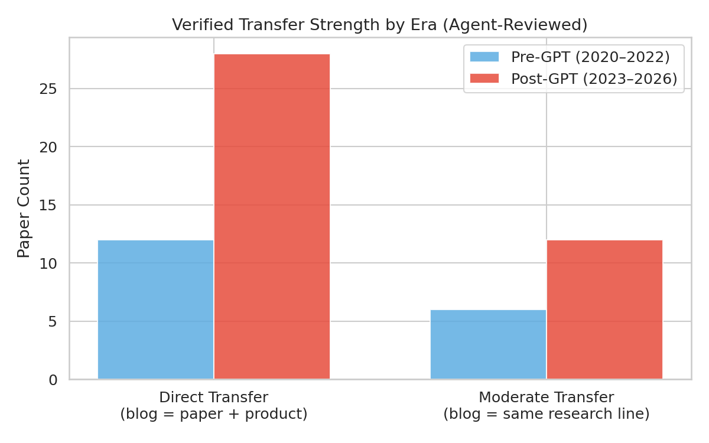

图10 — DIRECT vs. MODERATE 转化（分时期对比）

GPT 前：<strong style="font-size:24px;">16</strong> 篇（12 DIRECT + 6 MODERATE）

GPT 后：<strong style="font-size:24px;">40</strong> 篇（28 DIRECT + 12 MODERATE）

<strong>💡 DIRECT 转化翻倍以上（12→28），</strong> NVIDIA 更加系统化地通过博客发布研究到产品的成功案例。

---

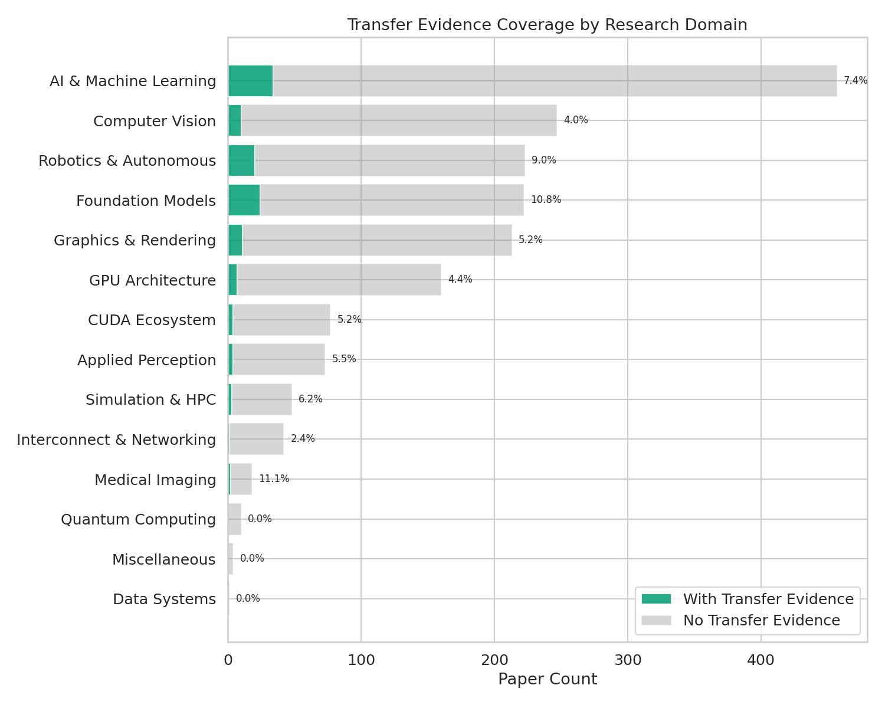

## 4. 产品转化：各领域分布

*图11 — 各领域转化率排名*

| 领域 | 论文 | 转化 | 率 |
|------|------|------|-----|
| 基础模型 | 219 | 24 | **11.0%** |
| 机器人与自主 | 219 | 20 | **9.1%** |
| AI 与机器学习 | 451 | 34 | **7.5%** |
| 仿真与 HPC | 47 | 3 | **6.4%** |
| 应用感知 | 73 | 4 | **5.5%** |
| CUDA 生态 | 75 | 4 | **5.3%** |
| GPU 架构 | 158 | 0 | **0.0%** |

GPU 架构零博客转化——硬件通过产品发布出货。**转化率衡量的是沟通渠道的选择，而非研究影响力。**

<strong>💡 硬件无声出货；软件和模型高声量发布。</strong>

---

## 4. 产品转化：产品版图

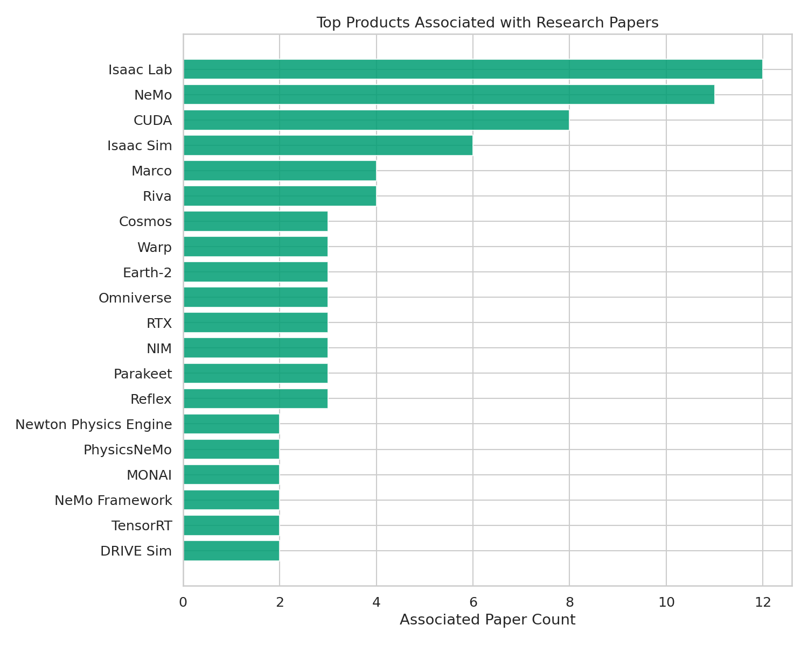

图12 — 前 20 个产品（按验证论文数排名）

<strong>四大生态系统</strong>：Isaac（16篇）— 机器人仿真与操控 · NeMo（12篇）— LLM 训练与语音 · 开发者工具 & CUDA（23篇）— 水平基座 + 垂直工具 · Omniverse/DRIVE（4篇）

<strong>💡 Isaac 和 NeMo 是最清晰的"发表-交付"管道。</strong> 论文→博客→产品的时间线可完整追溯。

---

## 4. 产品转化：时间趋势与学者贡献

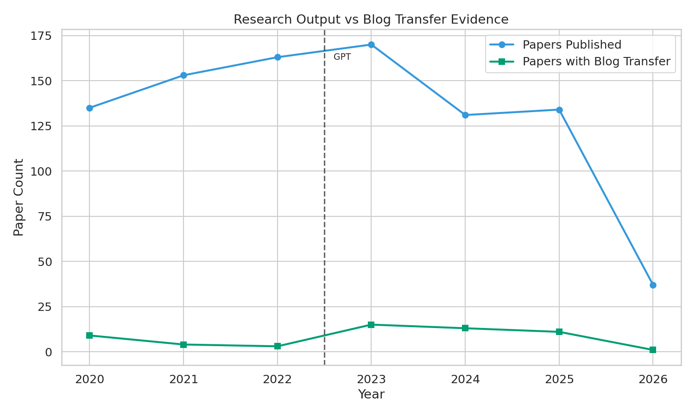

图13 — 每年论文数 vs. 转化数

2023 年峰值（18篇转化）与 LLM 转化浪潮吻合。GPT 后 40 篇 vs. GPT 前 16 篇——转化加速，势头持续至 2025 年。

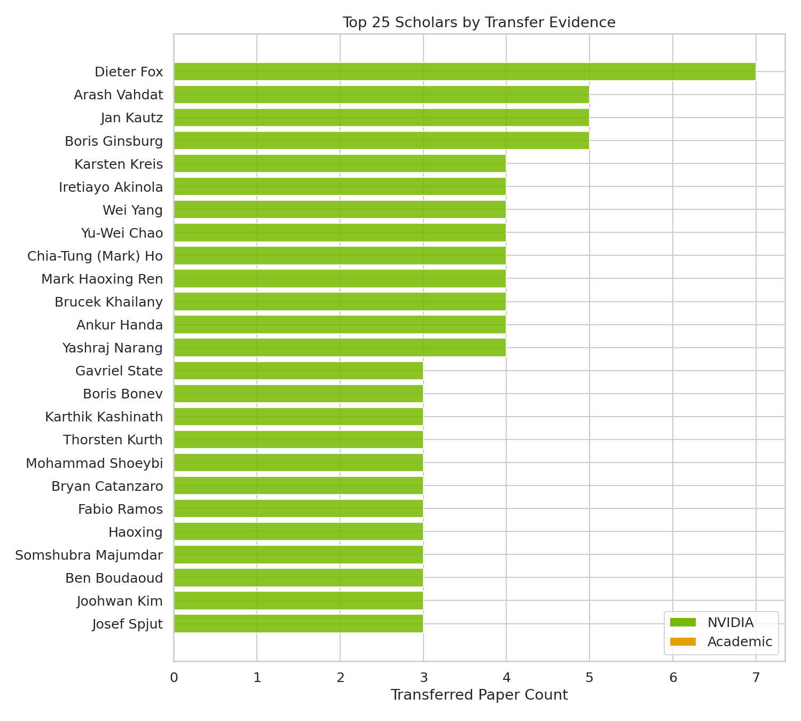

图14 — 前 25 位转化学者

Dieter Fox（7篇）、Mark Ren（7篇）领先。前 5 位转化学者贡献 28 篇（50%）——转化集中在少数领袖手中。

<strong>💡 转化是少数领袖驱动的合作成果。</strong> 前 5 位贡献了 50% 的验证转化。

---

## 5. 研究者画像：Dieter Fox

Dieter Fox

华盛顿大学教授 · NVIDIA 机器人研究高级总监（双重任职）

7 DIRECT · 全部为通讯/末位作者

Fox 是 NVIDIA 仿真到真实机器人研究的核心领导者。他在华盛顿大学的机器人实验室与 NVIDIA 的 Isaac 团队深度融合。每篇关键论文先发表在顶级会议（RSS、CoRL、NeurIPS），再进入产品集成——**先学术验证、后产品化**的审慎策略。

合作者 Yashraj Narang、Iretiayo Akinola、Ankur Handa 构成 NVIDIA 机器人核心团队。

| 论文 | 产品 | 亮点 |
|------|------|------|
| arxiv-2957 抓取分类 | Isaac, CUDA | 同月博客报道 |
| arxiv-2771 **Factory** | Isaac Gym, PhysX | 20,000× 加速 |
| arxiv-2665 DeXtreme | Isaac Gym, Omniverse | 32h=42年经验 |
| rss-0011 **IndustReal** | Isaac Lab, Isaac ROS | 真实硬件装配 |
| rss-0004 AutoMate | Isaac Sim, Isaac Lab | 泛化零件几何 |
| corl-0008 SkillGen | Isaac Lab | 自动演示生成 |
| corl-0001 VT-Refine | Isaac Lab, Warp, Newton | 视觉-触觉双臂 |

<strong>💡 7 篇论文横跨 5 年，从基础研究到双臂装配，全部注入 Isaac 生态。</strong>

---

## 5. 研究者画像：Mark Ren · Jan Kautz · Boris Ginsburg

Mark Haoxing Ren

前 NVIDIA 高级研究科学家 · VLSI CAD 与 EDA

7 MODERATE · 全部通讯作者

引领 NVIDIA 芯片设计 AI 演化：GPU 加速布局 → 领域适配 LLM → 多智能体框架。全部输入**内部芯片设计工具链**而非公开产品。Chia-Tung Ho 任第一作者实施，形成 DRC→Verilog→布局→Marco 的连贯序列。

Jan Kautz

NVIDIA 学习与感知研究副总裁

5 DIRECT · 全部通讯作者。横跨 CV、NAS、SSM、LLM 压缩。**Mamba-2-Hybrid 仅 1 个月转化的最快记录。**

 

Boris Ginsburg

NVIDIA 研究总监 + 大学任职

5 DIRECT · 全部通讯作者。语音研究 1-12 个月持续落地 NeMo（Fast-Conformer→Canary, TDT→Parakeet-TDT）。

<strong>💡 Kautz 的广度 vs. Ginsburg 的深度——两种领导力模式，同样高效转化。</strong>

---

## 5. 研究者画像：合作集群

### 生成式 AI 三人组
**Arash Vahdat** (5M) · **Karsten Kreis** (4D) · **Jan Kautz** (5D)

从去噪扩散 GAN 到蛋白质结合剂设计（arxiv-2522 → Proteina-Complexa/BioNeMo）。Vahdat 为关键扩散论文第一作者，Kreis 主笔 GAN。2026 年论文附带 GitHub、模型 checkpoint 和药企验证——生成模型应用于药物发现的前沿范式。

### 芯片设计
**Mark Ren** (7M) · **Chia-Tung Ho** (4M)
LLM 驱动的 EDA 自动化：VerilogCoder 94.2% 成功率，MCMM ~60× 人类加速。

### 机器人仿真到真实
**Dieter Fox** (7D) · **Iretiayo Akinola** (4D) · **Wei Yang** (4D) · **Yu-Wei Chao** (4D)

Isaac 全栈覆盖：仿真 (Factory) → 训练 (DeXtreme) → 装配 (IndustReal/AutoMate) → 基础模型 (GR00T)。与 NVIDIA GEAR 团队紧密合作。

### 语音 AI
**Boris Ginsburg** (5D) · Somshubra Majumdar
NeMo 语音全产品线。Ginsburg 团队是最自洽的转化单元——研究者同时撰写论文和博客。

<strong>💡 三个团队贡献了 80%+ 的验证转化。</strong> 转化不是个人英雄主义——它是紧密合作集群的产物。

---

## 5. 研究者画像：跨领域模式

### 合作集群结构
- **机器人**：Fox, Akinola, Yang, Chao
- **生成式 AI**：Vahdat, Kreis, Kautz
- **芯片设计**：Ren, Ho
- **语音**：Ginsburg, Majumdar

### 学术-产业双重性
前十中三位（Fox, Ren, Ginsburg）兼具学术和产业身份——他们转化的论文模糊了发表与产品开发的边界。

### 第一作者动态
- **实施主导者**：Mark Ho（4 篇一作）
- **研究总监**：Fox, Kautz, Ginsburg（通讯/末位）
- **共享一作**：Vahdat, Kreis, Yang, Chao

### 转化速度差异
- 最快：Mamba-2-Hybrid → NeMo（1 个月）
- 典型：语音研究 → NeMo（6-12 个月）
- 最长：IndustReal → Isaac Lab（2 年）

架构创新快速集成；硬件相关研究需更长验证周期。

<strong>💡 转化速度取决于研究类型。</strong> SSM 架构 1 个月集成；装配仿真到真实迁移需 2 年。

---

## 6. 产品转化故事：Isaac 生态系统（16篇论文）

Isaac 是 NVIDIA 的机器人 AI 开发平台，按仿真→训练→部署层次组织。它是已验证研究转化的最大接收方——16 篇论文注入 8 个不同的 Isaac 产品。

**五层架构**

| 层 | 组件 | 研究输入 |
|-----|------|----------|
| 仿真 | Isaac Sim | Factory SDF → PhysX |
| 训练 | Isaac Lab | DeXtreme, IndustReal |
| 部署 | Isaac ROS | FoundationPose |
| 基础模型 | GR00T | MaskedMimic, GR00T N1 |

**五年转化时间线**

**2020-21 奠基** — 人-机器人交互研究
**2022 突破** — Factory 20,000× 加速；DeXtreme 32h=42年经验
**2023-24 成熟** — IndustReal UR10e 装配；AutoMate 泛化；SkillGen 自动演示
**2025 灵巧操作** — DextrAH-RGB Atlas 抓取；GraspGen 57M 抓取
**2024-25 基础模型** — GR00T N1 2B 参数，76.8% 成功率（基线 46.4%），HuggingFace 开源

<strong>💡 先顶级会议发表，后产品集成。</strong> 每篇关键论文先出现在 RSS/CoRL/NeurIPS，再进入产品。R2D2 博客系列成为论文转化的主要叙事载体。

---

## 6. 产品转化故事：开发者工具（23篇论文）

涵盖"水平"平台（CUDA、Warp、TensorRT——加速任意负载）和"垂直"工具（Sionna、Riva、Reflex、Marco——领域专精）。23 篇验证转化——最大组合群体。

### 水平基座

**CUDA & GPU** — A100 TF32 10× Volta，直接驱动更大 CV 模型。UNAS 通过 TensorRT + AMP 实现 16× 推理加速。CUDA 出现在每个生态系统但仅 8 篇论文将其列为直接产品——**CUDA 是水，不是鱼。**

**Warp** — GPU Python 计算框架，横跨图形学、机器人学、物理学。

**Kaolin** — Simplicits 统一物理表示 → `kaolin.physics` API。

### 垂直工具

**Riva** — Parakeet ASR, Canary 多语种, Parakeet-TDT → 生产部署。

**Sionna → TensorRT → Aerial** — 最清晰的多阶段漏斗：Sionna 原型化 → TensorRT 硬化（A100 <1ms）→ Aerial 商用 5G RAN。

**Marco & DREAMPlace** — LLM 多智能体芯片设计（VerilogCoder 94.2%）。ispd-0003/5 GPU 加速宏布局。

**Reflex** — 15,000+ 玩家研究：25ms vs. 85ms 命中率 2×+。直接支撑 Reflex SDK。

<strong>💡 水平工具影响广但转化面窄；垂直工具管道路径长但可完整追溯。</strong>

---

## 6. 产品转化故事：NeMo 生态系统（12篇论文）

三层平台：**NeMo Framework**（LLM 训练）→ **Megatron-Core**（分布式大规模训练）→ **NeMo Curator**（数据管道）。部署侧：Parakeet（ASR）、Canary（语音翻译）、Minitron（压缩模型）。

| 年份 | 关键论文 | 产品集成 | 转化周期 |
|------|----------|----------|----------|
| 2020 | arxiv-3026 跨语言 ASR · arxiv-2962 BioMegatron | NeMo ASR, BioMegatron | 当月 |
| 2023 | Fast-Conformer · TDT · SteerLM | Canary, Parakeet-TDT, NeMo | 1-11 个月 |
| 2024 | **Mamba-2-Hybrid** · Minitron | NeMo SSM, TensorRT-LLM | **1-6 个月** 🏆 |

 

**语音谱系**：arxiv-3026 (2020) 跨语言迁移 → Fast-Conformer 2.8× 加速驱动 Canary → TDT 成为 Parakeet-TDT（推理 +64%，首个 HF Open ASR < 7.0 WER）。

**LLM 创新**：SteerLM 用属性条件 SFT 替代 RLHF。Minitron 压缩 Mistral-NeMo→Minitron-8B 超越 Llama-3.1-8B。Mamba-2-Hybrid 256K 序列 18× 加速，**1 个月后 NeMo 支持 SSM**。

<strong>💡 NeMo 是 NVIDIA"发表即交付"模式的最清晰范例。</strong> 研究者-工程师同时撰写论文和博客，驱动 1-12 个月转化周期。

---

## 6. 产品转化故事：CUDA + GPU — 沉默的基座

### 158 篇 GPU 架构论文 — 零验证博客转化

**原因**：GPU 研究通过 **Blackwell / Hopper / Ampere** 产品出货。硬件通过产品发布会和技术文档发布——非研究博客。

**流向**：硬件 → 研究能力，而非反向。A100 TF32 + 结构化稀疏直接驱动更大 CV 模型。UNAS 通过 TensorRT + AMP 实现 16× 推理加速。箭头从硬件指向研究能力。

零博客转化 **≠** 零影响力——这是不同的沟通渠道选择。

### 硬件-软件沟通鸿沟

| 渠道 | 内容 | 受众 |
|------|------|------|
| 博客 | 开发者叙事 | 软件/模型 |
| 产品发布 | 硬件叙事 | GPU/架构 |
| 数据表/文档 | 深度技术 | 硬件工程师 |

CUDA 作为次级产品出现在每个生态系统中——Isaac 和 NeMo 负载的执行基座、DREAMPlace 的加速核心。仅 8 篇论文将 CUDA 列为直接产品远远低估了其实际影响。

**CUDA 是水，不是鱼。**

<strong>💡 转化率衡量的是沟通渠道，而非研究影响力。</strong> GPU 架构是 NVIDIA 生态的基础——它只是通过不同的语言与世界对话。

---

<!-- _class: lead -->

# GPT 时刻转变

**2022 年末：以硬件为中心 → 以模型为中心**

*论文总数近似持平（451→472），但水下分布发生结构性断裂*

---

## 7. GPT 时刻：四维对比

### GPT 前 (2020-2022)

**451** 篇论文 · 以硬件为中心

基础模型 58 篇（12.9%）

**61.1%** NVIDIA 主导

**3.5%** 转化率 · 12 DIRECT

→

### GPT 后 (2023-2026)

**472** 篇论文 · 以模型为中心

基础模型 164 篇 **+183%**

**56.0%** NVIDIA 主导

**8.5%** 转化率 · 28 DIRECT

 

### 构成剧变
- 基础模型 +106 篇净增
- GPU 架构 -72 篇净减
- 研究组合显著转向模型领域
- 新领域涌现：数据系统等

### 不变的常量
- 合作模式：NVIDIA仍主导多数，但学术主导上升
- 组织方式：NVIDIA与学术界共同推进议程
- 出版策略：顶级会议 + arxiv
- 核心领域：AI/ML、CV、图形学稳健

<strong>💡 GPT 未改变 NVIDIA 研究机器的运转方式——它改变了机器制造的产物。</strong> 近似相同规模的论文，不同的主题组合。合作结构也更平衡：NVIDIA仍是多数第一作者，但学术界第一作者占比上升。

---

## 7. GPT 时刻：解读

### 为什么转化率翻 2.4 倍？

**结构性因素**：基础模型研究更"博客友好"——软件和模型发布天然适合博客叙事。GPU 架构研究较少经过博客渠道——因此博客可见转化率偏低。

**行为因素**：NVIDIA 在 GPT 后更加系统化地报道研究到产品连接。更多博客明确标注"本研究已集成至产品 X"。

### 为什么合作模式只是渐变？

NVIDIA 的研究组织方式是**结构性**的，但修正后数据显示第一作者格局更平衡：
- 内部研究团队设定方向
- 学术界提供专业化和人才管道
- 双重任职者在两者间建立桥梁

这种模式在前 GPT 时代已被验证有效，GPT 冲击后学术第一作者占比略有提升。

<strong>💡 转化率上升 = 更好的测量 + 更多的博客友好型研究。</strong> 底层研究影响力在 GPT 前后可能保持相对稳定——变化的是哪些研究被博客覆盖。

---

<!-- _class: lead -->

# 8. 关键结论

---

## 8. 关键结论

### 1. 真实管道，选择性证据
**6.1%** 论文具验证转化——公开可见的下限。GPU 架构 160 篇中只有 7 篇验证博客转化——**转化率衡量的是沟通渠道，非研究影响力。**

### 2. 改变方向，而非扩大规模
总产出近似稳定（451→472），基础模型 +183%，GPU 架构 -62%。**NVIDIA 重新分配资源而非扩张。**

### 3. NVIDIA 主导，学术界协作
**58.5%** NVIDIA 第一作者，**41.5%** 学术界第一作者。修正后的数据表明学术界具有真实的议程设定能力。

### 4. Isaac 与 NeMo：最清晰的转化管道
16 篇 Isaac + 12 篇 NeMo 展示"先学术验证、后产品化"模式。1 个月（Mamba-2-Hybrid）到 2 年（IndustReal）的转化周期。

### 5. GPT 后转化加速
**2.4×** 转化率提升（3.5%→8.5%）。更多博客友好领域 + 更系统的报道策略。**变化的是博客覆盖，不一定是底层影响力。**

### 6. 博客是战略渠道，非唯一渠道
53 篇博客承载验证转化。GPU 架构通过产品发布 + 技术文档出货。**硬件与软件使用不同的沟通语言与世界对话。**

<strong>💡 NVIDIA 的研究引擎有双重输出模式。</strong> 面向开发者的软件和模型通过博客传播；硬件和架构通过产品发布出货。承认转化率衡量的是沟通渠道而非影响力——才能正确解读数据。

---

<!-- _class: lead -->
<!-- _paginate: "false" -->

# 谢谢

 

**923 篇论文 · 56 篇验证转化 · 14 个领域**

**40 DIRECT · 18 MODERATE · 3,678 篇博客分析**

**2020-2026**
